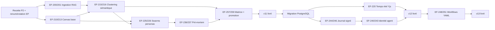

# CDC fonctionnel — Atelier d'idéation visuel & agentique

**Projet :** KayrosLab · **Lot :** v11 → v13 · **Exigences :** EF-200 → EF-262
**Statut du document :** proposition à arbitrer · **Date :** 2026-07-29
**Sources d'entrée :** [`block/buzz`](https://github.com/block/buzz) (Apache 2.0), [`SPECIFICATIONS_FONCTIONNELLES.md`](SPECIFICATIONS_FONCTIONNELLES.md) (EF-01 → EF-128), note de cadrage « AI-powered ideation platform ».

---

## 0. Avertissements préalables

**0.1 — Collision de numérotation à corriger avant tout ajout.** La plage `EF-88 → EF-101` est actuellement utilisée **deux fois** : par le module *Positionner* (ontologie concurrentielle) et par les *Connecteurs conversationnels* (`EF-88 → EF-109`, cf. `SPECIFICATIONS_CONNECTEURS_CHAT.md`). Deux exigences distinctes portent le même identifiant, ce qui casse la traçabilité. **Action préalable (bloquante) :** renuméroter les connecteurs chat en `EF-130 → EF-151`. Le présent CDC démarre à **EF-200** pour laisser 70 identifiants de marge.

**0.2 — Réserve de recette maintenue.** Le README indique que les statuts « réalisé » attestent d'un code testé unitairement, pas d'une recette fonctionnelle (P2 non déployé). Ce CDC **n'ajoute pas de dette de recette** : chaque exigence ci-dessous porte un critère d'acceptation exécutable, et le lot v11 est conditionné à la clôture de la recette P2.

**0.3 — Ce que ce CDC n'est pas.** Il ne remet pas en cause le cycle 8 étapes ni la gouvernance. Le canvas est une **surface d'entrée amont** (avant *Recueillir*) et une **surface de travail** sur les étapes *Cartographier*, *Construire* et *Éprouver*. Il ne se substitue à aucune étape existante.

---

## 1. Analyse comparative — `block/buzz` ↔ KayrosLab

### 1.1 Positionnement respectif

| Axe | **Buzz** (Block) | **KayrosLab** |
|---|---|---|
| Objet | Espace de travail humains + agents sur un relais qu'on possède | Atelier d'idéation stratégique **gouverné** |
| Unité atomique | **Événement signé** (Nostr NIP-01) dans un log unique | **Idée** (entité `model.mjs`, étapes × statuts) |
| Substrat | Relay Rust + Postgres + Redis + Typesense + S3 | Cœur ESM zéro dépendance + Fastify/PHP + fichiers JSON |
| Identité | Paire de clés Schnorr, **identique pour humain et agent** | Compte scrypt + jeton HMAC, RBAC, multi-tenant. **Les agents n'ont pas d'identité propre** |
| Agents | **Membres** d'un canal, mêmes affordances qu'un humain (créer canal, éditer canvas, lancer workflow) | Rôles internes de l'orchestrateur (Planner, Critic, Devil's Advocate, Red Team, Bisociateur, Synthesizer) — **non adressables, non membres** |
| Audit | Log à chaîne de hachage (`buzz-audit`), tout est événement | Transitions horodatées + audit gouvernance (`governance.mjs`), **par domaine** |
| Automatisation | **Workflows YAML** déclaratifs (triggers message / réaction / planning / webhook) | Orchestrateur impératif (Plan-and-Solve + ReAct), pas de DSL utilisateur |
| Surface visuelle | Canaux, threads, **canvases**, média avec commentaires ancrés à la frame | Formulaires + graphe Cytoscape (Positionner uniquement) |
| Recherche | Index unique Typesense sur *tous* les types d'événements | Vector Memory (Qdrant / InMemory) sur la mémoire agent |
| Souveraineté | Auto-hébergement du relais, clés côté utilisateur | Ollama local (P1) ou proxy backend détenant les clés (P2) |
| Convergence vers l'exécution | Faible — c'est un espace de travail, pas un pipeline de décision | **Forte** — vote pondéré, veto, projection Monte-Carlo, Réaliser, impact réalisé vs projeté |

### 1.2 Lecture stratégique

Les deux projets sont **complémentaires, pas concurrents**. Buzz résout la *collaboration* (le substrat, l'identité, l'audit, la mise en salle des agents) ; KayrosLab résout la *convergence* (la gouvernance, l'arbitrage, la projection chiffrée, la mesure d'impact).

Le déficit de KayrosLab est en **amont** : entre le signal faible brut et le canevas *Recueillir*, il n'existe aujourd'hui aucune surface de divergence. On demande à l'utilisateur d'arriver avec une idée déjà formée pour remplir un formulaire structuré. C'est exactement le trou que la note de cadrage décrit, et c'est là que les emprunts à Buzz paient.

**Ce que KayrosLab ne doit pas copier :** la stack Nostr/Rust/Typesense. Le coût de migration est hors de proportion avec le bénéfice, et la valeur de Buzz tient à ses **concepts**, pas à son protocole. Décision retenue : *emprunter les concepts, pas la stack*.

### 1.3 Fonctionnalités extraites de Buzz et retenues

| # | Fonctionnalité Buzz | Transposition KayrosLab | Exigences |
|---|---|---|---|
| B1 | Identité par clé, **agent = membre** de plein droit | Chaque agent (Critic, Red Team, persona custom) reçoit un `agentId` + une paire de clés Ed25519 et devient un **participant adressable** du canvas et des commentaires | EF-240 → EF-243 |
| B2 | **Log d'événements unique** à chaîne de hachage | Journal d'événements applicatif unifié : toute mutation (nœud, arête, vote, gate, transition, sortie d'agent) devient un événement signé, chaîné, rejouable | EF-244 → EF-247 |
| B3 | **Workflows YAML** (triggers message/réaction/planning/webhook) | DSL déclaratif `kayros-workflow.yml` : « quand un nœud entre dans le cluster X, déclencher le swarm Red Team » | EF-248 → EF-251 |
| B4 | **Commentaires ancrés** (frame vidéo, position) | Commentaires ancrés à un nœud, une arête ou une zone du canvas — le fil existant (`comments.mjs`) gagne une ancre spatiale | EF-224 |
| B5 | **Recherche transversale** un seul index, tous types d'événements | Index unique sur nœuds + commentaires + sorties d'agent + idées + gates, avec « réponse avec reçus » (citation de l'événement source) | EF-252 → EF-254 |
| B6 | **CLI agent-first** (`buzz-cli`, JSON in / JSON out) | `kayros-cli` : surface d'appel outil pour LLM externes (Claude Code, Goose) permettant de piloter le canvas et le portefeuille | EF-255 → EF-256 |
| B7 | **« Branche = salle »** — le contexte devient un espace | « Cluster = atelier » : un cluster sémantique promu devient un espace de travail avec ses nœuds, ses agents, son fil et sa décision | EF-219 |
| B8 | Auto-hébergement, données chez soi | Déjà couvert (P1 Ollama). Renforcé : le canvas et les embeddings doivent fonctionner **hors ligne** | EF-262 |

**Écartés explicitement :** Nostr/NIP-01/NIP-34 (protocole), NIP-42 (auth Schnorr en remplacement de scrypt/HMAC), git hosting, huddles voix, clients mobiles Flutter, réputation web-of-trust inter-relais. Motif commun : coût de réécriture sans valeur pour le cas d'usage « idéation stratégique gouvernée ». La signature d'événements est conservée (B2) **sans** le protocole qui la porte chez Buzz.

---

## 2. Architecture cible

```
┌──────────────────────────────────────────────────────────────────────┐
│                     Canvas infini (EF-210 → EF-224)                  │
├───────────────────┬───────────────────┬──────────────────────────────┤
│ Ingestion contexte│  Moteurs créatifs │  Structuration & clustering  │
│  (EF-200 → 209)   │  (EF-225 → 239)   │      (EF-215 → 219)          │
├───────────────────┴───────────────────┴──────────────────────────────┤
│      Validation & raffinement — Pre-mortem, Red Team (EF-236→239)    │
├──────────────────────────────────────────────────────────────────────┤
│   Convergence → cycle gouverné 8 étapes existant (EF-257 → EF-261)   │
├──────────────────────────────────────────────────────────────────────┤
│  Journal d'événements signé · identité agent · workflows (EF-240→256)│
└──────────────────────────────────────────────────────────────────────┘
```

**Placement dans le cycle.** Le canvas s'insère **avant `00 Recueillir`** et alimente `02 Cartographier` / `03 Construire`. La promotion d'un nœud ou d'un cluster produit une **Idée** au sens de `model.mjs`, qui rejoint le portefeuille et le cycle gouverné inchangé.

```
[Canvas divergent]  ──promotion──►  00 Recueillir → 01 Écouter → ... → 08 Réaliser
       ▲                                                                   │
       └────────────── retour de signal / re-divergence ◄──────────────────┘
```

**Réutilisation du cœur existant — obligatoire.** Aucun module n'est réécrit :

| Besoin nouveau | Module `core/` réutilisé |
|---|---|
| Vecteurs de nœuds, recall sémantique | `embeddings.mjs`, `memory.mjs` (Qdrant / InMemory) |
| Personas de sparring | `orchestrator.mjs` (rôles Critic / Devil's Advocate / Red Team / Bisociateur) |
| Résilience appels LLM | `resilience.mjs` (retry + circuit breaker) |
| Scoring Impact/Effort | `scorecard.mjs` (grilles paramétrables) |
| Fil de discussion sur nœud | `comments.mjs` (2 niveaux, suppression douce) |
| Promotion nœud → Idée | `intake.mjs` (canevas Recueillir) + `model.mjs` |
| Audit des mutations | `governance.mjs` (persistance + audit) |
| Notification de swarm terminé | `notify.mjs` (webhook / email / digest) |

---

## 3. Exigences fonctionnelles

Légende : 🔴 à construire · 🟡 partiel (base existante à étendre) · 🟢 déjà couvert par le cœur.
Priorité : **M**ust · **S**hould · **C**ould · **W**on't (ce lot).

### 3.1 Ingestion multimodale de contexte — EF-200 → EF-209

| Réf | Exigence | Prio | État |
|---|---|---|---|
| **EF-200** | Un utilisateur dépose des documents (PDF, DOCX, MD, TXT, CSV) dans un espace de travail ; le contenu est découpé, vectorisé et rendu interrogeable par les agents du canvas. | M | 🔴 |
| **EF-201** | Le contenu ingéré est **attribué à sa source** : toute assertion d'agent s'appuyant sur un document cite le fichier, la page ou le paragraphe. Une assertion sans source est signalée comme non sourcée, jamais présentée comme sourcée. | M | 🔴 |
| **EF-202** | Une URL (site concurrent, article, dépôt) est ingérée via les collecteurs existants du module *Positionner* (web scanner, GitHub/GitLab scanner) et devient un nœud de contexte. | M | 🟡 (EF-88→91) |
| **EF-203** | Un transcript d'entretien utilisateur est ingéré et **découpé en verbatims** ; chaque verbatim est un nœud candidat, rattaché à son locuteur et à son horodatage. | S | 🔴 |
| **EF-204** | Une session vocale est transcrite en temps réel ; la transcription est segmentée en **nœuds de concept** formatés (titre + puces), pas en bloc de texte brut. | S | 🔴 |
| **EF-205** | La transcription vocale fonctionne **en local** (Whisper embarqué ou équivalent) lorsque le palier P1 souverain est actif ; aucune donnée audio ne sort. Si aucun moteur local n'est disponible, la fonction est **désactivée**, jamais silencieusement basculée vers le cloud. | M | 🔴 |
| **EF-206** | Le corpus de contexte est **scopé par tenant et par espace de travail** ; le `tenantId` provient du jeton, jamais du client (cohérence EF-48). | M | 🟢 |
| **EF-207** | Un document ingéré peut être **retiré**, avec suppression effective de ses vecteurs et invalidation des assertions qui s'y appuyaient (marquées « source retirée »). | M | 🔴 |
| **EF-208** | Le classifieur de sensibilité (`governance.mjs`) s'applique à l'ingestion : un document classé sensible n'est pas transmis à un fournisseur LLM externe ; l'espace bascule en mode local ou l'ingestion est refusée **avec motif**. | M | 🟡 |
| **EF-209** | Le volume ingéré par espace est plafonné et le plafond est **affiché avant** dépassement, pas après. | C | 🔴 |

### 3.2 Canvas infini — EF-210 → EF-224

| Réf | Exigence | Prio | État |
|---|---|---|---|
| **EF-210** | Espace de travail à pan et zoom **non borné**, avec mini-carte et retour à l'origine. Performance cible : 60 fps jusqu'à 1 000 nœuds visibles, dégradation gracieuse au-delà (culling + niveau de détail). | M | 🔴 |
| **EF-211** | Types de nœuds : **idée**, **question**, **hypothèse**, **preuve/source**, **critique**, **décision**, **groupe**. Chaque type a une forme et une couleur distinctes, et un jeu de champs propre. | M | 🔴 |
| **EF-212** | Arêtes **typées et orientées** : `soutient`, `contredit`, `dérive de`, `dépend de`, `remplace`. Le typage réutilise la grammaire de relations de l'ontologie *Positionner* (EF-93). | M | 🔴 |
| **EF-213** | Création, édition, déplacement, redimensionnement, duplication, suppression de nœuds ; multi-sélection rectangle et par lasso ; opérations de groupe. | M | 🔴 |
| **EF-214** | **Annuler / rétablir** sur au moins 50 opérations, y compris les mutations produites par les agents. | M | 🔴 |
| **EF-215** | **Auto-clustering sémantique** : les nœuds sont regroupés visuellement par proximité vectorielle, sans tri manuel. Le clustering est **déterministe et rejouable à graine fixée** (cohérence avec le Monte-Carlo seedé de `projection.mjs`). | M | 🔴 |
| **EF-216** | Chaque cluster reçoit un **libellé généré** par le LLM, éditable par l'utilisateur. Un libellé édité manuellement n'est jamais écrasé par un re-clustering. | M | 🔴 |
| **EF-217** | **Déduplication temps réel** : lorsqu'un nœud dépasse un seuil de similarité cosinus avec un nœud existant, une proposition de fusion est présentée. La fusion est **toujours suggérée, jamais automatique** — deux formulations proches peuvent porter deux intentions distinctes. | M | 🔴 |
| **EF-218** | L'utilisateur peut **figer** un nœud à une position ; le re-clustering et les layouts automatiques respectent les positions figées. | S | 🔴 |
| **EF-219** | Un cluster peut être **promu en atelier** : il devient un espace de travail nommé avec ses propres nœuds, son fil de discussion, ses agents assignés et sa décision de sortie. *(transposition B7 « branche = salle »)* | S | 🔴 |
| **EF-220** | Édition **collaborative temps réel** : plusieurs participants (humains et agents) modifient le même canvas ; curseurs et sélections des autres sont visibles. Convergence garantie sans verrou ni écrasement silencieux. | S | 🔴 |
| **EF-221** | Le canvas est **utilisable hors ligne** ; les modifications locales sont réconciliées à la reconnexion sans perte. | S | 🔴 |
| **EF-222** | Recherche plein texte et sémantique **dans le canvas**, avec mise en surbrillance et navigation vers les résultats. | M | 🔴 |
| **EF-223** | Export du canvas : PNG, SVG, JSON (schéma documenté et réimportable), Markdown structuré. | S | 🔴 |
| **EF-224** | **Commentaires ancrés** à un nœud, une arête ou une zone. Réutilise `comments.mjs` (deux niveaux, édition datée, suppression douce préservant l'audit). *(transposition B4)* | M | 🟡 |

### 3.3 Co-création & sparring agentique — EF-225 → EF-239

| Réf | Exigence | Prio | État |
|---|---|---|---|
| **EF-225** | **Expansion d'un nœud** : à la demande, un agent génère N nœuds enfants (variantes, sous-problèmes, contre-exemples) reliés par des arêtes typées. | M | 🔴 |
| **EF-226** | **Swarm multi-personas** : plusieurs personas distinctes traitent le même nœud en parallèle et produisent chacune sa sortie, visuellement attribuée. | M | 🔴 |
| **EF-227** | Personas fournies en standard : **VC sceptique**, **client cible**, **designer UI/UX**, **optimiseur budget**, **juriste / conformité**, **ingénieur systèmes**. Chaque persona expose son prompt et ses critères — **aucune persona n'est une boîte noire**. | M | 🔴 |
| **EF-228** | Les personas sont **paramétrables et créables** par le tenant (nom, angle, critères, poids de vote associé). | S | 🔴 |
| **EF-229** | Les agents existants du cœur (Critic, Devil's Advocate, **Red Team**, Bisociateur, Synthesizer) sont **exposés comme personas de canvas** sans duplication de code. | M | 🟡 |
| **EF-230** | Les sorties d'agents sont **streamées** ; un swarm long reste interruptible et son coût en jetons est affiché en cours d'exécution. | M | 🔴 |
| **EF-231** | Un désaccord entre personas est **conservé et matérialisé** par une arête `contredit`. Il n'est jamais moyenné ni lissé en synthèse : le conflit est le produit. | M | 🔴 |
| **EF-232** | **SCAMPER** en un clic : les 7 transformations appliquées à un nœud, chacune produisant un nœud enfant étiqueté. | M | 🔴 |
| **EF-233** | **Six chapeaux de Bono** : six lectures d'un nœud ou d'un cluster, disposées en couronne. | S | 🔴 |
| **EF-234** | **Premiers principes** : décomposition en contraintes physiques / économiques / réglementaires, puis recomposition. | S | 🔴 |
| **EF-235** | **Bisociation** : le module existant propose des ponts entre deux clusters éloignés du canvas. | S | 🟡 |
| **EF-236** | **Pré-mortem IA** : « nous sommes en 2028, ce projet a échoué — pourquoi ? ». Produit un cluster de causes d'échec, chacune notée en probabilité et sévérité. | M | 🔴 |
| **EF-237** | Chaque cause de pré-mortem est **convertible en hypothèse testable** rattachée à l'idée promue, et devient une cible d'attaque de l'étape *Éprouver* (cohérence EF-60). | M | 🔴 |
| **EF-238** | La Red Team peut être lancée **directement depuis le canvas** sur un nœud ou un cluster, et produit son rapport d'attaque / kill shots existant. | S | 🟡 |
| **EF-239** | **Synthèse visuelle** : génération d'un visuel indicatif (mock, moodboard) pour un concept abstrait. Marqué comme illustratif, jamais présenté comme une maquette validée. | C | 🔴 |

### 3.4 Identité agent, journal d'événements & workflows — EF-240 → EF-256

*(emprunts structurels à Buzz)*

| Réf | Exigence | Prio | État |
|---|---|---|---|
| **EF-240** | Chaque agent dispose d'une **identité propre** (`agentId`, paire de clés Ed25519, persona, tenant) et n'emprunte jamais l'identité d'un humain. | M | 🔴 |
| **EF-241** | Un agent est **membre d'un espace de travail** : on l'ajoute et on le retire comme un participant humain ; son périmètre est défini par son appartenance, pas par des drapeaux de permission. | M | 🔴 |
| **EF-242** | Toute production d'agent est **signée** de sa clé et visuellement attribuée. Une sortie non signée est refusée à l'affichage. | M | 🔴 |
| **EF-243** | Un agent **ne peut pas résoudre un gate ni exercer un veto**. Le vote d'agent est consultatif et pondéré séparément du vote humain. *Cette exigence est structurante : sans elle, la gouvernance devient déclarative.* | M | 🔴 |
| **EF-244** | Toute mutation (nœud, arête, cluster, commentaire, sortie d'agent, vote, transition, gate) est émise comme **événement typé** dans un journal unique, horodaté, attribué à une identité. | M | 🔴 |
| **EF-245** | Le journal est **chaîné par hachage** : chaque événement référence le hachage du précédent. Toute altération est détectable. | S | 🔴 |
| **EF-246** | L'état d'un canvas est **reconstructible par rejeu** du journal depuis l'origine. La reconstruction est vérifiée par test automatisé. | S | 🔴 |
| **EF-247** | Le journal est **exportable** (JSONL) et **vérifiable hors ligne** par un utilitaire fourni. | C | 🔴 |
| **EF-248** | Un tenant définit des **workflows déclaratifs** en YAML : déclencheur → condition → action. | S | 🔴 |
| **EF-249** | Déclencheurs supportés : création/modification de nœud, entrée dans un cluster, franchissement de seuil de score, ouverture ou résolution de gate, planification (cron), webhook entrant. | S | 🔴 |
| **EF-250** | Actions supportées : lancer un swarm, lancer une Red Team, créer un nœud, notifier (`notify.mjs`), ouvrir un gate, promouvoir en Idée. | S | 🔴 |
| **EF-251** | Un workflow **ne peut pas franchir un gate de gouvernance** ni exécuter une décision : il peut la préparer et la notifier, jamais la prendre. | M | 🔴 |
| **EF-252** | **Index de recherche unifié** couvrant nœuds, commentaires, sorties d'agent, idées, gates, transitions — un seul point d'entrée, tous types d'événements. | S | 🔴 |
| **EF-253** | Recherche **hybride** : lexicale + sémantique, avec filtres par type, auteur, période, espace. | S | 🔴 |
| **EF-254** | Une réponse d'agent à une question sur l'historique cite **les événements sources** (« réponse avec reçus ») et non une reformulation non traçable. | M | 🔴 |
| **EF-255** | **`kayros-cli`** : interface JSON in / JSON out permettant à un LLM externe (Claude Code, Goose, agent maison) de lire et muter le canvas et le portefeuille. | C | 🔴 |
| **EF-256** | Le CLI s'authentifie par **jeton d'agent scopé**, révocable, avec les mêmes restrictions de gouvernance que EF-243. | C | 🔴 |

### 3.5 Convergence vers le cycle gouverné — EF-257 → EF-262

| Réf | Exigence | Prio | État |
|---|---|---|---|
| **EF-257** | **Matrice Impact × Effort** : les nœuds d'un espace sont positionnés sur une matrice interactive. Le pré-positionnement est proposé par le LLM et **toujours ajustable manuellement**. | M | 🔴 |
| **EF-258** | Le scoring de la matrice réutilise `scorecard.mjs` : critères, poids et échelle paramétrables par tenant. Une évaluation **partielle** est signalée comme telle (taux de couverture), conformément à EF-70. | M | 🟡 |
| **EF-259** | **Promotion nœud/cluster → Idée** : le contenu alimente automatiquement le canevas *Recueillir* (valeur, problème, ressources, parties prenantes, risques, équipe). Tout champ non renseigné devient un **angle mort assigné à un agent** (EF-60). | M | 🟡 |
| **EF-260** | Le lien **Idée ↔ canvas d'origine** est bidirectionnel et persistant : depuis une idée du portefeuille, on remonte au cluster qui l'a produite et aux sources qui l'ont nourrie. | M | 🔴 |
| **EF-261** | **Génération de PRD / user stories** à partir d'un cluster promu : document structuré (contexte, objectifs, hors-périmètre, exigences, critères d'acceptation, métriques). Marqué **brouillon généré**, exigeant une validation humaine avant diffusion. | S | 🔴 |
| **EF-262** | L'ensemble canvas + clustering + swarms fonctionne au **palier P1 souverain** (Ollama local, embeddings locaux, aucune donnée sortante). Toute fonction indisponible en local est **désactivée avec mention explicite**, jamais dégradée silencieusement vers le cloud. | M | 🔴 |

---

## 4. Modèle de données (esquisse)

```
Workspace { id, tenantId, nom, createdBy, ideaId?, settings }
  └─ Node { id, workspaceId, type, titre, corps, x, y, w, h, pinned,
            clusterId?, embedding[], authorId, authorKind: human|agent,
            provenance: { sourceDocId?, page?, span? }, createdAt }
  └─ Edge { id, from, to, relation: soutient|contredit|derive|depend|remplace, label? }
  └─ Cluster { id, workspaceId, label, labelSource: llm|human, centroid[], seed }
  └─ Comment { id, anchor: {kind: node|edge|region, ref}, ...comments.mjs }
  └─ AgentRun { id, personaId, targetNodeId, status, tokens, cost, outputNodeIds[] }
  └─ Event { seq, prevHash, hash, type, actorId, actorKind, payload, ts, sig }

Agent { id, tenantId, persona, publicKey, memberships[], voteWeight, canResolveGate: false }
SourceDoc { id, workspaceId, nom, mime, chunks[], vectors[], sensitivity, ingestedAt }
```

**Point d'attention.** `Node.embedding` ne doit pas être stocké dans le même fichier JSON que les nœuds : les vecteurs vont dans la Vector Memory existante (Qdrant en P2, InMemory en P1), les nœuds gardent une référence. Sinon le fichier de persistance devient impraticable dès quelques centaines de nœuds.

---

## 5. Choix techniques — recommandations et arbitrages

| Décision | Recommandation | Alternative écartée | Motif |
|---|---|---|---|
| Moteur de canvas | **React Flow** (SVG/DOM) derrière une interface `CanvasRenderer` abstraite | PixiJS / Konva (WebGL/Canvas2D) | React Flow s'intègre à l'app React existante et livre en semaines, pas en mois. Le plafond est ~1 000–1 500 nœuds ; l'abstraction permet de basculer sur Konva si la mesure l'impose. **À réévaluer sur données réelles au lot v12.** |
| Graphe ontologique *Positionner* | Reste sur **Cytoscape.js** | Unifier sur React Flow | Deux besoins distincts : layout de graphe dirigé vs canvas libre. L'unification prématurée coûterait plus qu'elle ne rapporte. |
| Collaboration temps réel | **Yjs** (CRDT) + provider WebSocket sur Fastify | OT côté serveur | CRDT donne l'offline (EF-221) gratuitement. OT impose un serveur autoritaire, incompatible avec le palier P1. |
| État client | **Zustand** | Redux | Volume de boilerplate sans bénéfice ici. |
| Réduction 2D des vecteurs | **PCA seedé** en v11, UMAP seedé en v12 | t-SNE | t-SNE n'est pas déterministe à graine fixée de manière fiable et ne préserve pas la structure globale. La reproductibilité est une exigence (EF-215). |
| Clustering | **HDBSCAN** sur vecteurs (pas sur la projection 2D) | k-means | k-means impose de fixer k et force chaque nœud dans un cluster. HDBSCAN gère le bruit — un nœud isolé doit pouvoir le rester. |
| Transcription locale | **whisper.cpp** via binaire embarqué | API cloud | Exigence de souveraineté P1 (EF-205). |
| Signature d'événements | **Ed25519** (`node:crypto`, zéro dépendance) | Schnorr/secp256k1 (Buzz) | Ed25519 est natif Node, sans dépendance externe — cohérent avec la contrainte « cœur zéro dépendance ». Le choix de courbe n'a d'incidence que si l'on veut l'interopérabilité Nostr, hors périmètre. |
| Recherche unifiée | **SQLite FTS5 + Qdrant** en P2 | Typesense (Buzz) | Un service de moins à opérer ; volume attendu très inférieur à celui de Buzz. |
| Persistance | **Migration fichiers JSON → PostgreSQL** | Rester en fichiers | Bloquant : le canvas collaboratif multi-instance est incompatible avec l'écriture atomique en fichiers. Résout au passage la partielle EF-46. |

**Dépendance critique.** EF-220 (collaboration temps réel) et EF-244 (journal d'événements) supposent une base partagée. La migration PostgreSQL est donc sur le **chemin critique du lot v12**, pas un chantier annexe.

---

## 6. Priorisation et lotissement

### 6.1 Synthèse MoSCoW

| Priorité | Nombre | Exigences |
|---|---|---|
| **Must** | 38 | EF-200, 201, 202, 205, 206, 207, 208, 210–217, 222, 224, 225, 226, 227, 229, 230, 231, 232, 236, 237, 240–244, 251, 254, 257, 258, 259, 260, 262 |
| **Should** | 20 | EF-203, 204, 218, 219, 220, 221, 223, 228, 233, 234, 235, 238, 245, 246, 248, 249, 250, 252, 253, 261 |
| **Could** | 5 | EF-209, 239, 247, 255, 256 |
| *Total* | *63* | *EF-200 → EF-262* |
| **Won't (ce lot)** | — | Protocole Nostr, git hosting, huddles voix, clients mobiles, réputation inter-relais |

### 6.2 Lots

| Lot | Objectif | Exigences | Effort | Sortie mesurable |
|---|---|---|---|---|
| **v11 — Canvas divergent** | Rendre le canvas utilisable seul, avec ingestion et clustering | EF-200, 201, 202, 206, 207, 208, 210–218, 222–227, 229–232, 236, 237, 257–260, 262 | L (8–10 sem.) | Une session d'idéation complète : dépôt de documents → nœuds → clusters → swarm → promotion en Idée du portefeuille |
| **v12 — Collaboratif & tracé** | Multi-utilisateur, journal signé, agents identifiés | EF-203, 219, 220, 221, 240–247, 252, 253, 254 + **migration PostgreSQL** | L (8–10 sem.) | Trois participants + deux agents sur le même canvas ; journal rejouable et vérifié par test |
| **v13 — Automatisation & ouverture** | Workflows, frameworks avancés, surface externe | EF-204, 205, 209, 228, 233, 234, 235, 238, 239, 248–251, 255, 256, 261 | M (6–8 sem.) | Un workflow YAML déclenche une Red Team sur seuil et notifie ; `kayros-cli` pilote un canvas depuis Claude Code |

**Préalable bloquant à v11 :** clôture de la recette fonctionnelle P2 (parcours HTTP réel contre un serveur en fonctionnement) et renumérotation EF-88→109 des connecteurs chat.

### 6.3 Chemin critique



---

## 7. Risques et mitigations

| # | Risque | Impact | Prob. | Mitigation |
|---|---|---|---|---|
| R1 | **Performance du canvas** au-delà de ~1 000 nœuds avec React Flow | Élevé | Moyenne | Interface `CanvasRenderer` abstraite dès le premier commit ; jeu de test de 5 000 nœuds en CI avec seuil de fps ; bascule Konva prévue et chiffrée |
| R2 | **Coût LLM** d'un swarm 6 personas × N nœuds | Élevé | Élevée | Compteur de jetons en temps réel (EF-230), plafond par espace, cache d'embeddings, personas exécutables en local (Ollama) |
| R3 | **Migration PostgreSQL** bloquant v12 entier | Élevé | Moyenne | Démarrer la migration **en parallèle de v11**, pas après ; couche `repository.mjs` déjà abstraite, l'ajout d'un dépôt Postgres n'exige pas de toucher les appelants |
| R4 | **Dérive de périmètre** : le canvas devient un Miro générique et dilue la promesse « gouverné » | Élevé | Élevée | Toute exigence de canvas doit tracer vers une étape du cycle 8 ; refus explicite de fonctions sans lien avec la convergence (dessin libre, formes, présentation) |
| R5 | **Qualité du clustering** perçue comme arbitraire, l'utilisateur perd confiance | Moyen | Moyenne | Libellé explicable + affichage du score de similarité ; libellé humain jamais écrasé (EF-216) ; fusion toujours suggérée (EF-217) |
| R6 | **Souveraineté** : dérive vers des fonctions cloud-only qui vident P1 de son sens | Élevé | Moyenne | EF-262 est un critère de sortie de lot, testé : la suite fonctionnelle tourne intégralement contre Ollama en CI |
| R7 | **Agents devenus décideurs** de fait (le vote consultatif oriente mécaniquement le censeur) | Élevé | Moyenne | EF-243 en dur dans `governance.mjs` ; vote agent affiché dans un bloc séparé du vote humain ; audit distinguant les deux |
| R8 | **Transcription vocale** de faible qualité en français en local | Moyen | Moyenne | Fonction *Should*, pas *Must* ; évaluation whisper.cpp large-v3 sur corpus FR avant engagement |

---

## 8. Critères d'acceptation transverses (Definition of Done)

Une exigence n'est déclarée réalisée que si :

1. Un **test automatisé** couvre le comportement nominal **et** au moins un cas limite (`node --test`, cœur zéro dépendance conservé).
2. Le **parcours HTTP complet** a été exécuté contre un serveur en fonctionnement — pas seulement le test unitaire. *Cette clause corrige explicitement la réserve du README.* ✅ **Satisfait pour le périmètre canvas** : `backend/fastify/tests/recette-p2.mjs` — 70 vérifications contre PostgreSQL 18 et Fastify réels. Trois défauts invisibles en test unitaire y ont été trouvés et corrigés (cascade bloquée par le trigger append-only, événement non rejouable sans id explicite, sorties de framework non bornées).
3. La fonction est vérifiée **au palier P1** (Ollama local) ou **désactivée avec mention explicite** si elle en est structurellement incapable.
4. Toute mutation produit un **événement d'audit** attribué et horodaté.
5. L'absence de donnée est **déclarée non calculable**, jamais affichée à zéro (règle déjà en vigueur, EF-78).
6. Toute sortie de LLM est **attribuée** (agent, modèle, horodatage) et **marquée comme générée**.

---

## 9. Hors-périmètre assumé

- Protocole Nostr, relais auto-hébergé, NIP-34, hébergement git.
- Huddles voix, appels, présence temps réel type messagerie.
- Clients mobiles natifs.
- Réputation web-of-trust inter-organisations.
- Dessin libre, formes géométriques, mode présentation — un canvas d'idéation gouverné n'est pas un outil de whiteboarding généraliste (cf. R4).
- Toute fonction rendant un agent capable de résoudre un gate ou d'exercer un veto.

---

## 10. Questions ouvertes à arbitrer

| # | Question | Impact si non tranchée |
|---|---|---|
| Q1 | Le canvas est-il **par idée** ou **par thème** (plusieurs idées issues d'un canvas) ? | Structure le modèle de données `Workspace.ideaId` — un-à-un ou un-à-plusieurs. À trancher avant EF-210. |
| Q2 | Le vote d'un agent est-il **affiché** dans l'agrégat présenté au censeur, ou seulement en annexe ? | Détermine si EF-243 tient en pratique ou seulement en théorie. |
| Q3 | Un cluster promu en atelier (EF-219) **consomme-t-il un slot WIP** de l'étape *Cartographier* ? | Affecte les compteurs de charge EF-52 et l'entonnoir EF-85. |
| Q4 | Quel modèle d'embeddings par défaut en P1 souverain, et quelle stratégie de **re-vectorisation** en cas de changement de modèle ? | Un changement de modèle invalide tous les clusters existants. À prévoir dès v11. |
| Q5 | Faut-il un **plafond de coût par tenant** bloquant, ou seulement alertant ? | Arbitrage produit/commercial, impacte EF-230. |

---

*CDC produit le 2026-07-29 · à réviser après arbitrage des questions §10.*
