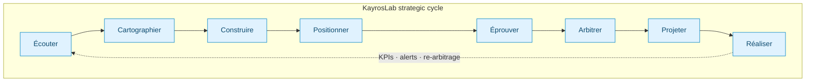
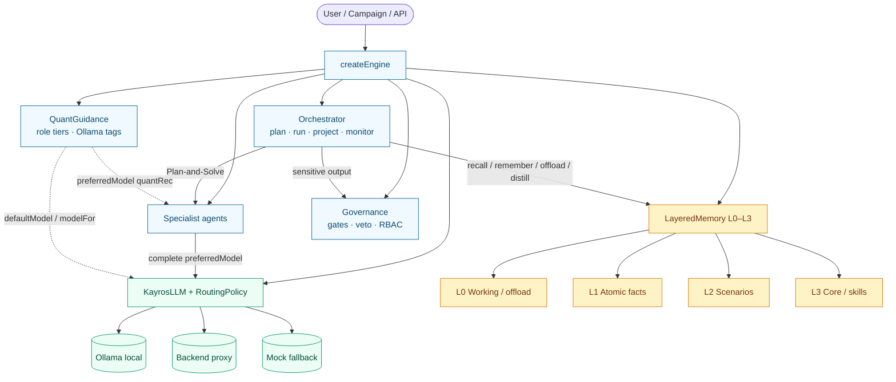
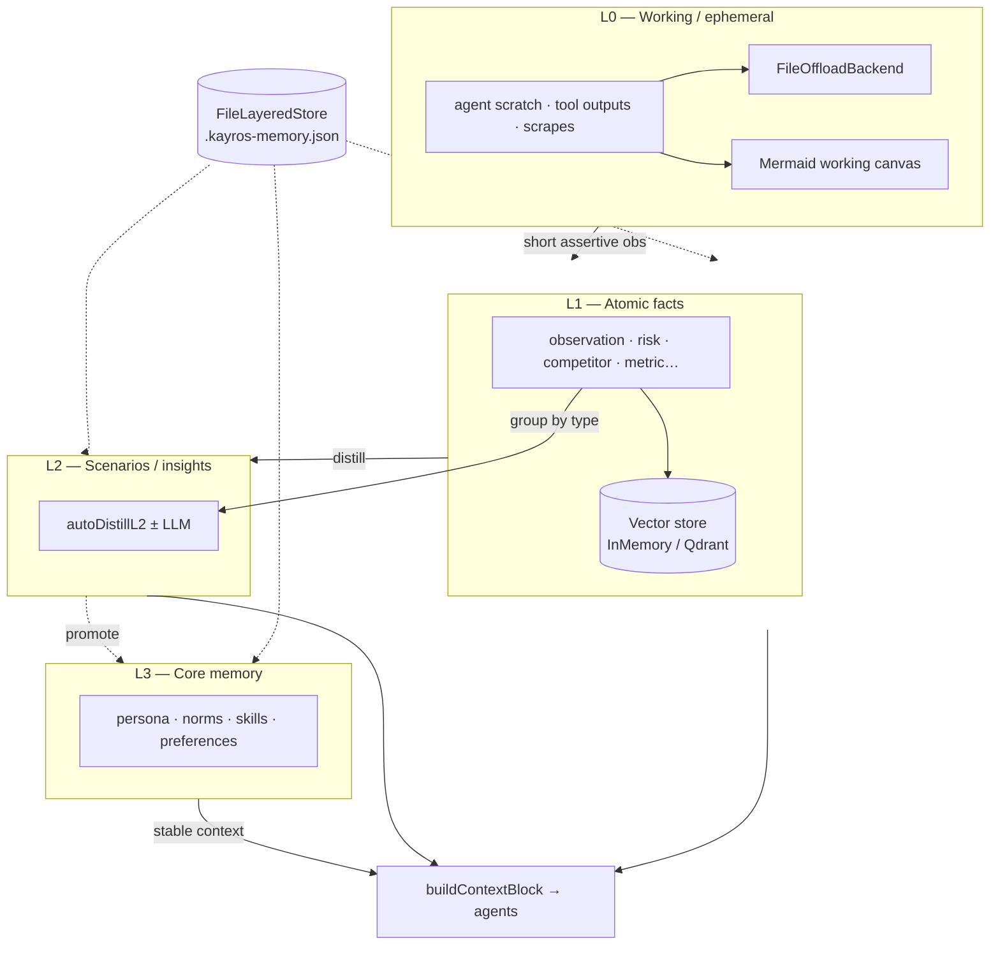
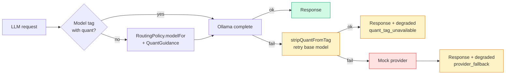

# KayrosLab

[](https://geoking2104.github.io/KayrosLab/)
[](https://geoking2104.github.io/KayrosLab/positionner-app/)
[](https://geoking2104.github.io/KayrosLab/kayroslab-complete-with-ai-agents.html)
[](https://geoking2104.github.io/KayrosLab/kayroslab-complete-with-ai-agents.html)
[](https://www.kayroslab.com)

**Du signal faible à la décision stratégique — gouvernée.**

KayrosLab est un **atelier d'idéation stratégique gouverné** qui transforme des signaux faibles en décisions robustes, challengées, arbitrées, projetées **puis exécutées et mesurées**. Architecture agentique (Plan-and-Solve + ReAct), mémoire stratifiée L0–L3, calculs déterministes, et Human-in-the-Loop structuré avec censeurs et droit de veto.

Ce n'est **pas** un modèle entraîné : c'est un **« LLM gouverné »** — un orchestrateur qui pilote de vrais LLM (Claude via backend, **Ollama local quant-aware**) derrière une couche de gouvernance.

---

## How it works — visual overview

### 1. Strategic cycle (8 steps + feedback loop)



| # | Step | Role | Output |
|---|---|---|---|
| 00 | **Recueillir** | Structured intake canvas | Comparable idea from entry |
| 01 | **Écouter** | Noise reduction, scoring, clustering | Qualified signals |
| 02 | **Cartographier** | Trend network, bridges (bisociation) | Graph + strategic bridges |
| 03 | **Construire** | Scenarios, Collision Mode, brief | Scenarios + hypotheses |
| 04 | **Positionner** | Web + GitHub/GitLab, ontology, gap analysis | Cytoscape graph + OWL export |
| 05 | **Éprouver** | Critic + Devil's Advocate + **Red Team** | Attack report, kill shots |
| 06 | **Arbitrer** | Weighted vote, human gate, veto | Go / No-Go / Revision |
| 07 | **Projeter** | Roadmap, resources, probabilistic foresight | Trajectory + loop to Écouter |
| 08 | **Réaliser** | Pilot → Deploy → Review | Tracked milestones, measured impact |

**Two orthogonal axes.** *Step* = where *execution* stands; *status* = where *decision* stands. Dormant states (`en_pause`, `consideration_future`, `non_poursuivi`) are reactivable.

---

### 2. Engine architecture (orchestrator · agents · memory · LLM)



**Runtime event stream** (`orchestrator.run`):

```text
start → recall → trace × N → offload? → distill? → synthesis → gate? → final
         └ quant snapshot          └ quant per agent
```

---

### 3. Layered memory (L0 → L3)



| Layer | Purpose | Persistence |
|---|---|---|
| **L0** | Working context, offloadable heavy payloads, Mermaid canvas | Optional files under `offloadRoot` |
| **L1** | Atomic facts with confidence, actors, sourceRefs | JSON + optional vectors |
| **L2** | Scenarios / insights (`autoDistill` heuristic or LLM) | JSON + optional vectors |
| **L3** | Persona, norms, skills (versioned, scoped) | JSON |

---

### 4. Quant-aware local path (Ollama) + soft fallback



| Option | Effect |
|---|---|
| `quant` | Global GGUF quant (default recommendation: **Q4_K_M**) |
| `roleQuant` | Per-agent override (Planner / Critic / Synthesizer → **Q5_K_M**) |
| `syncAvailableQuants` | Filter against live `ollama list` + **rebind** agent `preferredModel` |
| Soft fallback | quant tag → base tag → mock, with `response.degraded` metadata |

```bash
# Local probe
node core/quant-ollama-demo.mjs llama3.2 "Évaluer une offre B2B"
```

Details: **[core/OLLAMA.md](core/OLLAMA.md)** · **[core/README.md](core/README.md)**

---

## 🚀 Three entry points

| Page | Usage |
|---|---|
| **[`index.html`](index.html)** | Commercial site & enterprise offer |
| **[`kayroslab-complete-with-ai-agents.html`](kayroslab-complete-with-ai-agents.html)** | Reference app v0.3.0: positioning, campaigns, history, PDF, multi-idea, PWA |
| **[`frontend/positionning-app/`](frontend/positionning-app/)** | React competitive positioning (ontology, Cytoscape, OWL, query playground) |

---

## 🌟 What sets KayrosLab apart

| Criterion | Chat LLM | Innovation platform | **KayrosLab** |
|---|---|---|---|
| Structure | Conversation | Stage-gate | **Governed 8-step cycle** |
| Agents | One model | — | **Multi-agent** (Planner, Critic, Devil's Advocate, **Red Team**, Bisociateur, Synthesizer) |
| Memory | Session / flat | Tickets | **Layered L0–L3 + vector recall** |
| Numbers | LLM guesses | Manual entry | **Deterministic** (seeded Monte-Carlo, P10/P50/P90) |
| Decision | Informal | Vote | **Weighted vote instructs + veto decides** |
| Sovereignty | Cloud | Cloud | **Ollama local quant-aware** or proxy (keys never client-side) |

The aggregated vote **instructs** the decision; it does not replace it. Veto remains absolute; every refusal requires a reason.

Full specs: **[SPECIFICATIONS_FONCTIONNELLES.md](SPECIFICATIONS_FONCTIONNELLES.md)** (EF-01→87) · **[SPECIFICATIONS_TECHNIQUES.md](SPECIFICATIONS_TECHNIQUES.md)**.

---

## 🧠 Core `core/`

Zero-dependency engine (ESM, Node 20+), unit-tested, shared by the browser app and the backend. See **[core/README.md](core/README.md)**.

| Module | Role |
|---|---|
| `index.mjs` | `createEngine(opts)` — providers, memory, embeddings, governance, tools, orchestrator, **quantGuidance** |
| `orchestrator.mjs` | `plan()` / `run()` / `project()` / `monitorProjection()` — quant events, optional `autoDistill` |
| `kayros-llm.mjs` | LLM facade + Mock / Anthropic / Ollama / HttpBackend, circuit breaker, **quant soft-fallback** |
| `quant-guidance.mjs` · `quant-schema.mjs` · `quant-ui.mjs` | Role tiers, tag resolution, JSON Schema, timeline/canvas HTML helpers |
| `memory.mjs` · `memory-types.mjs` | SharedMemory + **LayeredMemory L0–L3**, offload, persistence, Mermaid canvas |
| `model.mjs` | Idea entity, orthogonal step × status, traced transitions |
| `repository.mjs` | InMemory / File stores, portfolio view + WIP counters |
| `auth.mjs` | scrypt, HMAC tokens, revocation, anti-bruteforce, multi-tenant |
| `intake.mjs` | Collect canvas → hypotheses + attack targets |
| `scorecard.mjs` · `evaluation.mjs` | Per-step grids, weighted vote, consensus |
| `campaign.mjs` · `comments.mjs` | Campaigns, moderation, threaded discussion |
| `projection.mjs` · `impact.mjs` · `execution.mjs` | Monte-Carlo, realized vs projected, Realize phase |
| `reporting.mjs` · `loop.mjs` | Dashboard, funnel, KPI loop Projeter → Écouter |
| `positionning/` | Competitive ontology module (scanners, gap analysis, OWL) |
| `governance.mjs` · `notify.mjs` | Gates, RBAC, veto, webhooks / email |
| `resilience.mjs` · `ki.mjs` · `tool-registry.mjs` | Retry + Circuit Breaker · Kayroslab Index · tools |

```js
import { createEngine } from './core/index.mjs';

const eng = createEngine({
  sovereignty: 'local',
  model: 'llama3.1:8b-instruct',
  quant: 'q4_K_M',
  roleQuant: { Planner: 'q5_K_M', Critic: 'q5_K_M', Synthesizer: 'q5_K_M' },
  syncAvailableQuants: true,
});

await eng.syncAvailableQuants; // rebind preferredModel from installed tags

const plan = await eng.orchestrator.plan('Lancer une offre B2B', {
  ideaId: 'idea-1',
  sovereignty: 'local',
});

for await (const ev of eng.orchestrator.run(plan, {
  governance: 'supervise',
  sovereignty: 'local',
  autoDistill: true,
})) {
  console.log(ev.type, ev.quant ?? '');
}
```

```bash
cd core && node --test
```

---

## 🔌 Backend

`backend/fastify/` (VPS/PaaS, reuses `core/`) and `backend/php/` (shared OVH proxy).

| Domain | Endpoints |
|---|---|
| Public demo | `POST /v1/demo/chat` · `POST /v1/demo/report-leads` · `POST /v1/demo/positionning/analyze` |
| LLM & tools | `POST /v1/llm` · `POST /v1/embed` · `GET /v1/tools` · `POST /v1/tools/call` |
| Auth | `POST /v1/auth/register\|login\|logout` · `GET /v1/auth/me` |
| Portfolio | `GET\|POST /v1/ideas` · `GET\|PATCH /v1/ideas/:id` · `GET /v1/portfolio` |
| Evaluation | `POST /v1/ideas/:id/votes` · `POST /v1/ideas/:id/score` |
| Campaigns | `GET\|POST /v1/campaigns` · `POST /v1/ideas/:id/moderate` |
| Governance | `POST /v1/ideas/:id/gates` · `POST /v1/gates/:id/resolve` |
| Projection & impact | `POST /v1/ideas/:id/projection` · `GET\|POST /v1/ideas/:id/impact` |
| Reporting | `GET /v1/reporting/dashboard` · `POST /v1/reporting/compare` |

**Safe by default.** Without `KAYROS_AUTH_SECRET`, protected routes return `503`. `tenantId` comes from the token, never the client. LLM keys stay server-side.

---

## 🛠️ Development

```bash
cd core && node --test
node core/quant-ollama-demo.mjs llama3.2
```

**Persistence** (atomic JSON): `KAYROS_USERS_FILE` (0600), `KAYROS_IDEAS_FILE`, `KAYROS_GATES_FILE`.
**Notifications**: `KAYROS_NOTIFY_WEBHOOK` or `KAYROS_SMTP_URL`. See `backend/fastify/.env.sample`.

**Demo lead capture**: full PDF/Markdown exports from the HTML app require a GDPR form; the backend emails the document via `POST /v1/demo/report-leads`.

**Public Positionner**: `POST /v1/demo/positionning/analyze` uses server-side `MISTRAL_API_KEY`; no hard-coded competitors in the UI.

---

## 🚢 Deployment

| Tier | Description | Status |
|---|---|---|
| **P0** | Standalone offline (mock) — autonomous HTML | ✅ |
| **P1** | Local sovereign — Ollama (LLM + embeddings + quant guidance), no data leaves the machine | ✅ |
| **P2** | Governed cloud — backend proxy holding keys (Fastify VPS or PHP shared) | 🔵 in progress |

**CI/CD**: `.github/workflows/deploy-vps-backend.yml` deploys `backend/fastify/` (SSH + PM2, port 8787).

**P2 go-live (ops):**
1. GitHub secrets: `VPS_SSH_USER`, `VPS_SSH_KEY`, `ANTHROPIC_API_KEY`.
2. VPS: nginx `api.kayroslab.com` → `localhost:8787` + DNS + TLS.
3. Persistence & notification env vars (see `.env.sample`).

---

## 📊 Functional coverage

| Scope | Requirements | State |
|---|---|---|
| Ideation process | EF-01 → EF-45 | ✅ implemented |
| Platform & collaboration | EF-46 → EF-87 | **39 done · 3 partial · 0 todo** |
| Positionner — competitive ontology | EF-88 → EF-101 | 🟢 collectors & gap analysis · 🔴 ontology UX expansion |

The 3 partials are intentional: file persistence vs shared multi-instance DB (EF-46), no dedicated UI action to reactivate a dormant idea (EF-58), incomplete filter facets (EF-55).

> ⚠️ “Done” means **unit-tested code**, not a full HTTP recipe against a live P2 server.

---

## 🗺️ Roadmap

| Phase | Goal | Status |
|---|---|---|
| v1–v4 | Prototype, agentic ReAct + Plan-and-Solve, resilience, vector memory | ✅ |
| v5 | Real “governed LLM” core (Planner LLM, governance, embeddings) | ✅ |
| v6 | Projeter + cyclic loop + probabilistic foresight | ✅ |
| v7 | Backends, auth, multi-user portfolio | ✅ |
| v8 | Downstream cycle (Réaliser) + portfolio reporting | ✅ |
| v9 | Collaboration: campaigns, moderation, comments, activity & digest | ✅ |
| v10 | **Layered memory L0–L3 + quant-aware local engine + soft fallback** | ✅ |
| v11 | Live recipe, shared multi-instance store, deeper Positionner ontology UX | 🔵 |

---

## 📬 Contact

**Geoffroy de La Tournelle** — Founder & Director, KayrosLab  
[geoffroydelatournelle@gmail.com](mailto:geoffroydelatournelle@gmail.com) · [LinkedIn](https://www.linkedin.com/in/gdelatournelle/)

---

## 🌐 GitHub Pages

**Positionner app:** [https://geoking2104.github.io/KayrosLab/positionner-app/](https://geoking2104.github.io/KayrosLab/positionner-app/)

Enable once: **Settings → Pages → Deploy from a branch → `gh-pages` / (root)**.

---

*KayrosLab — Transformer le bruit en stratégie gouvernée.*
