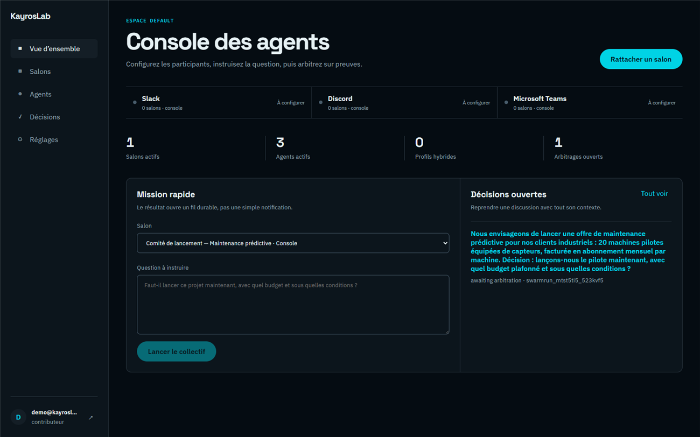
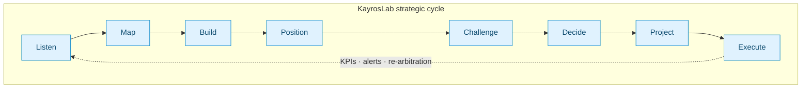
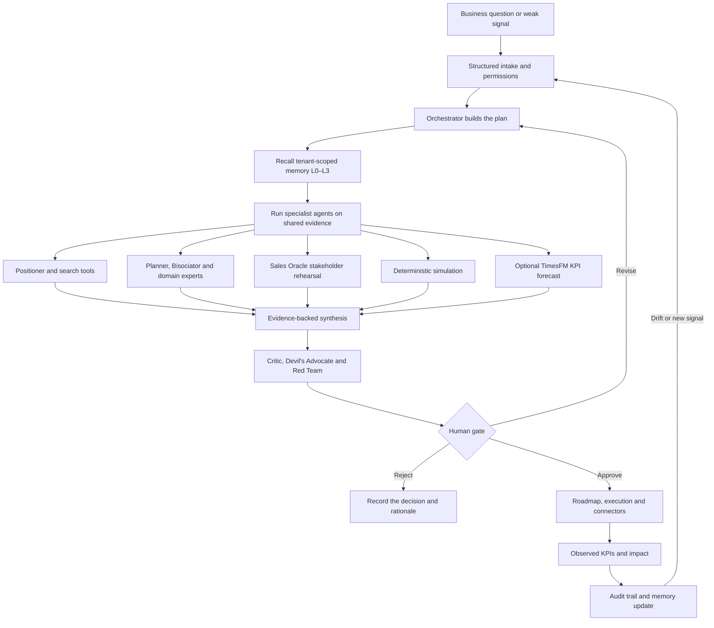
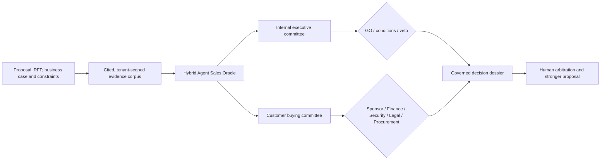
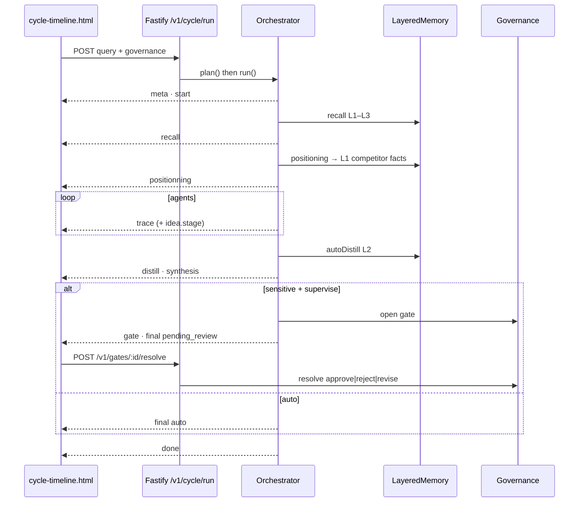
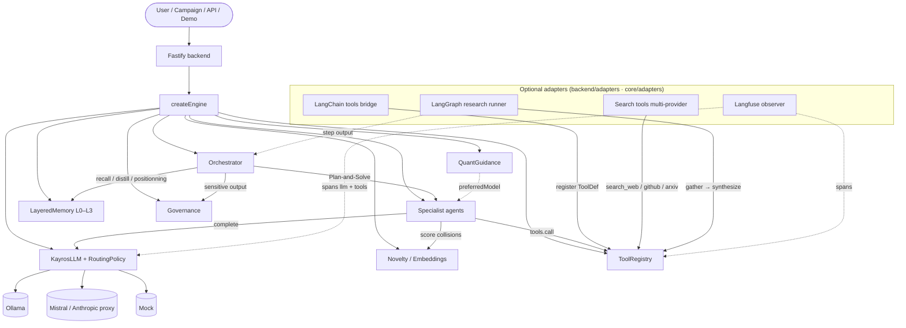
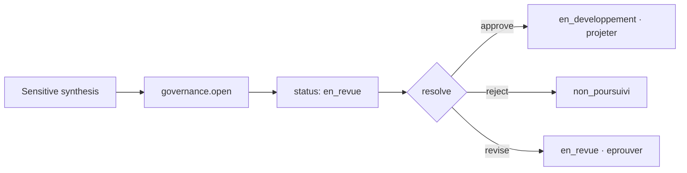

<div align="center">

# KayrosLab

**Crash-test your strategic decisions before the real world does.**

KayrosLab is a governed decision workshop: AI agents with opposing duties — finance, engineering,
legal, sales — investigate one real decision, consolidate their objections into a verdict, and a
human arbitrates with the evidence in hand. Ask from the web console, Slack, Microsoft Teams, or
Discord; every decision stays in a durable, audited dossier. Run it local or cloud — no scraped
profiles, no black box.

[](https://www.kayroslab.com)
[](https://www.kayroslab.com/kayroslab-complete-with-ai-agents.html)
[](https://geoking2104.github.io/KayrosLab/)
[](https://github.com/Geoking2104/KayrosLab/actions/workflows/deploy-positionning-pages.yml)
[](https://github.com/Geoking2104/KayrosLab/actions/workflows/core-tests.yml)
[](#license)

[Website](https://www.kayroslab.com) · [Console](https://www.kayroslab.com/console/) · [Live demo](https://www.kayroslab.com/kayroslab-complete-with-ai-agents.html) · [Whitepaper](https://www.kayroslab.com/whitepaper-kayroslab.html) · [Contact](mailto:contact@kayroslab.com)

</div>

<p align="center">
  
</p>

<p align="center">
  <sub><em>Verdicts stay consultative until a human arbitrates — every analysis, objection and condition stays in the dossier.</em></sub>
</p>

---

## What is KayrosLab?

A strategy can sound coherent in the meeting and still fail its first serious objection. Meetings
compress uncertainty into opinions, the strongest voice wins, and the numbers get retrofitted
afterwards. Nobody reconstructs why the decision was made — until it is too late to change it.

KayrosLab turns one decision into a governed operation. You state the question; a committee of
agents with opposing duties — a CFO, an engineer, a lawyer, a sales lead — investigates the
evidence, attacks each other's assumptions, and consolidates objections, conditions and a verdict:
**GO, conditional GO, or NO-GO**. The verdict stays consultative until the accountable human accepts
it, attaches conditions, or overrides a veto — and the whole dossier (claims, sources, numbers,
justifications) remains inspectable afterwards.

It is not a trained model, and it does not sell you a crystal ball. It is a **governed LLM stack**:
an orchestrator that drives real models — Ollama quant-aware on your machine, or Mistral / Claude
through the Fastify backend — behind layered memory, deterministic Monte-Carlo numbers, and human
gates with veto rights.

---

## Compose the committee.

*You don't pick one voice. You hear all of them.*

- **[Specialized agents](#complete-agent-operations) →** System agents (CFO, CTO, Legal…), custom experts and hybrid agents with consented stakeholder profiles — veto power included.
- **[Hybrid Agent Sales Oracle](#hybrid-agent-sales-oracle) →** Rehearse an executive decision or pressure-test a customer RFP against the buying committee before you answer.
- **[Novelty engine](#novelty--bisociation) →** Bisociation collisions ranked by embeddings, with a non-obvious Kayros Signature on each candidate.
- **[Positioner](#core-engine) →** Web, GitHub, GitLab and ArXiv scanning, ontology graph, competitor facts written to memory.

## Decide where the team works.

*Slack, Teams, Discord or the console — every channel becomes a decision room.*

- **[Agent console](#agent-console) →** Self-service workspace: rooms, agent registry, decision dossiers and Sales Oracle — no second login.
- **[Chat connectors](#backend-api) →** Slack (signatures, idempotence, Block Kit), Microsoft Teams (JWT RS256, Adaptive Cards), Discord (Ed25519).
- **[Durable dossiers](#agent-console) →** Postgres-backed decision threads you can resume with new evidence, from the same collective.
- **[Human arbitration](#how-it-works) →** Accept the consensus, pass under conditions, or override a veto — every action recorded.

## Keep the numbers honest.

*A forecast is a range — never a verdict.*

- **[Deterministic Monte-Carlo](#how-it-works) →** P10/P50/P90 from stated hypotheses; no number is invented.
- **[TimesFM 2.5](#backend-api) →** Optional KPI forecasting with uncertainty bands, tenant-scoped and labelled simulation.
- **[Epistemic tags](#core-engine) →** Observed, assumed or unknown — uncertainty travels with the claim.
- **[KPI drift](#core-engine) →** Reality diverging from the plan re-opens arbitration on its own.

## Stay inspectable.

*Your machines, your models, your audit trail.*

- **[Zero-dependency core](#core-engine) →** The decision engine runs on Node 20 with no npm dependencies.
- **[Layered memory](#memory-layers) →** L0–L3: working context, atomic facts, distilled scenarios, tenant norms.
- **[Governance](#gate--idea) →** Gates, RBAC, weighted votes and vetoes over an append-only audit trail.
- **[Local or cloud](#deployment) →** Ollama quant-aware locally, or governed cloud; JSON files or Postgres, per tenant.

---

## Where KayrosLab fits

| Criterion | Chat LLM | Innovation platform | **KayrosLab** |
|---|---|---|---|
| Structure | Conversation | Stage-gate | **Governed 8-step cycle** |
| Agents | One model | — | **Multi-agent** + Red Team + Bisociator |
| Memory | Session / flat | Tickets | **Layered L0–L3 + tenant scope** |
| Novelty | Implicit | Manual | **Embedding-ranked collisions + Kayros Signature** |
| Numbers | LLM guesses | Manual | **Deterministic** Monte-Carlo |
| Decision | Informal | Vote | **Vote instructs · veto decides** |
| Sovereignty | Cloud | Cloud | **Ollama quant-aware** or proxy |

| Category | Representative players | Where they excel | The gap KayrosLab fills |
|---|---|---|---|
| Innovation management suites | Brightidea · HYPE Innovation · ITONICS · Qmarkets · IdeaScale | Idea collection at scale, campaigns, stage-gate pipelines, impact tracking | Intelligence is organizational (workflow, scorecards), not governed multi-agent deliberation — no buyer-committee rehearsal, no veto mapping |
| Decision intelligence | Cloverpop and similar | Decision process structure, human+AI agents, decisions captured as a system of record | No adversarial rehearsal, no consented stakeholder simulation, no local sovereign deployment path |
| Chat LLM assistants | ChatGPT · Claude · Gemini | Fast drafting and one-model analysis | Session-only memory, no role boundaries, no evidence discipline, no gates or veto, no audit trail |
| Agent frameworks | LangChain / LangGraph · CrewAI · AutoGen | Build-your-own orchestration for dev teams | Governance, gates, console, memory and audit remain to be built; KayrosLab ships them — and hosts these frameworks as optional adapters |

**Position.** KayrosLab occupies the governed deliberation layer between conversation (chat LLMs),
collection (innovation suites) and custom builds (agent frameworks): role-bound agents, layered
memory L0–L3, deterministic numbers, human gates with veto — inspectable, deployable local or cloud.

---

## Get started

No heavy setup: create your workspace at **[kayroslab.com/console](https://www.kayroslab.com/console/)** —
self-service — and run your first committee from the browser. Or explore the
[public governed demo](https://www.kayroslab.com/kayroslab-complete-with-ai-agents.html) without an
account: semantic map, novelty-ranked exploration, full 8-agent cycle, PDF export.

<details>
<summary><b>Run the engine and the backend locally</b></summary>

<br/>

```bash
git clone https://github.com/Geoking2104/KayrosLab.git
cd KayrosLab/core && node --test          # zero-dependency decision core
node quant-ollama-demo.mjs llama3.2       # optional, needs Ollama

cd ../backend/fastify
cp .env.sample .env && npm install && node index.mjs   # http://localhost:8787
```

```js
import { createEngine } from './core/index.mjs';

const eng = createEngine({
  sovereignty: 'local',
  model: 'llama3.1:8b-instruct',
  quant: 'q4_K_M',
  syncAvailableQuants: true,
});

const plan = await eng.orchestrator.plan('Launch a B2B offer', { ideaId: 'idea-1' });
for await (const ev of eng.orchestrator.run(plan, {
  governance: 'auto',
  positionning: true,
  autoDistill: true,
  waitGate: false,
})) {
  console.log(ev.type, ev.idea ?? '');
}
```

Open `cycle-timeline.html?api=http://localhost:8787` for the live cycle view, seed a demo idea with
`node core/seed-demo.mjs`, and point the console at your backend.

</details>

Prerequisites: Node.js 20+. Optional: [Ollama](https://ollama.com) for local inference and
embeddings, Postgres for multi-instance persistence.

---

## Your first decision in ten minutes

**1. Open the console.** [kayroslab.com/console](https://www.kayroslab.com/console/) — create your
workspace; signup is self-service with a verified e-mail.

**2. Connect a channel (optional).** In **Réglages**, add Slack, Microsoft Teams or Discord
credentials (stored encrypted server-side) and bind a channel to a collective in mention-only or
always-on mode.

**3. Compose the committee.** In **Agents**, start from the system agents — CFO, CTO, Legal — and
add custom experts or consented hybrid profiles. Grant veto power where a blocking opinion matters.

**4. Ask, then arbitrate.** From **Mission rapide** or a bound channel, ask the real question. Each
agent answers with a verdict, strengths, objections, conditions and metrics; the collective returns
a consensus dossier. Accept it, pass it under conditions, or override a veto — the dossier keeps
the whole story.

Deeper walkthrough: [pitch-seed](docs/pitch-seed.md) · [specialized swarms](docs/specialized-agent-swarms.md)

---

## The strategic cycle



| # | Step | Domain code | Role | Output |
|---|---|---|---|---|
| 00 | **Intake** | `recueillir` | Structured intake canvas | Comparable idea |
| 01 | **Listen** | `ecouter` | Noise reduction, scoring, clustering | Qualified signals |
| 02 | **Map** | `cartographier` | Trend network, bisociation bridges | Graph + bridges |
| 03 | **Build** | `construire` | Scenarios, Collision Mode, brief | Scenarios + hypotheses |
| 04 | **Position** | Positioner | Web + GitHub/GitLab, ontology, gaps → **L1 facts** | Graph + OWL + L1 |
| 05 | **Challenge** | `eprouver` | Critic + Devil's Advocate + **Red Team** | Attack report |
| 06 | **Decide** | `arbitrer` | Weighted vote, human gate, veto | Go / No-Go / Revision |
| 07 | **Project** | `projeter` | Roadmap, resources, foresight | Trajectory + feedback loop |
| 08 | **Execute** | `realiser` | Pilot → Deploy → Review | Milestones + measured impact |

**Two orthogonal axes:** *stage* = execution progress; *status* = decision state. Dormant statuses
(`en_pause`, `consideration_future`, `non_poursuivi`) are **reactivable** via
`POST /v1/cycle/reactivate`.

---

## Complete agent operations

KayrosLab does not hand one prompt to one model. It turns a decision into a governed operation:
evidence is collected, agents receive bounded roles, tools add verifiable facts or calculations,
opposing views are reconciled, and a human approves the result before action.



| Operation | What the agents do | Control that remains human | Durable output |
|---|---|---|---|
| **Frame** | Convert the request into objectives, constraints, roles and a runnable plan | Confirm scope, permissions and sensitive actions | Intake record + execution plan |
| **Ground** | Recall authorized memory and gather external or uploaded evidence | Approve sources and profile use | Cited, tenant-scoped corpus |
| **Explore** | Generate options, map competitors and rank novel combinations | Select or reject candidate directions | Scenarios + positioning graph |
| **Rehearse** | Sales Oracle agents expose objections, veto paths and missing proof | Judge whether simulated feedback is useful | Objection matrix + evidence plan |
| **Quantify** | Run deterministic trajectories; optionally forecast observed KPI series with TimesFM | Choose assumptions and review high uncertainty | Scenarios + `SIMULATION` forecast bands |
| **Challenge** | Critic and Red Team attack claims, feasibility and risk | Resolve disagreements and vetoes | Attack report + decision packet |
| **Decide** | Aggregate votes and conditions without overriding governance | Approve, reject or request revision | Signed gate decision + rationale |
| **Execute and learn** | Build the roadmap, monitor KPIs and surface drift | Own delivery and re-arbitration | Milestones, impact readings and audit log |

TimesFM is deliberately one tool inside this loop. It forecasts statistically plausible KPI
trajectories from at least 20 ordered observations; it does not replace deterministic business
scenarios, agent judgment or the human gate.

---

## Hybrid Agent Sales Oracle

A hybrid agent combines a governed business role with an authorized stakeholder profile. The role
supplies explicit decision rules; the profile can supply consented communication preferences, DISC
traits, decision triggers and objection patterns. Personality simulation is opt-in per swarm and
never changes the requirement for human arbitration.


### Rehearse an executive decision

1. Upload the proposal, business case, metrics and constraints; every extracted claim keeps its source.
2. Compose a panel from built-in CFO, CTO, Legal, Risk and Operations agents, custom experts, or consented hybrids.
3. Run the cited corpus through `GO`, `CONDITIONAL_GO` and veto rules.
4. Review the friction map, requested evidence and simulated stakeholder reactions before the accountable executive decides.

### Pressure-test a customer RFP

1. Upload the RFP, response, pricing, security, contractual and delivery evidence into one controlled corpus.
2. Map the buying committee: sponsor, procurement, finance, security, legal, operations and technical evaluators.
3. Red-team the cited offer against each veto holder's explicit role rules and authorized decision triggers.
4. Generate an objection matrix, conditional-GO checklist, evidence plan, negotiation brief and executive narrative.



**Safeguards:** official connectors or authorized exports only; no LinkedIn scraping; explicit
consent and provenance; tenant isolation; no private-fact fabrication; simulated feedback is
labelled and cannot be presented as a real quote, endorsement or behavioral prediction.

### Integrated web tool

The [Hybrid Agent Sales Oracle workspace](https://www.kayroslab.com/console/) is embedded in the
agent console for provisioned customers — no second login, it reuses the console session:

1. Open the **Sales Oracle** tab in the [console](https://www.kayroslab.com/console/). The bearer token stays in browser memory only; it is never persisted to `localStorage`, cookies or the repository.
2. Select an existing tenant-scoped case or create an RFP, executive-decision, renewal or negotiation case.
3. Select PDF, DOCX, TXT, Markdown or CSV evidence. The browser computes SHA-256 locally, requests a short-lived signed URL, uploads directly to object storage, then asks the API to verify and queue ingestion.
4. Follow the active corpus and document states without exposing another tenant's cases.

The browser client is implemented in [`backend/web/public/assets/sales-oracle-tool.js`](backend/web/public/assets/sales-oracle-tool.js); API metadata and upload lifecycle remain in [`backend/fastify/routes/sales-oracle.mjs`](backend/fastify/routes/sales-oracle.mjs).

Direct browser uploads require the private S3-compatible bucket to allow `PUT` requests from the production origin. Example CORS policy:

```json
[
  {
    "AllowedOrigins": ["https://www.kayroslab.com"],
    "AllowedMethods": ["PUT"],
    "AllowedHeaders": ["content-type", "x-amz-checksum-sha256", "x-amz-meta-sha256"],
    "ExposeHeaders": ["etag", "x-amz-checksum-sha256"],
    "MaxAgeSeconds": 3600
  }
]
```

Configure the server-only `KAYROS_S3_*` variables from [`backend/fastify/.env.sample`](backend/fastify/.env.sample). The real `.env` remains ignored by Git.

See [docs/specialized-agent-swarms.md](docs/specialized-agent-swarms.md) for schemas, endpoints and examples.

---

## Agent console

The [agent console](https://www.kayroslab.com/console/) is the operational surface where governed
decisions run day to day — in production, with self-service workspaces.

**Flow:** connect your channels → bind rooms to a collective → instruct the question → the
collective answers → humans arbitrate → resume with new evidence.

1. **Create a workspace in self service** — signup with verified e-mail (30-minute reset links), tenant-scoped space and per-tenant agent registry.
2. **Connect and bind rooms** — Slack, Microsoft Teams or Discord credentials stored encrypted server-side (`KAYROS_CONNECTOR_ENCRYPTION_KEY` required), connectivity test included; each channel is bound to a stable collective in mention-only or always-on mode.
3. **Run the collective** — every question triggers individual agent analyses (verdict, strengths and opportunities, objections, required conditions, metrics) aggregated into a consensus dossier: `GO`, `CONDITIONAL_GO` or `NO_GO`.
4. **Arbitrate** — the verdict stays consultative until a human accepts the consensus, passes it under conditions, overrides a veto with justification, or requests re-evaluation; every action is recorded in the durable thread.
5. **Resume** — reply with new evidence or parameters to relaunch the same collective on the same dossier; Postgres-backed threads survive restarts and remain tenant-scoped.

| Console page | What it does |
|---|---|
| **Vue d'ensemble** (Overview) | Connection status, live metrics (rooms, active agents, hybrid profiles, pending arbitrations), quick mission launcher |
| **Salons** (Rooms) | Channels bound to collectives — mode, collective id, latest decision threads |
| **Agents** | Registry of system, custom and hybrid agents: mission, constraints, decision rules, provider/model, tools, veto power, consented Crystal Knows profile import. Literary personalities from public-domain authors (writers, philosophers) can be added from a curated, source-verified catalog |
| **Décisions** (Decisions) | Durable dossiers — analyses, objections, conditions, replies and arbitrations |
| **Sales Oracle** | Governed case workspace: create a case, upload the evidence corpus, follow ingestion — reuses the console session |
| **Réglages** (Settings) | Connector secrets encrypted at rest, connectivity tests, Crystal Knows capability state |

The console shares the governed runtime with the API and chat connectors: a decision opened in
Slack and continued in the console is one thread and one audit trail.

**Version en ligne : 3 salons par utilisateur et 3 agents construits par salon.** Les agents
d'auteur (personnalités bâties sur la somme des œuvres du domaine public) comptent dans cette
limite ; les sources intégrées sont Project Gutenberg, NosLivres/efele, Ebooks libres et gratuits,
Wikisource et l'annuaire Bookatomy.

---

## How it works

### Strategic cycle

See [The strategic cycle](#the-strategic-cycle) above — eight steps, two orthogonal axes
(stage × status), KPI feedback looping Execute back into Listen.

### Novelty & Bisociation

The Bisociator agent generates structured collisions (Framework + Mechanism + Proposal + Bridge).
When embeddings are available, collisions are scored and ranked:

- **Intra-batch diversity** — distance to other candidates in the same round
- **Memory distance** — distance to L1/L2 stored knowledge
- **Input distance** — distance to the original idea / constraints

Preferred embedding model order (soft fallback):

`qwen3-embedding:0.6b` → `bge-m3` → `mxbai-embed-large` → `nomic-embed-text` → Mock

Override with `KAYROS_EMBED_MODEL`.
See `core/novelty.mjs` and `core/embed-select.mjs`.

### Live cycle (SSE)



**Event stream:** `meta → start → recall → positionning → trace×N → offload? → distill? → synthesis → gate? → final → done`

### Engine architecture

KayrosLab separates a **zero-dependency decision core** from **optional periphery adapters**.
Adapters may call into the core (`ToolRegistry`, memory, LLM); they never replace governance,
gates, or the strategic cycle.



| Layer | Responsibility | Replaceable? |
|---|---|---|
| **Core** (`createEngine`, orchestrator, governance, L0–L3, novelty) | Decision, audit, sovereignty path | No |
| **ToolRegistry** | Declarative tools + gates for write side-effects | Extended only |
| **Adapters** | LangChain tools, LangGraph subgraphs, web search, Langfuse traces | Yes — optional peers |

See [docs/engine-architecture.md](docs/engine-architecture.md) and [backend/adapters/README.md](backend/adapters/README.md).

### Memory layers

| Layer | Purpose | Persistence |
|---|---|---|
| **L0** | Working context, offload, Mermaid canvas | Optional `offloadRoot` |
| **L1** | Atomic facts (+ **competitor** from Positioner) | JSON + vectors |
| **L2** | Scenarios (`autoDistill`) | JSON + vectors |
| **L3** | Persona, norms, skills (tenant / user scope) | JSON |

Promotion path: L0 → L1 → distill L2 → `POST /v1/memory/promote` → L3.

### Gate → idea



`POST /v1/gates/:gateId/resolve` with `{ decision, reason }` runs `applyGateResolution` and returns `{ resolution, idea }`.

### Quant-aware Ollama

Request → tagged model → Ollama. On failure: strip quant suffix and retry → mock fallback (response marked `degraded`).
Details: [core/OLLAMA.md](core/OLLAMA.md) · [core/README.md](core/README.md).

---

## Core engine

Path: [`core/`](core/) — ESM, Node 20+, **no npm dependencies** for the engine itself.

| Module | Role |
|---|---|
| `index.mjs` | `createEngine` — providers, memory, orchestrator, novelty injection |
| `orchestrator.mjs` | plan / run / project — recall, positioning→L1, distill, gates |
| `cycle-lifecycle.mjs` | Agent→stage, `applyGateResolution`, reactivate |
| `memory.mjs` · `memory-scope.mjs` · `memory-rank.mjs` | L0–L3, tenant hierarchy, ranking |
| `novelty.mjs` | Embedding-based novelty scoring & ranking of collisions |
| `embed-select.mjs` | Soft-fallback embedding model selection |
| `kpi-drift.mjs` | KPI time-series drift detection |
| `adapters/timesfm-forecast.mjs` | Zero-dependency TimesFM contract, validation and uncertainty policy |
| `adapters/*` | Optional: TimesFM, LangChain tools, LangGraph runner, search tools, Langfuse (peers; no core deps) |
| `positionning/` | Scanners, ontology, OWL, `to-l1`, graph builder |
| `agents/` | Specialist agents (Planner, Critic, Red Team, **Bisociateur**, …) |
| `connectors.mjs` | Slack / Teams adapters, account link, gate views |
| `account-link-store.mjs` · `account-link-service.mjs` | Durable Slack/Teams ↔ Kayros links |
| `connectors-motif.mjs` | Motif modal + post-resolve `chat.update` |
| `pg-store.mjs` | Optional multi-instance Postgres |
| `seed-demo.mjs` | Demo idea seed |
| `quant-guidance.mjs` | Role tiers, soft fallback |
| `governance.mjs` | Gates, RBAC, veto |
| `model.mjs` | Idea stage × status |

See **[core/README.md](core/README.md)** for API-level docs.

---

## Backend API

Path: [`backend/fastify/`](backend/fastify/) — reuses `core/`.

### Optional TimesFM KPI forecasts

When an idea has at least 20 ordered observations for one KPI, the authenticated
API can request a TimesFM 2.5 trajectory without adding Python dependencies to
`core/`:

```bash
curl -X POST https://api.kayroslab.com/v1/ideas/IDEA_ID/forecast \
  -H "Authorization: Bearer $KAYROS_JWT" \
  -H "Content-Type: application/json" \
  -d '{"kpi":"adoption","horizon":12}'
```

The response includes point forecasts, P10–P90 quantiles, an uncertainty ratio,
model provenance and a human-review flag. It is always a simulation. See
[`docs/TIMESFM_FORECASTING.md`](docs/TIMESFM_FORECASTING.md) for architecture,
deployment and limitations.

| Domain | Endpoints |
|---|---|
| **Cycle SSE** | `POST /v1/cycle/run` · `POST /v1/cycle/reactivate` · `GET /v1/cycle/status` |
| **Memory** | `GET\|POST /v1/memory/l3` · `GET /v1/memory/ideas/:id` · `POST /v1/memory/promote` · `POST /v1/memory/save` |
| **Positioning** | analyze, search, GitHub, ArXiv, OWL, `GET /v1/positionning/ontology` |
| **Governance** | `POST /v1/ideas/:id/gates` · `GET /v1/gates` · `POST /v1/gates/:id/resolve` |
| **Specialized swarms** | `GET\|POST /v1/swarm/agents` · `POST /v1/swarm/configurations` · `POST /v1/swarm/run` · `POST /v1/swarm/runs/:id/arbitrate` |
| **Hybrid profiles** | `POST /v1/swarm/agents/:agentId/personality/import` |
| **Sales Oracle documents** | `POST\|GET /v1/sales-oracle/cases` · `POST /v1/sales-oracle/cases/:id/documents/uploads` · `POST /v1/sales-oracle/cases/:id/documents/:documentId/complete` · document list/status |
| **TimesFM forecasts** | `GET /v1/forecast/status` · `POST /v1/ideas/:id/forecast` · `GET /v1/ideas/:id/forecasts` |
| **Developer Portal MCP** | `POST /mcp` — scoped Streamable HTTP tools, resources and prompt for agentic API consumers |
| **Agent Console** | `GET /v1/console/overview` · agents CRUD + Crystal import · connectors (configure / test) · rooms · threads · `POST /v1/console/threads/:threadId/arbitrate` |
| **Contact** | `POST /v1/contact` — public contact request (honeypot, per-IP rate limit, e-mail routed server-side) |
| **Auteurs du domaine public** | `GET /v1/literary/authors` · `GET /v1/literary/sources` · `GET /v1/literary/search?q=` — recherche temps réel (Gutenberg, NosLivres/efele, EbooksGratuits, Wikisource) · `POST /v1/literary/authors/:authorId/agent` · `POST /v1/literary/agents` — personnalité d'agent construite depuis la somme des œuvres du domaine public (txt/html/epub) + portrait |
| **Connectors** | Slack events + interactive · Discord `/kayros` · Teams Bot Framework messages · link tokens |
| LLM & tools | `POST /v1/llm` · `POST /v1/embed` |
| Auth | register / login / logout / me |
| Portfolio | ideas, portfolio, campaigns |
| Reporting | projection, impact |

---

## UI entry points

| File | Purpose |
|---|---|
| `kayroslab-complete-with-ai-agents.html` | **Public demo** — semantic map → novelty-ranked exploration → Kayros Signature → 8-agent governed cycle → export |
| `cycle-timeline.html` | Live SSE cycle visualisation |
| `portfolio-board.html` | Portfolio kanban |
| `ontology-explorer.html` / `ontology-panel.html` | Ontology graph (Cytoscape) |
| `index.html` / `index.fr.html` | Commercial landing |
| `frontend/positionning-app` | React Positioner application |
| `frontend/console-app` | **Production agent console** (served at `/console/`) — self-service signup, Slack/Teams/Discord room binding, agent registry with veto & hybrid profiles, durable decision dossiers, Sales Oracle tab, human arbitration |

---

## Configuration

See `backend/fastify/.env.sample` and `core/OLLAMA.md`.

Key environment variables:

| Variable | Role |
|---|---|
| `MISTRAL_API_KEY` | Backend LLM provider |
| `LINKEDIN_ACCESS_TOKEN` | Optional official LinkedIn authenticated-member profile import |
| `CRYSTALKNOWS_API_TOKEN` | Optional Crystal Knows profile import on eligible plans |
| `KAYROS_MCP_CLIENTS_JSON` | SHA-256 token digests, tenant bindings, scopes and optional expiries for MCP clients |
| `KAYROS_EMBED_MODEL` | Force embedding model (default: soft fallback chain) |
| `DATABASE_URL` | Optional Postgres |
| `OLLAMA_*` | Local quant-aware inference |
| `KAYROS_TIMESFM_ENABLED` | Enables the optional TimesFM adapter and deployment path |
| `KAYROS_TIMESFM_ENDPOINT` · `KAYROS_TIMESFM_TOKEN` | Loopback inference endpoint and shared service token |
| `TIMESFM_MODEL_ID` | TimesFM model identifier (default: `google/timesfm-2.5-200m-pytorch`) |

### Optional adapters (env)

| Variable | Purpose |
|---|---|
| `KAYROS_SEARCH_PROVIDER` | `auto` · `tavily` · `brave` · `google` · `duckduckgo` |
| `KAYROS_SEARCH_LIMIT` | Max results (default `5`) |
| `TAVILY_API_KEY` · `BRAVE_API_KEY` | Web search providers |
| `GOOGLE_API_KEY` · `GOOGLE_CX` | Google Programmable Search |
| `GITHUB_TOKEN` | GitHub search rate limits / private |
| `LANGFUSE_PUBLIC_KEY` · `LANGFUSE_SECRET_KEY` | LLM observability (no-op if unset) |
| `LANGFUSE_BASE_URL` | Cloud or self-hosted Langfuse |
| `LANGFUSE_RELEASE` | Release tag on traces |

Search tools register at backend boot (`registerSearchToolsFromEnv`). Langfuse attaches via `attachLangfuse(app)` when keys are present.

---

## Deployment

### GitHub Pages (static demos + Positioner)

Workflow: `.github/workflows/deploy-positionning-pages.yml`

- Triggers on push to `main` for the listed HTML / frontend paths
- Builds the React Positioner app
- Copies static demos (with **size guard** on the main demo HTML > 50 KB to prevent truncation)
- Publishes with `peaceiris/actions-gh-pages` (force orphan)

### OVH VPS (backend)

```bash
# On the VPS after setting DATABASE_URL in backend/fastify/.env
bash deploy/ovh-vps/deploy-backend.sh
bash deploy/ovh-vps/install-cron-backup.sh
```

CI: `.github/workflows/deploy-vps-backend.yml` (SSH + PM2, port **8787**).

| Tier | Description | Status |
|---|---|---|
| **P0** | Standalone offline (mock) | ✅ |
| **P1** | Local sovereign — Ollama quant-aware | ✅ |
| **P2** | Governed cloud — Fastify + optional Postgres | ✅ |

Also see [RUNBOOK.md](RUNBOOK.md).

---

## Development & tests

```bash
# Engine unit tests
cd core && node --test

# Targeted suites
node --test connectors-slack-deep.test.mjs connectors-motif.test.mjs positionning/ontology-graph.test.mjs
```

CI workflow: `.github/workflows/core-tests.yml`.

---

## Roadmap

| Phase | Goal | Status |
|---|---|---|
| v1–v9 | Prototype → collaboration | ✅ |
| v10 | Layered memory L0–L3 + quant soft-fallback | ✅ |
| v11 | SSE cycle · lifecycle · positioning→L1 · memory API · timeline · gate→idea | ✅ |
| v12 | Postgres multi-instance · ontology UX · portfolio · seed/pitch | ✅ |
| v13 | Slack deepen (signature, idempotence) · ontology Cytoscape graph | ✅ |
| v14 | Persist account links · motif modal · message update · ontology embed panel | ✅ |
| **v15** | **Embedding novelty ranking · Kayros Signature · public demo ranking UI** | ✅ |
| **v16** | Engine novelty API · KPI drift · Discord scaffold · **optional adapters** (LangChain tools, LangGraph research, multi-provider search, Langfuse) · demo ontology/Mistral wiring | ✅ |
| **v17** | **Teams adapter complet** (JWT RS256 Azure Bot, JWKS cache, Adaptive Cards, gate/EF-20, idempotence, route interactive, envoi proactif bot + webhook) | ✅ |
| **v18** | **Engine/adapters split + governed intelligence layers** (zero-dep `core/`, optional `core/adapters/` + `backend/adapters/`, P0–P4 control layers, decision packet surface) · CI GitHub Actions (core + backend + i18n) | ✅ |
| **v19** | **Specialized swarms + Hybrid Agent Sales Oracle** — system/custom/hybrid composition, personality simulation, official profile imports, veto-aware executive and buyer-committee rehearsal | ✅ |
| **v20** | **Governed TimesFM forecasting** — isolated model service, P10–P90 uncertainty, tenant-scoped snapshots and mandatory human review for wide intervals | ✅ |
| **v21** | **Governed agent console in production** — self-service signup, encrypted connector secrets, Slack/Teams/Discord room binding, Postgres-backed durable decision threads with human arbitration | ✅ |

---

## Documentation

| I want to… | Start here |
|---|---|
| Understand the engine modules and API | [core/README.md](core/README.md) · [engine architecture](docs/engine-architecture.md) |
| Run local, quant-aware inference | [core/OLLAMA.md](core/OLLAMA.md) |
| Operate in production | [RUNBOOK.md](RUNBOOK.md) |
| Compose swarms, hybrid agents and Sales Oracle cases | [docs/specialized-agent-swarms.md](docs/specialized-agent-swarms.md) |
| Connect Codex, Claude Code or Cursor | [Developer Portal MCP](docs/developer-portal-mcp.md) |
| Read the functional and technical specs | [SPECIFICATIONS_FONCTIONNELLES.md](SPECIFICATIONS_FONCTIONNELLES.md) · [SPECIFICATIONS_TECHNIQUES.md](SPECIFICATIONS_TECHNIQUES.md) |
| Follow the Slack / Teams / Discord product thesis | [SPECIFICATIONS_CONNECTEURS_CHAT.md](SPECIFICATIONS_CONNECTEURS_CHAT.md) |
| Use the optional adapters | [backend/adapters/README.md](backend/adapters/README.md) |
| Understand TimesFM forecasting | [docs/TIMESFM_FORECASTING.md](docs/TIMESFM_FORECASTING.md) |
| Run the demo end to end | [docs/pitch-seed.md](docs/pitch-seed.md) |
| Track releases | [CHANGELOG.md](CHANGELOG.md) |
| Dig into past iterations | [docs/v13-slack-ontology.md](docs/v13-slack-ontology.md) · [docs/v14-slack-ontology.md](docs/v14-slack-ontology.md) |

---

## Why "KayrosLab"?

**Kairos** (καιρός) is ancient Greek for the opportune moment — not the time on the clock, but the
fleeting instant when conditions align and acting makes the difference. Chronos tells you it is
Tuesday; kairos tells you it is time.

Most organisations decide on chronos: the quarterly committee, the roadmap review, the loudest
opinion. KayrosLab exists to find the kairos in your evidence — and to tell you, with objections and
numbers attached, whether the moment is now, now under conditions, or not yet. The lab in the name
is the governed workshop where that question gets rehearsed before reality runs the experiment.

The longer narrative lives in the [whitepaper](https://www.kayroslab.com/whitepaper-kayroslab.html).

---

## Contact

**Geoffroy de La Tournelle** — Founder & Director, KayrosLab
[geoffroydelatournelle@gmail.com](mailto:geoffroydelatournelle@gmail.com) · [LinkedIn](https://www.linkedin.com/in/gdelatournelle/)

---

## License

Proprietary — © KayrosLab / Geoffroy de La Tournelle. All rights reserved unless otherwise stated in writing.

---

*KayrosLab — Turning noise into governed strategy.*
