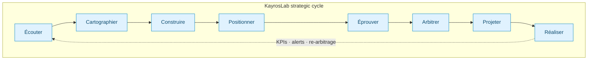
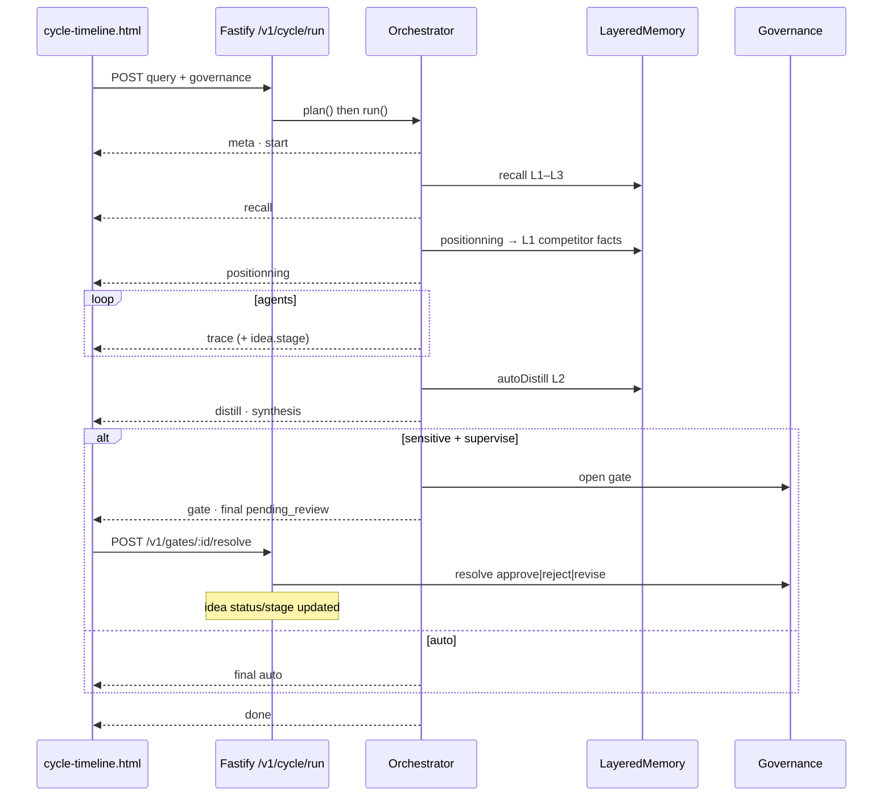
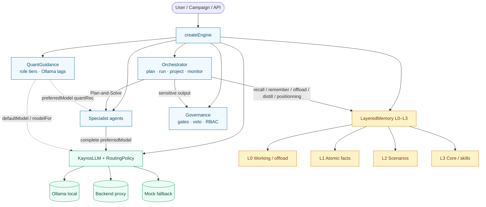
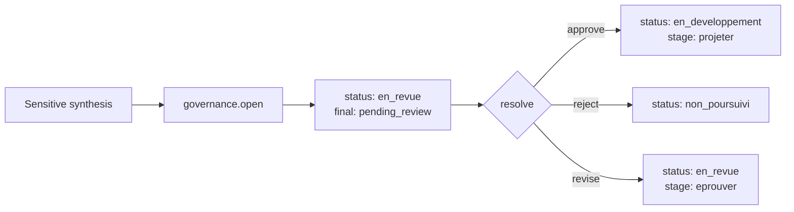
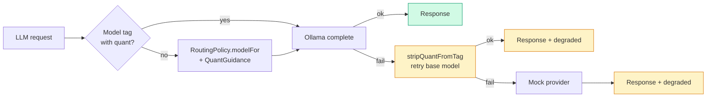

# KayrosLab

[](https://geoking2104.github.io/KayrosLab/)
[](https://geoking2104.github.io/KayrosLab/positionner-app/)
[](https://geoking2104.github.io/KayrosLab/kayroslab-complete-with-ai-agents.html)
[](./cycle-timeline.html)
[](https://geoking2104.github.io/KayrosLab/kayroslab-complete-with-ai-agents.html)
[](https://www.kayroslab.com)

**Du signal faible à la décision stratégique — gouvernée.**

KayrosLab est un **atelier d'idéation stratégique gouverné** qui transforme des signaux faibles en décisions robustes, challengées, arbitrées, projetées **puis exécutées et mesurées**. Architecture agentique (Plan-and-Solve + ReAct), mémoire stratifiée L0–L3, calculs déterministes, et Human-in-the-Loop structuré avec censeurs et droit de veto.

Ce n'est **pas** un modèle entraîné : c'est un **« LLM gouverné »** — un orchestrateur qui pilote de vrais LLM (Claude via backend, **Ollama local quant-aware**) derrière une couche de gouvernance.

---

## How it works — visual overview

### 1. Strategic cycle (8 steps + feedback loop)



| # | Step | Role | Output |
|---|---|---|---|
| 00 | **Recueillir** | Structured intake canvas | Comparable idea from entry |
| 01 | **Écouter** | Noise reduction, scoring, clustering | Qualified signals |
| 02 | **Cartographier** | Trend network, bridges (bisociation) | Graph + strategic bridges |
| 03 | **Construire** | Scenarios, Collision Mode, brief | Scenarios + hypotheses |
| 04 | **Positionner** | Web + GitHub/GitLab, ontology, gap analysis → **L1 competitor facts** | Cytoscape + OWL + L1 |
| 05 | **Éprouver** | Critic + Devil's Advocate + **Red Team** | Attack report, kill shots |
| 06 | **Arbitrer** | Weighted vote, human gate, veto | Go / No-Go / Revision |
| 07 | **Projeter** | Roadmap, resources, probabilistic foresight | Trajectory + loop to Écouter |
| 08 | **Réaliser** | Pilot → Deploy → Review | Tracked milestones, measured impact |

**Two orthogonal axes.** *Stage* = where *execution* stands; *status* = where *decision* stands. Dormant states (`en_pause`, `consideration_future`, `non_poursuivi`) are **reactivable** (`POST /v1/cycle/reactivate`).

---

### 2. Live governed cycle (SSE)



**Event stream:**

```text
meta → start → recall → positionning → trace×N → offload? → distill?
     → synthesis → gate? → final → done
```

Each event may carry `idea: { stage, status }` (lifecycle sync).

Open **[`cycle-timeline.html`](cycle-timeline.html)** (`?api=http://localhost:8787`) for the live UI: stage rail, memory inspector, L2→L3 promote.

---

### 3. Engine architecture



---

### 4. Layered memory (L0 → L3)


| Layer | Purpose | Persistence |
|---|---|---|
| **L0** | Working context, offload, Mermaid canvas | Optional `offloadRoot` |
| **L1** | Atomic facts (+ **competitor** from positionning) | JSON + vectors |
| **L2** | Scenarios (`autoDistill`) | JSON + vectors |
| **L3** | Persona, norms, skills (scoped tenant/user) | JSON |

**Memory API**

| Method | Path | Role |
|---|---|---|
| `GET` | `/v1/memory/l3` | List core norms |
| `POST` | `/v1/memory/l3` | Upsert L3 |
| `GET` | `/v1/memory/ideas/:ideaId` | Inspector L0–L3 |
| `POST` | `/v1/memory/promote` | L2 → L3 |
| `POST` | `/v1/memory/save` | Force disk persist |

---

### 5. Gate → idea (Human-in-the-Loop)



`POST /v1/gates/:gateId/resolve` with `{ decision: "approve"|"reject"|"revise", reason }` updates the idea via `applyGateResolution` and returns `{ resolution, idea }`.

---

### 6. Quant-aware local path (Ollama) + soft fallback



Details: **[core/OLLAMA.md](core/OLLAMA.md)** · **[core/README.md](core/README.md)**

---

## 🚀 Entry points

| Page | Usage |
|---|---|
| **[`index.html`](index.html)** | Commercial site & enterprise offer |
| **[`kayroslab-complete-with-ai-agents.html`](kayroslab-complete-with-ai-agents.html)** | Reference app: positioning, campaigns, PDF, PWA |
| **[`cycle-timeline.html`](cycle-timeline.html)** | **Live SSE cycle** — stage rail, positionning, memory inspect, promote L2 |
| **[`frontend/positionning-app/`](frontend/positionning-app/)** | React competitive positioning |

---

## 🌟 What sets KayrosLab apart

| Criterion | Chat LLM | Innovation platform | **KayrosLab** |
|---|---|---|---|
| Structure | Conversation | Stage-gate | **Governed 8-step cycle** |
| Agents | One model | — | **Multi-agent** + Red Team |
| Memory | Session / flat | Tickets | **Layered L0–L3 + tenant scope** |
| Numbers | LLM guesses | Manual | **Deterministic** Monte-Carlo |
| Decision | Informal | Vote | **Vote instructs + veto decides** |
| Sovereignty | Cloud | Cloud | **Ollama quant-aware** or proxy |

---

## 🧠 Core `core/`

Zero-dependency engine (ESM, Node 20+). See **[core/README.md](core/README.md)**.

| Module | Role |
|---|---|
| `index.mjs` | `createEngine` — providers, memory, quant, orchestrator |
| `orchestrator.mjs` | plan / run / project — recall, **positionning→L1**, distill, gates |
| `cycle-lifecycle.mjs` | Agent→stage, **applyGateResolution**, reactivate |
| `memory.mjs` · `memory-scope.mjs` · `memory-rank.mjs` | L0–L3, tenant hierarchy, ranking |
| `positionning/to-l1.mjs` | Gap analysis → competitor L1 facts |
| `quant-guidance.mjs` | Role tiers, soft fallback |
| `governance.mjs` | Gates, RBAC, veto |
| `model.mjs` | Idea stage × status |

```js
import { createEngine } from './core/index.mjs';

const eng = createEngine({
  sovereignty: 'local',
  model: 'llama3.1:8b-instruct',
  quant: 'q4_K_M',
  syncAvailableQuants: true,
});

const plan = await eng.orchestrator.plan('Lancer une offre B2B', { ideaId: 'idea-1' });
for await (const ev of eng.orchestrator.run(plan, {
  governance: 'auto',
  positionning: true,
  autoDistill: true,
  waitGate: false,
})) {
  console.log(ev.type, ev.idea ?? '');
}
```

```bash
cd core && node --test
```

---

## 🔌 Backend

`backend/fastify/` reuses `core/`.

| Domain | Endpoints |
|---|---|
| **Cycle SSE** | `POST /v1/cycle/run` · `POST /v1/cycle/reactivate` · `GET /v1/cycle/status` |
| **Memory** | `GET\|POST /v1/memory/l3` · `GET /v1/memory/ideas/:id` · `POST /v1/memory/promote` · `POST /v1/memory/save` |
| LLM & tools | `POST /v1/llm` · `POST /v1/embed` · tools |
| Auth | register / login / logout / me |
| Portfolio | ideas, portfolio, campaigns |
| **Governance** | `POST /v1/ideas/:id/gates` · `GET /v1/gates` · `POST /v1/gates/:id/resolve` |
| Projection & reporting | projection, impact, dashboard |

**Safe by default.** Without `KAYROS_AUTH_SECRET`, protected routes return `503`. `tenantId` from token only.

```bash
cd backend/fastify && npm install && node index.mjs
# open cycle-timeline.html?api=http://localhost:8787
```

---

## 🛠️ Development

```bash
cd core && node --test
node core/quant-ollama-demo.mjs llama3.2
```

Persistence: `KAYROS_USERS_FILE`, `KAYROS_IDEAS_FILE`, `KAYROS_GATES_FILE`, `KAYROS_MEMORY_FILE`.  
See `backend/fastify/.env.sample`.

---

## 🚢 Deployment

| Tier | Description | Status |
|---|---|---|
| **P0** | Standalone offline (mock) | ✅ |
| **P1** | Local sovereign — Ollama quant-aware | ✅ |
| **P2** | Governed cloud — Fastify proxy | 🔵 |

CI: `.github/workflows/deploy-vps-backend.yml` (SSH + PM2, port 8787).

---

## 🗺️ Roadmap

| Phase | Goal | Status |
|---|---|---|
| v1–v9 | Prototype → collaboration | ✅ |
| v10 | Layered memory L0–L3 + quant soft-fallback | ✅ |
| v11 | **SSE cycle · idea lifecycle · positionning→L1 · memory API · timeline UI · gate→idea** | ✅ |
| v12 | Shared multi-instance store, deeper ontology UX | 🔵 |

---

## 📬 Contact

**Geoffroy de La Tournelle** — Founder & Director, KayrosLab  
[geoffroydelatournelle@gmail.com](mailto:geoffroydelatournelle@gmail.com) · [LinkedIn](https://www.linkedin.com/in/gdelatournelle/)

---

*KayrosLab — Transformer le bruit en stratégie gouvernée.*
