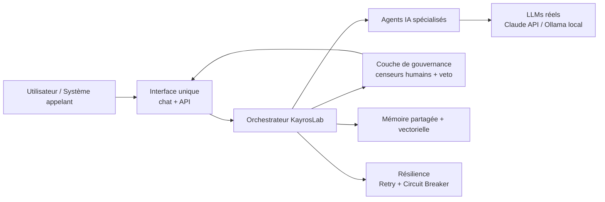
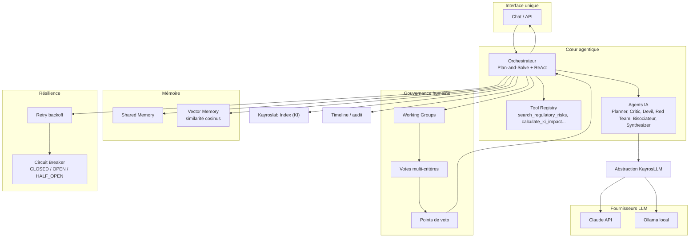
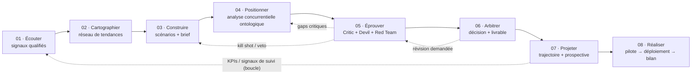
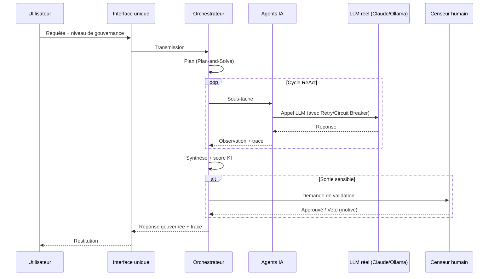

# KayrosLab — Spécifications Fonctionnelles

> **Du Signal Faible à la Décision Stratégique — Atelier d'Idéation Agentique Hybride, vers un « LLM gouverné ».**

| | |
|---|---|
| **Document** | Spécifications fonctionnelles (SFD) |
| **Version** | 0.3 — v0.3.0 features intégrées, document validé |
| **Date** | 23 juillet 2026 |
| **Statut** | 🟢 Validé |
| **Auteur** | Geoffroy de La Tournelle — Founder & Director, KayrosLab |
| **Dépôt** | https://github.com/Geoking2104/KayrosLab |
| **Audience** | Mixte : COMEX / produit **et** équipe technique |
| **Périmètre** | Système **cible** (orchestrateur + agents IA + censeurs humains + exposition « LLM gouverné »), fondé sur l'existant du dépôt et des prototypes |

**Convention de lecture.** Chaque fonctionnalité est qualifiée :
`🟢 Existant` (codé dans un artefact) · `🟠 Partiel` (simulé / maquetté) · `🔵 Cible` (à construire). Les identifiants d'exigences sont de la forme `EF-XX` (exigence fonctionnelle) et `US-XX` (user story).

---

## 0. Résumé exécutif

KayrosLab est un **atelier d'idéation stratégique gouverné** qui transforme des signaux faibles en décisions robustes via un processus traçable et **cyclique en 8 étapes** (Écouter → Cartographier → Construire → **Positionner** → Éprouver → Arbitrer → Projeter → Réaliser, qui reboucle sur Écouter). Sa singularité par rapport à un LLM conversationnel classique tient à trois piliers :

1. **Un collectif d'agents IA spécialisés** (Planner, Critic, Devil's Advocate, Red Team, Bisociateur, Synthesizer) plutôt qu'un modèle unique.
2. **Un orchestrateur** qui planifie, séquence et arbitre les agents (paradigme *Plan-and-Solve + ReAct*) avec mémoire partagée et vectorielle.
3. **Des censeurs humains** (Human-in-the-Loop structuré) disposant de **droits de validation et de veto** à des points de contrôle définis.

**L'objectif de transformation** — « faire de KayrosLab un LLM » — est précisé dans ce document comme la construction d'un **« LLM gouverné »** : un produit agentique qui **orchestre de vrais LLMs** (Claude via API, Ollama en local) derrière une couche de gouvernance et expose une **interface unique**. KayrosLab ne devient pas un modèle entraîné ; il devient un **système d'IA composite gouverné** qui *se comporte* comme un assistant expert, mais **traçable, résilient et arbitré par des humains**.

---

## 1. Contexte & Vision

### 1.1 Positionnement

Les LLMs classiques (ChatGPT, Claude, Gemini) génèrent du texte de façon linéaire, sans mémoire durable de l'idée, sans contradiction organisée, ni gouvernance humaine formalisée. KayrosLab industrialise un **processus d'idéation** dans lequel l'IA est un collaborateur au sein d'un dispositif contrôlé.

### 1.2 Objectif de transformation : le « LLM gouverné »

> **Définition retenue (validée).** Un **LLM gouverné** = une interface unique (chat/API) adossée à un orchestrateur qui décompose la demande, mobilise des agents IA spécialisés s'appuyant sur de vrais LLMs, applique des garde-fous de résilience, et **soumet les sorties sensibles à des censeurs humains** avant restitution.

**Ce que c'est :** un système agentique composite, souverain (LLM local possible), traçable et arbitré.
**Ce que ce n'est pas :** un modèle de fondation entraîné par KayrosLab, ni un simple wrapper d'API sans gouvernance.



**Objectifs mesurables (cibles proposées, à arbitrer avec le COMEX) :**

| Objectif | Indicateur | Cible |
|---|---|---|
| Robustesse des idées | Score KI moyen des idées arbitrées | ≥ 7,5 / 10 |
| Gouvernance effective | % de décisions sensibles passées par un censeur humain | 100 % |
| Traçabilité | % d'outputs agents horodatés et rattachés à une idée | 100 % |
| Souveraineté | Fonctionnement complet en LLM local (Ollama) sans cloud | Oui/Non |
| Résilience | % d'appels LLM récupérés par retry/fallback | ≥ 95 % |

---

## 2. Cartographie de l'existant

| Artefact | Emplacement | Rôle réel | Qualification |
|---|---|---|---|
| `kayroslab-complete-with-ai-agents.html` | Dépôt | **Fichier de référence unique v0.3.0** : Export PDF, Campaigns/Hackathons, History, Settings, Slack Webhooks, Multi-idea, Onboarding, PWA | 🟢 (v0.3.0) |
| `kayroslab_standalone.html` (163 Ko) | Prototype local (mai) | App la plus riche fonctionnellement : workflow 5 étapes, Working Groups (HIL), roundtable, livrables/PDF, ROI, feed — **source à ré-intégrer** dans le fichier de référence | 🟢 / 🟠 |
| `kayroslab-enhanced-future-proofing.html` | Dépôt | Variante Future Proofing + Collision Mode — **retiré** (nettoyage v0.3.0) | 🗑️ Retiré |
| `kayroslab-complete-updated.html` | Dépôt | ~~Placeholder vide~~ — **supprimé** (décision actée) | 🗑️ Retiré |
| `Kayros_standalone.html` | Prototype local | Landing / pricing (marketing) | Hors périmètre app |

> **Décision actée (produit).** Le badge « Open in Browser » pointe désormais vers `kayroslab-complete-with-ai-agents.html`, désigné **fichier de référence unique**. Le placeholder est supprimé. Les fichiers legacy (`enhanced-future-proofing`, `portfolio`, `reference`) ont été retirés. Les fonctions du prototype 163 Ko (workflow 5 étapes complet) restent à fusionner — c'est un lot d'ingénierie identifié au backlog (§10).

**Synthèse Existant vs Cible (macro) :**

| Domaine | Existant | Cible |
|---|---|---|
| Processus 5 étapes | 🟢 Écran par étape (163 Ko) | 🔵 Piloté par l'orchestrateur, transitions gouvernées |
| Agents IA | 🟠 Planner/Critic/Bisociateur scriptés | 🔵 Agents réels (LLM) : + Devil's Advocate, Red Team, Synthesizer |
| Orchestrateur | ❌ | 🔵 Plan-and-Solve + ReAct, Tool Registry |
| Censeurs humains | 🟠 Working Groups, votes, tâches | 🔵 Rôles + droits de veto formalisés aux gates |
| Mémoire | 🟠 localStorage | 🔵 Shared Memory + Vector Memory (recherche sémantique) |
| LLM réels | 🟠 Délégation simulée | 🔵 Claude API + Ollama, abstraction `KayrosLLM` |
| Résilience | ❌ | 🔵 Retry backoff + Circuit Breaker |
| Exposition « LLM gouverné » | ❌ | 🔵 Interface/endpoint unique |
| **Export PDF** | 🟢 Print-based report (header, KI, concurrents, gaps, ontologie) | 🔵 Export natif avec templates |
| **Campaigns / Hackathons** | 🟢 Création/édition, countdown, soumission d'idées, leaderboard, Close/Reopen | 🔵 Notifications push réelles |
| **History** | 🟢 Auto-save, search, delete, restore, compare (KI, 14 dimensions, Δ) | 🔵 Sync cloud |
| **Settings** | 🟢 Theme (Light/Dark), Locale (FR/EN), Gap Threshold (slider 1–20), API Key (password) | 🔵 Profils utilisateur persistés |
| **Slack Webhooks** | 🟢 Block Kit formatting, auto-send toggle, manual share, test webhook | 🔵 Teams / Discord |
| **Multi-idea Analysis** | 🟢 Textarea batch (≤10), concurrency 3, progress bar, ranked results, winner highlight | 🔵 Analyse illimitée |
| **Onboarding Tour** | 🟢 7 adaptive steps, highlight + tooltip, localStorage | — |
| **PWA** | 🟢 Manifest (standalone, #D83B01), Service Worker (cache-first), icons 192/512, apple-meta | 🔵 Offline-first complet |

---

## 3. Acteurs & rôles

### 3.1 Agents IA spécialisés

| Agent | Fonction | Entrée | Sortie | Statut |
|---|---|---|---|---|
| **Planner** | Décompose la demande en sous-tâches, choisit les outils/agents | Objectif d'idée, contexte | Plan structuré | 🟠→🔵 |
| **Critic** | Identifie faiblesses, biais, angles morts | Proposition | Liste de critiques priorisées | 🟠→🔵 |
| **Devil's Advocate** | Conteste systématiquement l'hypothèse dominante | Scénario retenu | Contre-arguments | 🔵 |
| **Red Team** | Attaques offensives + *kill shots* pour tester la robustesse | Idée challengée | Rapport d'attaque + vulnérabilités | 🔵 |
| **Bisociateur** | Génère des idées originales par collision de concepts distants | 2+ concepts | Idées bisociatives | 🟠→🔵 |
| **Synthesizer** | Consolide débats et versions en une synthèse arbitrable | Timeline, contributions | Synthèse + recommandations | 🟠→🔵 |
| **Connecteurs externes** | Délégation à un LLM tiers (Claude/GPT/Gemini/DeepSeek) comme « compétence » | Sous-tâche | Réponse + coût/tokens | 🟠 (simulé) |

### 3.2 Orchestrateur

Composant central qui : (a) reçoit la demande via l'interface unique ; (b) établit un **plan** (Plan-and-Solve) ; (c) exécute un cycle **ReAct** (raisonnement ↔ action outil ↔ observation) ; (d) mobilise les agents et la mémoire ; (e) applique la résilience ; (f) déclenche les **gates de gouvernance** humaine ; (g) restitue une réponse tracée. `🔵 Cible`.

### 3.3 Censeurs humains (Human-in-the-Loop)

| Rôle humain | Responsabilité | Droit de veto | Point d'intervention |
|---|---|---|---|
| **Arbitre / COMEX** | Décision finale, priorisation ; validation roadmap/budget & jalons futurs | ✅ Oui | Étapes 5 (Arbitrer) & 6 (Projeter) |
| **Expert métier** | Validation de pertinence sectorielle | ⚠️ Conditionnel | Étapes 3–4 |
| **Red Team humaine** | Challenge final avant décision ; scénario adverse projeté | ⚠️ Alerte bloquante | Étapes 4 & 6 |
| **Facilitateur** | Anime le processus, arbitre les Working Groups, valide le RACI | ❌ Non (orchestration) | Toutes étapes |
| **Censeur de sortie** | Contrôle des outputs sensibles avant restitution en mode « LLM gouverné » | ✅ Oui | Gate de sortie (§7) |

> **Working Groups (existant 🟢).** Le prototype 163 Ko permet déjà de rejoindre un groupe de travail, d'assigner/cocher des tâches et de commenter — socle concret des censeurs humains à formaliser.

### 3.4 Matrice rôles (type RACI + veto)

Légende : **R**esponsable · **A**pprobateur · **C**onsulté · **I**nformé · **V** = droit de veto.

| Activité | Orchestrateur | Planner | Critic/Devil | Red Team | Synthesizer | Expert métier | Arbitre COMEX |
|---|---|---|---|---|---|---|---|
| Qualifier les signaux (É1) | A | R | C | I | I | C | I |
| Cartographier tendances (É2) | A | R | C | I | C | C | I |
| Construire scénarios (É3) | A | R | C | I | R | **C/V** | I |
| Éprouver / attaquer (É4) | A | C | R | **R/V** | C | C | I |
| Arbitrer & décider (É5) | C | I | C | C | R | C | **A/V** |
| Projeter trajectoire & roadmap (É6) | A | R | C | C | R | C | **A/V** |
| Restituer en mode LLM gouverné | A | C | C | C | R | I | **A/V** |

---

## 4. Architecture fonctionnelle cible



---

## 5. Le processus en 8 étapes (cyclique)



> **Modèle cyclique.** Le processus n'est plus linéaire : **Projeter** reboucle sur **Écouter** via les KPIs et signaux de suivi (tâche planifiée), rendant l'idéation continue et apprenante.

Chaque étape est spécifiée ci-dessous : objectif, **fonctionnalités détaillées**, agents, censeurs, entrées/sorties, statut, user stories + critères d'acceptation.

### Étape 1 — Écouter

**Objectif.** Réduire le bruit et qualifier les signaux faibles.
**Agents.** Planner (cadrage), Critic (scoring). **Censeurs.** Expert métier (consulté).
**Entrées.** Corpus de signaux / sources. **Sorties.** Signaux qualifiés & scorés.
**Statut.** 🟢 Réduction de bruit et promotion de signal existent (`promoteNoiseSignal`, `renderNoiseReduction`). 🔵 Scoring assisté par LLM réel.

**Fonctionnalités détaillées.**

| # | Fonctionnalité | Détail |
|---|---|---|
| F1 | Cadrage d'écoute | Le Planner formule périmètre : question stratégique + sources + horizon. |
| F2 | Ingestion multi-source | Saisie texte/URL, upload, connecteurs veille. Signal `{id, source, date, contenu, url?}`. |
| F3 | Déduplication / clustering | Regroupement sémantique (embeddings) → évite doublons, pré-forme les clusters. |
| F4 | Scoring LLM expliqué | Pertinence · fraîcheur · impact → note 0–100 + justification traçable. |
| F5 | Réduction de bruit | Seuil configurable ; signaux sous seuil masqués mais conservés (réversible). |
| F6 | Promotion en signal qualifié | Action humaine horodatée, écrite en mémoire vectorielle (`ideaId`). |
| F7 | Tagging thématique | Tags/clusters proposés pour préparer Cartographier. |

- **EF-01 (🟢)** Le système présente les signaux et permet d'en promouvoir en signaux qualifiés.
- **EF-02 (🔵)** Chaque signal reçoit un score de pertinence expliqué (source, fraîcheur, impact).

> **US-01.** En tant que **stratège**, je veux **filtrer le bruit et promouvoir les signaux prometteurs** afin de **concentrer l'idéation sur l'essentiel**.
> **Critères d'acceptation.**
> *Étant donné* une liste de signaux, *quand* j'en promeus un, *alors* il rejoint la liste des signaux qualifiés avec horodatage.
> *Étant donné* un signal qualifié, *quand* le scoring LLM est activé, *alors* un score et sa justification s'affichent.

### Étape 2 — Cartographier

**Objectif.** Construire le réseau de tendances et repérer les ponts stratégiques.
**Agents.** Planner, Bisociateur (ponts). **Censeurs.** Expert métier (consulté).
**Statut.** 🟢 Réseau de tendances (`renderTrendNetwork`), sélection et envoi vers le scénario (`sendNetworkSelectionToScenario`).

**Fonctionnalités détaillées.**

| # | Fonctionnalité | Détail |
|---|---|---|
| F1 | Construction du réseau | Nœuds = tendances/clusters ; arêtes typées (corrélation, causalité, opposition) proposées par le LLM. |
| F2 | Détection de ponts (bisociation) | Liens non-évidents entre clusters distants, score nouveauté × plausibilité + justification. |
| F3 | Centralité / tendances-pivots | Repérage des nœuds leviers (fort pouvoir structurant). |
| F4 | Zones de tension | Contradictions/oppositions → zones fertiles pour l'idéation. |
| F5 | Horizon temporel | Étiquetage court/moyen/long par tendance (prépare Projeter). |
| F6 | Sélection → Construire | Sélection de nœuds/ponts → payload structuré transmis à l'étape 3. |
| F7 | Recall mémoire | Réutilise les signaux qualifiés d'Écouter via recall vectoriel (`ideaId`). |

- **EF-03 (🟢)** Visualiser les relations entre tendances et sélectionner des nœuds.
- **EF-04 (🔵)** Suggestion automatique de ponts non-évidents (bisociation) entre clusters distants.

> **US-02.** En tant que **facilitateur**, je veux **visualiser les liens entre tendances** afin d'**identifier des opportunités de croisement**.
> **Critères.** *Étant donné* un réseau, *quand* je sélectionne des nœuds, *alors* je peux les envoyer à l'étape Construire.

### Étape 3 — Construire

**Objectif.** Générer des scénarios candidats et un brief structuré.
**Agents.** Planner, Synthesizer, Bisociateur (Collision Mode). **Censeurs.** Expert métier (**consulté / veto conditionnel**).
**Statut.** 🟢 Scenario builder, canvas, collider (`renderScenarioBuilder`, `runShowcaseCollision`, `sendScenarioToCollider`). 🟠 Collision Mode (démo). 🔵 Génération assistée LLM réel.

**Fonctionnalités détaillées.**

| # | Fonctionnalité | Détail |
|---|---|---|
| F1 | Canvas de scénario | Composer/éditer un scénario à partir des nœuds/ponts sélectionnés en Cartographier. |
| F2 | Génération assistée LLM | `Synthesizer` produit 2–3 variantes typées (rupture / prudente / optimiste). |
| F3 | Collision Mode (bisociation) | `Bisociateur` force la collision de 2 concepts distants → idées scorées nouveauté × faisabilité. |
| F4 | Brief structuré | Problème · insight · proposition de valeur · cible · hypothèses clés · métriques. |
| F5 | Hypothèses explicites | Chaque scénario liste ses hypothèses critiques (matière d'Éprouver). |
| F6 | Pré-scoring KI provisoire | KI initial (5 dimensions stratégiques) pour prioriser les scénarios. |
| F7 | Traçabilité | Chaque idée bisociative ajoutée ⇒ timeline horodatée + mémoire. |

- **EF-05 (🟢)** Composer un scénario à partir de signaux/tendances (canvas éditable).
- **EF-06 (🟠→🔵)** Lancer un **Collision Mode** produisant des idées originales par bisociation.
- **EF-07 (🔵)** Produire un **brief structuré** exportable.

> **US-03.** En tant que **stratège**, je veux **assembler des scénarios et déclencher une collision créative** afin d'**obtenir des options non triviales**.
> **Critères.** *Étant donné* un canvas non vide, *quand* je lance Collision Mode, *alors* au moins une idée bisociative est ajoutée à la timeline et tracée.

### Étape 4 — Éprouver

**Objectif.** Challenger les idées (Future Proofing) : Critic + Devil's Advocate + **Red Team offensive**.
**Agents.** Critic, Devil's Advocate, **Red Team**, connecteurs externes. **Censeurs.** Red Team humaine (**alerte bloquante**).
**Statut.** 🟠 Timeline scriptée (Planner→Critic→Bisociateur) + délégation externe simulée + KI dynamique (`runEnhancedFutureProofing`, `delegateToExternalAgent`, `calculateIntelligentKI`). 🔵 Red Team réelle + rapport d'attaque + boucle de correction.

**Fonctionnalités détaillées.**

| # | Fonctionnalité | Détail |
|---|---|---|
| F1 | Future Proofing multi-agents | Timeline horodatée `Critic → Devil's Advocate → Red Team`. |
| F2 | Critic | Angles morts, biais, failles logiques. |
| F3 | Devil's Advocate | Conteste systématiquement les hypothèses clés issues de Construire. |
| F4 | Red Team offensive | Kill shots (attaques létales) + scénarios d'échec plausibles. |
| F5 | Rapport d'attaque | Chaque attaque `{type, sévérité, hypothèse visée, argument/preuve}`. |
| F6 | Boucle de correction | Vulnérabilité « critique » ⇒ renvoi en Étape 3 + blocage d'Arbitrer. |
| F7 | Délégation externe | Sous-tâches à un LLM externe, journalisées (modèle, tokens, coût). |
| F8 | Recalcul KI réel | KI recalculé d'après le travail d'attaque (stratégique + technique). |
| F9 | Red flags résiduels | Faiblesses non bloquantes listées pour l'arbitrage. |

- **EF-08 (🟠)** Lancer un Future Proofing multi-agents affichant une timeline horodatée.
- **EF-09 (🟠)** Déléguer une sous-tâche à un LLM externe et journaliser tokens & coût estimé.
- **EF-10 (🔵)** Produire un **rapport d'attaque** (kill shots) ; une vulnérabilité critique **renvoie le scénario en Étape 3**.
- **EF-11 (🟢/🔵)** Recalculer le **KI** en fonction du travail réel (voir §6.4).

> **US-04.** En tant que **Red Team (humaine ou IA)**, je veux **attaquer l'idée et émettre des kill shots** afin de **ne laisser passer que des idées robustes**.
> **Critères.** *Étant donné* une idée en Étape 4, *quand* une attaque est marquée « critique », *alors* la transition vers Étape 5 est **bloquée** jusqu'à correction ou levée de veto.
> *Étant donné* une délégation externe, *quand* la réponse arrive, *alors* l'appel est historisé (modèle, tokens in/out, coût).

### Étape 5 — Arbitrer

**Objectif.** Challenge humain final, décision, livrable (Gantt, PDF).
**Agents.** Synthesizer. **Censeurs.** **Arbitre / COMEX (approbateur + veto)**.
**Statut.** 🟢 Livrables + génération PDF + ROI + délivrance (`generateIdeaPdf`, `openDeliveryModal`, `updateRoiCalculations`). 🔵 Vote multi-critères formalisé + décision tracée.

**Fonctionnalités détaillées.**

| # | Fonctionnalité | Détail |
|---|---|---|
| F1 | Synthèse d'arbitrage | `Synthesizer` consolide scénario, KI, rapport d'attaque, red flags, ROI. |
| F2 | Vote multi-critères | Working Group : pondération sur les dimensions KI, vote par membre, agrégation tracée. |
| F3 | Décision Go / No-Go / Révision | Tranchée par l'Arbitre / COMEX. |
| F4 | Gate d'approbation + veto | Décision via gate humain ; Révision ⇒ renvoi en Étape 4. |
| F5 | Livrable | PDF + récap ROI + Gantt/roadmap synthétique. |
| F6 | Traçabilité immuable | Décision + auteur + horodatage immuables (audit). |
| F7 | Justification | Motif de décision consigné. |

- **EF-12 (🟢)** Générer un livrable (PDF) et un récapitulatif ROI de l'idée.
- **EF-13 (🔵)** Vote multi-critères (Working Group) débouchant sur une décision **Go / No-Go / Révision**.
- **EF-14 (🔵)** La décision et son auteur humain sont horodatés et immuables dans la timeline.

> **US-05.** En tant qu'**arbitre COMEX**, je veux **trancher sur la base d'une synthèse tracée** afin d'**assumer une décision auditable**.
> **Critères.** *Étant donné* une idée éprouvée, *quand* je vote « No-Go » ou « Révision », *alors* l'idée n'est pas restituée en sortie et la raison est journalisée.

### Étape 6 — Projeter 🟡 *(API roadmap + projections définitive)*

**Objectif.** Transformer **toute décision** d'Arbitrer (Go / No-Go / Révision) en **trajectoire pilotée et prospective probabilisée**, avec allocation de ressources, puis **reboucler automatiquement** sur Écouter.
**Agents.** Planner (roadmap/ressources), Synthesizer (récit/projection), Red Team (scénario adverse projeté), Critic (stress de trajectoire). **Censeurs.** COMEX (roadmap, budget, gates), Facilitateur (RACI).
**Entrées.** Décision + livrable + KI figé + red flags (Arbitrer). **Sorties.** *(Go)* `roadmap{jalons, RACI, ressources, budget, KPIs, risquesProbabilisés, gatesFuturs}` + `projections{scénariosPondérés, P10/P50/P90, valeurAttendue}` ; *(No-Go)* `capitalisation{apprentissages, réactivation, signaux}`.
**Statut.** 🟡 Partiellement cible — EF-39/40/41/42/43 implémentés : API `POST/GET /v1/ideas/:id/roadmap` (calculs déterministes + journal d'audit persistant via EF-32), matrice de risques EF-42 (`POST/GET /v1/ideas/:id/risques`), boucle monitor EF-43 (`POST /v1/ideas/:id/execution/monitor`). EF-44/45 restants ciblés.

**Portée selon la décision.** **Go** → roadmap + ressources/budget + suivi + projections probabilistes. **No-Go** → capitalisation (apprentissages archivés, conditions de réactivation, signaux à re-surveiller). **Révision** → note de trajectoire conditionnelle renvoyée à Éprouver.

**Fonctionnalités détaillées.**

| # | Fonctionnalité | Détail |
|---|---|---|
| F1 | Roadmap d'exécution (Go) | Now / Next / Later, jalons datés, dépendances. |
| F2 | Attribution & RACI | Porteurs/responsables par jalon. |
| F3 | Ressources & budget | Capacité (ETP), budget/coûts, arbitrage de capacité, TCO/ROI projeté. |
| F4 | Simulation probabiliste | Scénarios base/optimiste/adverse **avec probabilités** + valeur attendue ; Monte-Carlo léger → P10/P50/P90. |
| F5 | Indicateurs de suivi | *Leading/lagging* + seuils d'alerte. |
| F6 | Risques probabilisés | Red flags résiduels → matrice probabilité × impact + déclencheurs de re-arbitrage. |
| F7 | Boucle automatisée | KPIs/signaux ré-injectés dans Écouter via tâche planifiée ; re-arbitrage si seuil franchi. |
| F8 | Jalons de gouvernance | Gates futurs datés (COMEX). |
| F9 | Capitalisation (No-Go) | Archivage structuré des apprentissages + conditions de réactivation. |
| F10 | Export exécution | Roadmap (Gantt) + fiche projet + tableau KPI + note prospective probabiliste. |

> **Rigueur.** Les probabilités/espérances/quantiles sont calculés par un **outil déterministe** (Monte-Carlo/espérance) : le LLM fournit hypothèses et distributions, l'outil calcule — jamais de chiffres inventés. Tout est tracé (hypothèses → résultat).

- **EF-39 (🟢)** Générer, sur décision **Go**, une roadmap datée (Now/Next/Later) avec RACI proposé.
- **EF-40 (🟢)** Estimer **ressources et budget** (ETP, coûts, TCO/ROI projeté) et arbitrer la capacité.
- **EF-41 (🟢)** Produire des **projections de trajectoire probabilisées** (scénarios pondérés, valeur attendue, P10/P50/P90) via un outil déterministe.
- **EF-42 (🟢)** Maintenir une **matrice de risques** (probabilité × impact) avec déclencheurs de re-arbitrage. *Implémentation : `core/risques.mjs` (score déterministe, niveaux faible→critique, matrice 5×5) + `POST/GET /v1/ideas/:id/risques` (add/update/remove, gate `re_arbitrage` si seuil franchi, événements `risque.*` tracés).*
- **EF-43 (🟢)** **Reboucler automatiquement** vers Écouter : les KPIs de suivi ré-alimentent le corpus via tâche planifiée. *Implémentation : `POST /v1/ideas/:id/execution/monitor` (seuils + dérive KPI, ré-injection signaux, proposition gate `re_arbitrage`, événements `loop.monitor`/`loop.alert` tracés).*
- **EF-44 (🔵)** Sur décision **No-Go**, produire un **dossier de capitalisation** (apprentissages, conditions de réactivation).
- **EF-45 (🔵)** Planifier des **jalons de gouvernance futurs** (gates COMEX datés).

> **US-06.** En tant que **porteur de projet**, je veux **transformer une décision en trajectoire pilotée et probabilisée** afin de **piloter l'exécution et déclencher un re-arbitrage au bon moment**.
> **Critères.**
> *Étant donné* une décision **Go**, *quand* Projeter s'exécute, *alors* une roadmap datée avec RACI, ressources et budget est produite.
> *Étant donné* des variables clés incertaines, *quand* la simulation tourne, *alors* des scénarios **probabilisés** (valeur attendue + P10/P50/P90) calculés par outil déterministe sont restitués.
> *Étant donné* un KPI franchissant son seuil d'alerte, *quand* la boucle planifiée s'exécute, *alors* un signal est ré-injecté en Écouter et un re-arbitrage est proposé.

---

## 6. Modules transverses

### 6.1 Orchestration (Plan-and-Solve + ReAct) — `🔵 Cible`
- **EF-15** L'orchestrateur établit un plan explicite avant d'agir, puis boucle raisonnement→outil→observation.
- **EF-16** Chaque étape du plan est visible dans la timeline (transparence du raisonnement).
> **Critère.** *Étant donné* une demande, *quand* l'orchestrateur agit, *alors* le plan et chaque action outil sont journalisés et rattachés à l'idée.

### 6.2 Mémoire (Shared + Vector) — `🟠→🔵`
- **EF-17 (🟠)** Persistance de l'état (localStorage aujourd'hui : connecteurs, historique, workflow).
- **EF-18 (🔵)** **Vector Memory** : recherche sémantique (similarité cosinus) pour rappeler idées/contributions passées.
> **Critère.** *Étant donné* une nouvelle idée, *quand* elle est saisie, *alors* le système propose les idées passées les plus similaires.

### 6.3 Gouvernance & censeurs humains — `🟠→🔵`
- **EF-19 (🟢)** Working Groups : rejoindre, assigner/cocher des tâches, commenter.
- **EF-20 (🔵)** **Points de veto** aux gates (É3, É4, É5, sortie) avec rôle habilité et justification obligatoire.
- **EF-21 (🔵)** Votes multi-critères pondérés (les 5 dimensions KI).
> **Critère.** *Étant donné* un gate avec veto disponible, *quand* un censeur habilité l'active, *alors* la progression est stoppée et l'événement est tracé (qui, quand, pourquoi).

### 6.4 Kayroslab Index (KI) — `🟢/🔵`

**Décision actée : le KI repose d'abord sur 5 dimensions stratégiques, puis sur 6 dimensions techniques.**

- **Couche 1 — Dimensions stratégiques (référence de décision, cible) :** **Fit stratégique, Désirabilité, Faisabilité, Viabilité, Adaptabilité**. Ce sont les axes du Radar Chart d'arbitrage (Étape 5) et la base des votes multi-critères des censeurs.
- **Couche 2 — Dimensions techniques (opérationnelles, existant) :** global, vélocité, divergence, fiabilité, impact, originalité — calculées dynamiquement à partir de l'activité d'idéation (items canvas, longueur timeline, présence Bisociateur, appels externes). Elles instrumentent le processus et alimentent la couche stratégique.

- **EF-22 (🟢)** Recalcul du KI technique (6 dimensions) en temps réel selon l'activité d'idéation.
- **EF-23 (🔵)** KI stratégique (5 dimensions) + **Radar Chart** + historique ; les 6 dimensions techniques alimentent le calcul des 5 dimensions stratégiques.
> **Critère.** *Étant donné* une idée en Étape 5, *quand* le KI stratégique est affiché, *alors* les 5 axes (Fit, Désirabilité, Faisabilité, Viabilité, Adaptabilité) sont visibles sur un radar et servent de base au vote.

### 6.5 Connecteurs LLM & AI Connectors — `🟠→🔵`
- **EF-24 (🟠)** Gérer des connecteurs (nom, rôle, provider, clé API démo) en CRUD, stockés localement.
- **EF-25 (🔵)** Abstraction **`KayrosLLM`** : bascule mock → Claude API → Ollama sans changer le code appelant.
- **EF-26 (🔵)** Sélection du fournisseur par politique (souveraineté : forcer Ollama local).
> **Sécurité (voir §8).** Les clés API ne doivent jamais être en clair côté client en production.

### 6.6 Résilience (Retry + Circuit Breaker) — `🔵 Cible`
- **EF-27** Retry exponentiel avec backoff sur échec d'appel LLM.
- **EF-28** Circuit Breaker à 3 états (CLOSED / OPEN / HALF_OPEN) + **fallback** (autre fournisseur ou réponse dégradée tracée).
> **Critère.** *Étant donné* un fournisseur en échec répété, *quand* le seuil est atteint, *alors* le circuit passe OPEN et l'orchestrateur bascule sur le fallback, l'incident étant journalisé.

### 6.7 Persistance & multi-idées — `🟠→🔵`
- **EF-29 (🟠)** Persistance par idée (localStorage).
- **EF-30 (🔵)** Gestion **multi-idées** isolées (une fiche d'identité par idée) + migration vers IndexedDB.

### 6.8 Traçabilité / Timeline / audit — `🟢/🔵`
- **EF-31 (🟢)** Timeline horodatée des contributions (acteur, action, détail).
- **EF-32 (🔵)** Journal d'audit exportable (contributions IA + humaines, décisions, veto).

### 6.9 Exposition « LLM gouverné » — `🔵 Cible` (cœur de la transformation)
- **EF-33** Interface unique (chat + API) acceptant une requête et un **niveau de gouvernance** (voir §7).
- **EF-34** Toute sortie « sensible » traverse un **gate de censure humaine** avant restitution.
- **EF-35** La réponse restituée est accompagnée de sa **trace** (agents mobilisés, sources, statut de gouvernance).

---

## 7. Mode « LLM gouverné » — séquence & interface



**Spécification de l'interface (fonctionnelle).**

| Champ (entrée) | Description |
|---|---|
| `requête` | Demande en langage naturel |
| `niveau_gouvernance` | `auto` (IA seule) · **`supervisé` (défaut — censeur si sortie sensible)** · `strict` (censeur obligatoire). **Décision actée : `strict` n'est PAS le défaut** ; il est activé à la demande ou par politique. |
| `souveraineté` | `cloud` (Claude) · `local` (Ollama) |
| `idée_cible` | Rattachement à une fiche d'idée existante (optionnel) |

| Champ (sortie) | Description |
|---|---|
| `réponse` | Résultat restitué |
| `statut_gouvernance` | `auto` · `validé_humain` · `bloqué_veto` |
| `trace` | Agents mobilisés, sources, appels LLM, score KI |
| `idée_ref` | Référence de la fiche d'idée mise à jour |

- **EF-36 (🔵)** En mode `strict`, aucune réponse n'est restituée sans approbation d'un censeur habilité. **`strict` n'est pas le mode par défaut.**
- **EF-37 (🔵)** En cas de veto, la sortie retournée est un message de blocage motivé, jamais le contenu sensible.
- **EF-38 (🔵)** Le mode par défaut est **`supervisé`** : la réponse est restituée directement, sauf si l'orchestrateur la classe « sensible », auquel cas elle passe par un censeur.

> **US-06.** En tant que **système appelant**, je veux **interroger KayrosLab comme un LLM tout en garantissant une supervision humaine** afin d'**obtenir des réponses stratégiques auditables**.
> **Critères.** *Étant donné* `niveau_gouvernance = strict`, *quand* la réponse est prête, *alors* elle est mise en attente de validation humaine avant restitution.

---

## 8. Exigences non-fonctionnelles (observables fonctionnellement)

| Domaine | Exigence | Statut |
|---|---|---|
| **Sécurité** | Clés API jamais en clair côté client en production ; passage par un backend/coffre | 🔵 |
| **Souveraineté** | Fonctionnement complet possible en LLM local (Ollama), sans dépendance cloud | 🔵 |
| **Coût** | Journalisation tokens in/out + coût estimé par appel ; plafond configurable | 🟠→🔵 |
| **Performance** | Retour d'un cycle simple < 5 s (cloud) ; timeline mise à jour en temps réel | 🟠 |
| **Offline-first** | L'app tourne sans backend pour la démo (standalone) | 🟢 |
| **Accessibilité** | Contrastes, navigation clavier, tailles de cibles | 🔵 |
| **Auditabilité** | Toute décision humaine est immuable et exportable | 🔵 |
| **PWA** | Manifest (standalone, #D83B01), Service Worker (cache-first), icons 192/512, apple-mobile-web-app | 🟢 |

---

## 9. Personas

| Persona | Besoin principal | Étapes clés |
|---|---|---|
| **Stratège / Idéateur** | Transformer des signaux en scénarios solides | É1 → É3 |
| **Facilitateur** | Animer le collectif et l'IA, arbitrer les groupes | Toutes |
| **Expert métier / Censeur** | Valider la pertinence, poser un veto | É3–É5 |
| **Arbitre COMEX** | Décider et assumer, avec traçabilité | É5 |
| **Intégrateur** | Appeler KayrosLab comme un « LLM gouverné » via API | Mode §7 |
| **Campaign Manager** | Lancer et piloter des campagnes d'idéation, soumettre des idées, suivre le leaderboard | Modules v0.3.0 |
| **Analyste** | Comparer des analyses historiques, exporter des rapports, analyser en batch | Modules v0.3.0 |

---

## 10. Backlog fonctionnel & feuille de route

Priorisation **MoSCoW** (Must / Should / Could / Won't-now) alignée sur la roadmap v1–v7.

| Lot | Fonctions (EF) | Priorité | Roadmap |
|---|---|---|---|
| **Consolidation artefacts** en 1 fichier de référence (fusion 163 Ko + ai-agents + future-proofing) | EF-01→14 | **Must** | v1–v2 |
| Orchestrateur réel (Plan-and-Solve + ReAct) | EF-15, EF-16 | **Must** | v2 |
| Connexion LLM réelle (`KayrosLLM` → Claude/Ollama) | EF-25, EF-26 | **Must** | v5 |
| Résilience (Retry + Circuit Breaker) | EF-27, EF-28 | **Must** | v3 |
| Gouvernance & veto formalisés | EF-20, EF-21, EF-34, EF-36, EF-37 | **Must** | v2–v4 |
| Red Team réelle + rapport d'attaque | EF-10 | **Should** | v4 |
| Vector Memory (recherche sémantique) | EF-18 | **Should** | v4 |
| Multi-idées + IndexedDB | EF-30 | **Should** | v4 |
| KI stratégique + Radar | EF-23 | **Could** | v4 |
| Interface « LLM gouverné » (API) | EF-33, EF-35 | **Must** | v5 |
| **Export PDF** (print-based report) | EF-102 | ✅ v0.3.0 | ✅ |
| **Campaigns / Hackathons** (création, countdown, soumission, leaderboard) | EF-103→EF-108 | ✅ v0.3.0 | ✅ |
| **History** (auto-save, search, delete, restore, compare) | EF-109→EF-112 | ✅ v0.3.0 | ✅ |
| **Settings** (theme, locale, gap threshold, API key) | EF-113→EF-116 | ✅ v0.3.0 | ✅ |
| **Slack Webhooks** (Block Kit, auto-send, test) | EF-117→EF-120 | ✅ v0.3.0 | ✅ |
| **Multi-idea Analysis** (textarea batch, progress, ranking) | EF-121→EF-124 | ✅ v0.3.0 | ✅ |
| **Onboarding Tour** (7 adaptive steps, localStorage) | EF-125 | ✅ v0.3.0 | ✅ |
| **PWA** (manifest, service worker, icons) | EF-126→EF-128 | ✅ v0.3.0 | ✅ |
| Synchronisation cloud (ElectricSQL) | — | **Won't-now** | v6 |
| Version décentralisée (Holochain) | — | **Won't-now** | v7 |

---

## 11. Hypothèses, risques & questions ouvertes

**Hypothèses.**
1. Le prototype 163 Ko (mai) est considéré comme la référence fonctionnelle de l'existant « workflow 5 étapes ».
2. Les LLMs cibles sont Claude (API) et Ollama (local) ; pas de fine-tuning propre à ce stade.
3. La gouvernance humaine s'appuie sur les Working Groups existants, à formaliser en rôles/veto.

**Risques.**
| Risque | Impact | Mitigation |
|---|---|---|
| Écart vision/code (beaucoup de « simulé ») | Attentes non tenues | Ce doc sépare Existant/Cible ; roadmap MoSCoW |
| Clés API côté client | Sécurité | Backend/coffre obligatoire en prod (EF, §8) |
| Latence multi-agents + gate humain | UX dégradée | Modes `auto/supervisé/strict`, async |
| Badge → placeholder | Crédibilité démo | ✅ Résolu : badge repointé vers `with-ai-agents`, placeholder supprimé |

**Décisions actées (15/07/2026 puis 23/07/2026).**
1. ✅ **Badge repointé** vers `kayroslab-complete-with-ai-agents.html` (démo réellement fonctionnelle).
2. ✅ **Placeholder supprimé** ; le dépôt est **consolidé autour d'un fichier de référence unique** (`kayroslab-complete-with-ai-agents.html`). Les fichiers legacy (`kayroslab-enhanced-future-proofing.html`, `kayroslab-portfolio.html`, `kayroslab-reference.html`) et le plan de consolidation (`CONSOLIDATION.md`) ont été **retirés** (nettoyage v0.3.0). La fusion des fonctions du prototype 163 Ko (workflow 5 étapes) reste un lot d'ingénierie identifié.
3. ✅ Le mode **`strict` n'est PAS le défaut** ; le défaut est **`supervisé`** (§7).
4. ✅ **KI = 5 dimensions stratégiques d'abord** (Fit, Désirabilité, Faisabilité, Viabilité, Adaptabilité), **puis les 6 dimensions techniques** en couche opérationnelle (§6.4).
5. ✅ **v0.3.0 livrée** : Export PDF, Campaigns/Hackathons, History, Settings, Slack Webhooks, Multi-idea Analysis, Onboarding Tour, PWA.

**Question restante.**
- Fusion effective des 3 apps en un seul fichier : périmètre exact et priorité (à cadrer dans `SPECIFICATIONS_TECHNIQUES.md`).

---

## 12. Glossaire

| Terme | Définition |
|---|---|
| **LLM gouverné** | Système agentique composite qui orchestre de vrais LLMs sous supervision humaine, exposé via une interface unique |
| **Plan-and-Solve** | Paradigme : planifier explicitement avant d'exécuter |
| **ReAct** | Boucle Raisonnement ↔ Action (outil) ↔ Observation |
| **Censeur humain** | Acteur habilité à valider/bloquer (veto) une sortie ou une transition |
| **Gate** | Point de contrôle où une validation (IA et/ou humaine) est requise |
| **KI (Kayroslab Index)** | Score composite de qualité d'une idée |
| **Kill shot** | Attaque Red Team invalidant une idée |
| **Bisociation** | Génération d'idées par collision de concepts distants |
| **Circuit Breaker** | Coupe-circuit à états (CLOSED/OPEN/HALF_OPEN) protégeant des pannes en cascade |
| **Campaign / Hackathon** | Défi thématique avec fenêtre de soumission, countdown, soumission d'idées et leaderboard |
| **PWA** | Progressive Web App : installation, offline, icônes, splash screen |

---

## 13. Plateforme & collaboration (EF-46 → EF-87)

> **Origine.** Ces exigences sont issues de l'analyse d'écarts vs Brightidea (cf. `ANALYSE-ECARTS-BRIGHTIDEA.md`).
> Elles couvrent la **couche plateforme** — persistance, portefeuille, collaboration, reporting — par opposition
> aux EF-01→45 qui couvrent le **processus d'idéation** lui-même.
> **Statuts au 2026-07-21** : 🟢 réalisé · 🟡 partiel · 🔴 à construire.

### 13.1 Persistance & comptes (EF-46 → EF-50)

- **EF-46 (🟡)** Les données (idées, comptes, gates) sont persistées côté serveur et survivent à un redémarrage.
  *Réalisé en fichiers JSON à écriture atomique (mono-serveur). Une base partagée reste nécessaire pour le multi-instance.*
- **EF-47 (🟢)** Un utilisateur dispose d'un compte : mot de passe haché (scrypt + sel), jeton de session signé, aucune donnée secrète stockée en clair.
- **EF-48 (🟢)** Les données sont **isolées par tenant** ; le tenant provient du jeton et jamais de la requête cliente.
- **EF-49 (🟢)** Chaque transition (étape, statut) et chaque résolution de gate est **horodatée, attribuée et persistée** (audit).
- **EF-50 (🟢)** Une session peut être révoquée (déconnexion, compromission) et les tentatives de connexion sont limitées.

> **US-07.** En tant qu'**administrateur**, je veux que **comptes, idées et arbitrages survivent à un redémarrage** afin de **ne pas perdre le travail en cours**.
> **Critères.** *Étant donné* un serveur redémarré, *quand* un utilisateur se reconnecte, *alors* il retrouve son portefeuille et les gates en attente.

### 13.2 Portefeuille (EF-51 → EF-55)

- **EF-51 (🟢)** Vue portefeuille en colonnes par étape (kanban) avec déplacement d'une idée d'une étape à l'autre.
- **EF-52 (🟢)** Chaque colonne affiche son **compteur de charge (WIP)**.
- **EF-53 (🟢)** Vues alternatives : **liste triable** (tri par colonne) et tableau de bord.
- **EF-54 (🟢)** Comparaison de plusieurs idées côte à côte (KI, votes, net réalisé, ROI, ancienneté). Le meilleur par critère est signalé **uniquement si la donnée existe** et **hors ex æquo**.
- **EF-55 (🟡)** Filtres combinables (statut, étape, catégorie) et recherche plein texte. *Statut et texte disponibles ; facettes incomplètes.*

### 13.3 Statut × Étape (EF-56 → EF-58)

- **EF-56 (🟢)** Le **statut décisionnel** est indépendant de l'**étape d'exécution** ; les deux évoluent séparément.
- **EF-57 (🟢)** Des états dormants existent (`consideration_future`, `en_pause`, `non_poursuivi`) sans suppression de l'idée.
- **EF-58 (🟡)** Une idée dormante peut être **réactivée** et repositionnée à une étape. *Disponible dans le cœur ; pas d'action dédiée dans l'interface.*

> **US-08.** En tant que **facilitateur**, je veux **geler une idée validée sans la supprimer** afin de **pouvoir la réactiver quand le budget existera**.
> **Critères.** *Étant donné* une idée en `en_pause`, *quand* je la réactive, *alors* son statut repasse en revue et l'historique conserve les deux transitions.

### 13.4 Collecte (EF-59 → EF-62)

- **EF-59 (🟢)** Formulaire de soumission structuré (valeur, problème, ressources, parties prenantes, risques, équipe) rendant les idées comparables dès l'entrée.
- **EF-60 (🟢)** Les champs du canevas **alimentent automatiquement** les hypothèses de *Construire* et les cibles d'attaque d'*Éprouver* ; un champ non renseigné devient lui-même un **angle mort** assigné à un agent.
- **EF-61 (🟢)** Campagnes / défis thématiques avec **fenêtre de soumission** (ouverture, fermeture) et statistiques de collecte.
- **EF-62 (🟢)** File de modération : une soumission en attente **n'entre pas dans le portefeuille** (ni WIP, ni entonnoir). Un **rejet exige un motif**, comme le veto.

### 13.5 Évaluation collaborative (EF-63 → EF-67)

- **EF-63 (🟢)** Plusieurs évaluateurs notent une idée (0–100) ; un évaluateur ne compte qu'une fois.
- **EF-64 (🟢)** L'agrégation est **pondérée par rôle** (COMEX ×3, expert/Red Team ×2, contributeur ×1).
- **EF-65 (🟢)** L'agrégat expose la **dispersion** et un indicateur de **consensus**.
- **EF-66 (🟢)** L'agrégat est **transmis au gate** et présenté au censeur : il **instruit** la décision sans la remplacer ; le veto reste entier.
- **EF-67 (🟢)** Fil de commentaires par idée, à deux niveaux (réponses). Édition datée ; **suppression douce** conservant auteur et horodatage — un fil de décision fait partie de l'audit.

### 13.6 Scorecards (EF-68 → EF-71)

- **EF-68 (🟢)** Les grilles d'évaluation sont **paramétrables** : critères, poids, échelle.
- **EF-69 (🟢)** Une grille **par étape** (screening léger échelle 10, évaluation approfondie échelle 100).
- **EF-70 (🟢)** Une idée peut être notée ; une évaluation **partielle** est signalée comme telle (taux de couverture), jamais présentée comme complète.
- **EF-71 (🟢)** Chaque notation est **historisée** (pas d'écrasement), permettant de suivre l'évolution du score.

### 13.7 Notifications (EF-72 → EF-75)

- **EF-72 (🟢)** L'ouverture d'un gate **notifie les censeurs habilités** du tenant concerné. *Sans cette exigence, la gouvernance reste théorique : le processus se fige.*
- **EF-73 (🟢)** Les notifications partent sur des **canaux externes réels** (webhook, email) ; une panne de canal n'empêche ni les autres ni l'arbitrage.
- **EF-74 (🟢)** Notifications d'activité (vote, commentaire, étape, statut, notation, modération, impact), diffusées **aux abonnés et jamais à l'auteur de l'action**.
- **EF-75 (🟢)** Digest périodique agrégé par idée et par type. Un **digest vide n'est pas envoyé**.

> **US-09.** En tant que **censeur COMEX**, je veux **être prévenu hors de l'application qu'un arbitrage m'attend** afin de **ne pas bloquer le processus sans le savoir**.
> **Critères.** *Étant donné* un gate ouvert, *quand* un canal est configuré, *alors* les porteurs du rôle requis reçoivent un message contenant l'idée et l'agrégat de vote.

### 13.8 Impact réel (EF-76 → EF-79)

- **EF-76 (🟢)** Les **investissements** constatés sont enregistrés par idée.
- **EF-77 (🟢)** Les **bénéfices** constatés sont enregistrés par idée ; le ROI réel est calculé.
- **EF-78 (🟢)** Le **réalisé est confronté au projeté** : écart absolu et relatif, position vis-à-vis de l'intervalle P10–P90. En l'absence de projection, l'écart est déclaré non calculable plutôt qu'affiché à zéro.
- **EF-79 (🟢)** ROI agrégé au niveau du portefeuille. *Ne porte que sur les idées disposant de données financières : agréger des idées sans impact fausserait le ratio.*

> **US-10.** En tant qu'**arbitre COMEX**, je veux **comparer ce qui a été réalisé à ce qui avait été projeté** afin de **calibrer la fiabilité de nos projections**.
> **Critères.** *Étant donné* une idée disposant d'une projection, *quand* des bénéfices sont saisis, *alors* l'écart et la position vs P10–P90 sont restitués.

### 13.9 Cycle aval (EF-80 → EF-83)

> **Arbitrage tranché.** Le cycle aval est porté par une **étape 7 « Réaliser »**, dont les sous-phases
> (**pilote → déploiement → bilan**) sont un attribut interne `execution.phase`. Motif : ajouter trois étapes
> aurait porté le kanban à dix colonnes et dilué l'identité du processus, qui reste un cycle d'**idéation**.
> Le modèle réutilise le motif orthogonal déjà établi entre statut et étape.

- **EF-80 (🟢)** Phase **Pilote** : l'exécution démarre à partir de la roadmap produite en *Projeter*, dont les jalons planifiés deviennent des jalons suivis.
- **EF-81 (🟢)** Phase **Déploiement** : passage de phase tracé.
- **EF-82 (🟢)** Suivi d'exécution des jalons (statut, date cible, date réelle), avec **avancement, blocages et jalons en retard**.
- **EF-83 (🟢)** **Bilan de clôture** : verdict (succès / mitigé / échec) et enseignements consignés ; la clôture bascule l'idée en statut `termine`.

> **Règle de clôture.** Le passage au bilan est **refusé si des jalons restent ouverts**. Un forçage explicite reste possible, mais il est **tracé dans l'historique** — on ne clôt pas silencieusement un projet inachevé.

> **US-11.** En tant que **porteur de projet**, je veux **suivre l'exécution des jalons issus de la roadmap** afin de **constater les dérives avant la clôture**.
> **Critères.** *Étant donné* une idée en `realiser`, *quand* un jalon dépasse sa date cible sans être fait, *alors* il est signalé en retard.
> *Étant donné* des jalons non terminés, *quand* je demande le passage au bilan, *alors* la clôture est refusée sauf forçage explicite tracé.

### 13.10 Reporting (EF-84 → EF-87)

- **EF-84 (🟢)** Tableau de bord portefeuille : volumes, actives/abandonnées, taux d'abandon, KI moyen, charge par étape et par statut.
- **EF-85 (🟢)** **Entonnoir de conversion** par étape, calculé sur l'**historique réel** : une idée n'est comptée comme ayant franchi une étape que si son historique l'atteste.
- **EF-86 (🟢)** Temps moyen passé par étape, déduit des transitions ; les séjours **encore en cours** sont comptés et distingués des séjours terminés.
- **EF-87 (🟢)** Export du portefeuille au format **CSV** (échappement conforme : séparateurs, guillemets et sauts de ligne). *Export PDF non couvert.*

### 13.11 Synthèse d'avancement

| Bloc | EF | Réalisé | Partiel | À construire |
|---|---|---|---|---|
| Persistance & comptes | 46–50 | 4 | 1 | 0 |
| Portefeuille | 51–55 | 4 | 1 | 0 |
| Statut × Étape | 56–58 | 2 | 1 | 0 |
| Collecte | 59–62 | 4 | 0 | 0 |
| Évaluation collaborative | 63–67 | 5 | 0 | 0 |
| Scorecards | 68–71 | 4 | 0 | 0 |
| Notifications | 72–75 | 4 | 0 | 0 |
| Impact réel | 76–79 | 4 | 0 | 0 |
| Cycle aval | 80–83 | 4 | 0 | 0 |
| Reporting | 84–87 | 4 | 0 | 0 |
| **Total** | **42** | **39** | **3** | **0** |

### 13.12 Connecteurs conversationnels (EF-88 → EF-109)

Les exigences **EF-88 à EF-109** couvrent l'intégration Slack / Teams / Discord et sont spécifiées dans un document dédié : **[SPECIFICATIONS_CONNECTEURS_CHAT.md](SPECIFICATIONS_CONNECTEURS_CHAT.md)**.

**Principe directeur.** Le connecteur n'est pas une boîte à idées déportée (modèle Brightidea, centré capture) mais une **salle d'arbitrage dans le canal** : le censeur approuve, révise ou refuse avec motif sans ouvrir l'application, et la décision reste aussi tracée et contraignante qu'en back-office.

**Préalable non négociable.** Le rôle et le tenant proviennent du **compte KayrosLab lié**, jamais du chat : sans cela, le droit de veto deviendrait cliquable par n'importe quel membre du canal.

Statut : 🔴 à construire (22 exigences). Dépend du déploiement P2.

---

---

## 8. Étape « Positionner » — Analyse concurrentielle ontologique

### 8.1 Vue d'ensemble

L'étape **Positionner** s'intercale entre **Construire** (03) et **Éprouver** (04). Une fois le scénario construit, l'idée est confrontée au marché réel via une analyse concurrentielle multi-sources avant d'être challengée par la Red Team.

**Finalité :** produire une **ontologie de positionnement** explorable sur 14 dimensions (7 tech, 7 business) en confrontant l'idée à ses concurrents identifiés automatiquement, selon le **prisme de l'Ontology Playground Microsoft** — une ontologie OWL avec types d'entités, propriétés typées, relations orientées et instances concurrentes.

**Conformité au modèle Ontology Playground.** L'outil se conforme au [Microsoft Ontology Playground](https://microsoft.github.io/Ontology-Playground/) sur 6 attributs obligatoires :

| Attribut | Exigence |
|----------|----------|
| **Types d'entités** | 3–8 types, chacun avec id, nom, description, icône (emoji), couleur hexadécimale, et 3–8 propriétés typées |
| **Relations** | Liens orientés entre types, avec nom verbal (verbe), cardinalité (`one-to-one`, `one-to-many`, `many-to-one`, `many-to-many`), description |
| **Graphe visuel** | Rendu Cytoscape.js : nœuds circulaires (icône + étiquette + couleur), arêtes orientées (verbe + flèche), layout force-directed (`fcose`) |
| **Inspecteur** | Panneau d'inspection au clic : propriétés du type, attributs, data bindings des instances |
| **Export OWL** | RDF/XML conforme OWL (owl:Class, owl:DatatypeProperty, owl:ObjectProperty, rdfs:domain/rdfs:range) |
| **Requêtes en langage naturel** | Moteur de requêtes intégré : suggestions automatiques, interrogation par entité et relation |

### 8.2 Sources de données

| Source | Données collectées | Méthode |
|--------|-------------------|---------|
| Web (DuckDuckGo / Google) | Pages concurrentes, extraits, positionnement déclaré | HTTP scraping / API Google CX |
| GitHub API | Repos, stars, forks, contributeurs, commits 90j, issues, fraîcheur | REST API publique |
| GitLab API | Repos, stars, forks, activité | REST API publique |

### 8.3 Ontologie — 14 types d'entités

**7 types Tech (pôle orange) :**

| ID | Nom | Icône | Couleur | Propriétés |
|----|-----|-------|---------|-----------|
| `architecture` | Architecture | 🏗️ | `#D83B01` | `pattern` (enum: monolith, modular, microservices, event-driven), `coupling` (string), `scalability` (string) |
| `stack` | Stack | 🛠️ | `#0078D4` | `languages` (string), `frameworks` (string), `database` (string), `cloud` (string), `ci_cd` (string) |
| `data_layer` | Data Layer | 💾 | `#107C10` | `storage_type` (enum: relational, nosql, graph, vector), `pipeline` (string), `caching` (string), `vector_store` (boolean) |
| `security` | Security | 🔒 | `#5C2D91` | `encryption` (enum: none, transit, rest, both), `auth` (string), `compliance` (string), `hds` (boolean), `nis2` (boolean) |
| `ia_ml` | IA / ML | 🤖 | `#00A9E0` | `models` (string), `rag` (boolean), `fine_tuning` (boolean), `training` (string), `inference` (string) |
| `scale_perf` | Scale & Perf | ⚡ | `#FFB900` | `throughput` (string), `latency_ms` (integer), `concurrency` (string), `sla` (decimal) |
| `api_surface` | API Surface | 🔌 | `#008272` | `protocols` (enum: rest, graphql, grpc, websocket), `versioning` (string), `sdk` (boolean), `openapi` (boolean) |

**7 types Business (pôle bleu) :**

| ID | Nom | Icône | Couleur | Propriétés |
|----|-----|-------|---------|-----------|
| `business_model` | Business Model | 💼 | `#0078D4` | `type` (enum: saas, paas, iaas, marketplace, hybrid), `maturity` (enum: seed, early, growth, mature) |
| `pricing` | Pricing | 💰 | `#107C10` | `model` (enum: subscription, usage, tiered, flat, freemium), `entry_price` (decimal), `per_seat` (boolean), `trial_days` (integer) |
| `go_to_market` | Go-to-Market | 🚀 | `#D83B01` | `channel` (enum: direct, partner, marketplace, hybrid), `sales_model` (enum: self, inside, field), `geography` (string) |
| `icp` | ICP | 👤 | `#5C2D91` | `segment` (enum: smb, mid, enterprise, all), `persona` (string), `vertical` (string), `employees_min` (integer) |
| `revenue_model` | Revenue | 📈 | `#008272` | `subscription` (boolean), `transactional` (boolean), `marketplace` (boolean), `arr_estimate` (string) |
| `customer_success` | Customer Success | 🤝 | `#00A9E0` | `support_tier` (enum: self, chat, email, phone, dedicated), `onboarding` (string), `sla_hours` (integer) |
| `unit_economics` | Unit Economics | 📊 | `#E81123` | `cac` (string), `ltv` (string), `margin` (decimal), `payback_months` (integer) |

### 8.4 Relations entre types d'entités

Chaque relation est un lien orienté entre deux types d'entités, avec un **verbe** comme nom de relation.

| ID | Verbe | Source → Cible | Cardinalité | Description |
|----|-------|---------------|-------------|-------------|
| `constrains` | contraint | architecture → stack | one-to-many | L'architecture contraint le choix de la stack |
| `determines` | détermine | stack → data_layer | one-to-one | La stack détermine le data layer |
| `secures` | sécurise | security → data_layer | many-to-one | La sécurité sécurise le data layer |
| `consumes` | consomme | ia_ml → data_layer | many-to-many | L'IA consomme les données du data layer |
| `exposes` | expose | api_surface → stack | one-to-one | L'API surface expose la stack |
| `impacts` | impacte | scale_perf → architecture | many-to-many | Les besoins de scale impactent l'architecture |
| `governs` | gouverne | security → compliance | many-to-many | La sécurité gouverne la conformité |
| `monetizes` | monétise | business_model → pricing | one-to-many | Le business model monétise via le pricing |
| `distributes` | distribue | go_to_market → pricing | many-to-many | Le GTM distribue selon le pricing |
| `targets` | cible | go_to_market → icp | many-to-one | Le GTM cible l'ICP |
| `drives` | pilote | revenue_model → unit_economics | one-to-one | Le revenue model pilote l'unit economics |
| `retains` | fidélise | customer_success → revenue_model | many-to-one | Le customer success fidélise le revenue |
| `funds` | finance | revenue_model → business_model | many-to-one | Le revenue finance le business model |

### 8.5 Protocole de scoring — 3 canaux pondérés

Chaque propriété de chaque instance concurrente est alimentée par 3 canaux :

```
Score(propriété, concurrent) = 0.25 × Web(p) + 0.40 × GitHub(p) + 0.35 × Heuristique(p)
```

### 8.6 Livrables

| Livrable | Format | Description |
|----------|--------|-------------|
| Ontologie de positionnement | JSON (ontologie) | Types d'entités, propriétés, relations, instances concurrentes, data bindings |
| Graphe interactif | React + Cytoscape.js | Nœuds = types d'entités (icône + couleur + propriétés inspectables), arêtes = relations (verbe + cardinalité + flèche), layout fcose force-directed |
| Inspecteur de propriétés | Panel coulissant | Au clic sur un nœud : propriétés typées, data bindings du concurrent sélectionné, gap analysis |
| Gap analysis | Liste superposée | Écarts de différenciation par propriété : baseline vs concurrents, seuil ≥ 5 pts |
| Catalogue d'instances | JSON (métadonnées) | Concurrents comme instances de l'ontologie avec leurs scores par propriété |
| Export OWL | RDF/XML | Ontologie conforme OWL (classes, propriétés, relations) prête à importer dans Ontology Playground |
| Query playground | Interface de requêtes | Requêtes en langage naturel : *« Show me all competitors with strong Security »*, *« How does Architecture connect to Stack? »* |

#### 8.6.1 Structure de l'ontologie de positionnement

```json
{
  "name": "Positionnement Concurrentiel",
  "description": "Ontologie d'analyse concurrentielle multi-dimensionnelle sur 14 dimensions tech et business",
  "entityTypes": [
    {
      "id": "architecture",
      "name": "Architecture",
      "description": "Le pattern architectural et la structure technique du produit",
      "icon": "🏗️",
      "color": "#D83B01",
      "properties": [
        { "name": "pattern", "type": "enum", "values": ["monolith", "modular", "microservices", "event-driven"], "isIdentifier": true },
        { "name": "coupling", "type": "string" },
        { "name": "scalability", "type": "string" }
      ]
    }
  ],
  "relationships": [
    {
      "id": "constrains",
      "name": "constrains",
      "from": "architecture",
      "to": "stack",
      "cardinality": "one-to-many"
    }
  ]
}
```

#### 8.6.2 Visualisation interactive

Le graphe interactif remplace la grille 2 colonnes par :

- **Nœuds** : chaque type d'entité est un cercle (60 px) avec icône emoji + nom en label. Couleur de fond = couleur du type. Clic → ouvre l'inspecteur.
- **Arêtes** : chaque relation est une flèche orientée avec le verbe comme label. Cardinalité optionnelle affichée au survol.
- **Layout** : force-directed `fcose` pour un placement organique.
- **Sélecteur de concurrent** : liste déroulante en haut du graphe. La sélection d'un concurrent ou de l'idée baseline applique ses data bindings sur les nœuds (intensité de remplissage proportionnelle au score).
- **Inspector panel** : au clic sur un nœud, affiche les propriétés du type + les valeurs bindées pour le concurrent sélectionné + l'écart baseline.
- **Query playground** : champ de saisie avec suggestions auto-générées : *« Show me all competitors »*, *« List all architectures »*, *« Show architecture by pattern »*, *« How does Architecture connect to Stack? »*.

### 8.7 Intégration dans le Kayros Index

Les gaps de différenciation sont injectés comme facteurs dans le KI :

| Facteur KI | Alimentation |
|------------|-------------|
| `competitive_intensity` | `avg(score_concurrents)` — plus le marché est dense, plus le risque est élevé |
| `differentiation` | `avg(positive_gaps)` — plus l'idée se différencie, plus le score monte |
| `market_maturity` | Dérivé de l'âge moyen des repos et du nombre de concurrents |

### 8.8 Exigences fonctionnelles — Positionner

| EF | Fonction | Statut |
|----|----------|--------|
| EF-88 | Recherche web de concurrents (DuckDuckGo) | 🟢 |
| EF-89 | Recherche GitHub par concurrence (repos, stars, forks) | 🟢 |
| EF-90 | Recherche GitLab (repos, stars, activité) | 🟢 |
| EF-91 | Calcul des KPIs GitHub (stars normalisées, forks, contributeurs, closure rate, recency, commits 90j) | 🟢 |
| EF-92 | Alimentation des 14 types d'entités avec propriétés typées (enum, string, integer, decimal, boolean) | 🔴 |
| EF-93 | Relations orientées entre types (verbe, cardinalité, description) | 🔴 |
| EF-94 | Graphe Cytoscape.js interactif (nœuds, arêtes, layout fcose) | 🔴 |
| EF-95 | Inspecteur de propriétés par clic sur nœud (type + data bindings concurrent) | 🔴 |
| EF-96 | Gap analysis par propriété (baseline vs concurrents, seuil ≥ 5 pts) | 🟢 |
| EF-97 | Query playground en langage naturel avec suggestions auto-générées | 🔴 |
| EF-98 | Export OWL RDF/XML conforme (classes, datatype/object properties) | 🔴 |
| EF-99 | Catalogue d'instances concurrentes (métadonnées, scores bindés) | 🔴 |
| EF-100 | Lien direct depuis l'interface KayrosLab | 🟢 |
| EF-101 | Utilisation de Google Custom Search comme alternative (si clé configurée) | 🟢 |

Statut : 🟢 partiel (collecteurs, scoring, gap analysis, lien) · 🔴 restructuration ontologique complète à réaliser dans l'application React

---

**Écart transverse subsistant.** Aucune de ces exigences n'a été validée **en conditions réelles** : le parcours HTTP complet n'a jamais été exécuté contre un serveur en fonctionnement (déploiement P2 en attente). Les statuts 🟢 attestent d'un code testé unitairement, pas d'une recette fonctionnelle.

---

## 14. Modules v0.3.0 — Fonctionnalités livrées

### 14.1 Export PDF — Rapport print-based

**Statut.** 🟢 Existant (v0.3.0).

L'Export PDF produit un rapport formaté pour l'impression via `window.print()` et CSS `@media print`. Le rapport inclut :

| Élément | Description |
|---|---|
| Header | Titre de l'analyse, date, auteur |
| KI Score | Score global Kayroslab Index avec les 6 dimensions techniques |
| Tableau concurrents | Scores des concurrents par dimension |
| Gap analysis | Écarts de différenciation (baseline vs concurrents, seuil configurable) |
| Grille ontologie | Dimensions de l'ontologie de positionnement (14 types) |

- **EF-102 (🟢)** L'utilisateur peut exporter un rapport PDF depuis l'onglet Export. Le CSS `@media print` masque tous les éléments d'interface (navigation, boutons, onglets) pour ne conserver que le contenu du rapport.

> **US-12.** En tant qu'**analyste**, je veux **générer un rapport PDF complet** afin de **partager l'analyse avec des parties prenantes hors de l'application**.
> **Critères.** *Étant donné* une analyse terminée, *quand* je clique sur « Export PDF », *alors* un dialogue d'impression s'ouvre avec le rapport formaté (header, KI, concurrents, gaps, ontologie).

---

### 14.2 Campaigns / Hackathons

**Statut.** 🟢 Existant (v0.3.0).

Module complet de campagnes d'idéation et hackathons.

**Fonctionnalités.**

| # | Fonctionnalité | Détail |
|---|---|---|
| F1 | Création / édition | Formulaire : nom, description, date de début, date de fin, statut (ouverte/fermée). |
| F2 | Countdown timer | Affichage du temps restant avant fermeture. |
| F3 | Soumission d'idées | Les participants soumettent des idées analysées via le pipeline KayrosLab (KI, dimensions). |
| F4 | Leaderboard | Classement des idées par score KI. Podium 🥇🥈🥉. |
| F5 | Close / Reopen | Une campagne peut être close (arrêt des soumissions) puis ré-ouverte. |
| F6 | Persistance | Stockage localStorage (campagnes, soumissions, scores). |

- **EF-103 (🟢)** Créer une campagne avec nom, description, dates de début/fin.
- **EF-104 (🟢)** Afficher un countdown timer vers la date de fermeture.
- **EF-105 (🟢)** Soumettre une idée dans une campagne ouverte ; l'idée est analysée et scorée.
- **EF-106 (🟢)** Afficher un leaderboard des idées par score KI avec podium 🥇🥈🥉.
- **EF-107 (🟢)** Clore et rouvrir une campagne (bascule de statut).
- **EF-108 (🟢)** Persister campagnes et soumissions dans localStorage.

> **US-13.** En tant que **Campaign Manager**, je veux **créer une campagne d'idéation chronométrée** afin de **stimuler la génération d'idées sur un thème donné**.
> **Critères.** *Étant donné* une campagne ouverte, *quand* un participant soumet une idée, *alors* elle est analysée via KayrosLab et apparaît dans le leaderboard.
> *Étant donné* une campagne clôturée, *quand* je clique « Reopen », *alors* les soumissions sont à nouveau autorisées.

---

### 14.3 History

**Statut.** 🟢 Existant (v0.3.0).

Chaque analyse est automatiquement sauvegardée dans l'historique.

**Fonctionnalités.**

| # | Fonctionnalité | Détail |
|---|---|---|
| F1 | Auto-save | Sauvegarde automatique après chaque analyse complète. |
| F2 | Recherche | Champ de recherche plein texte dans l'historique. |
| F3 | Suppression | Supprimer une entrée d'historique. |
| F4 | Restauration | Restaurer une analyse supprimée dans l'interface active. |
| F5 | Comparaison | Comparer deux analyses côte à côte : KI global, 14 dimensions avec delta (Δ), concurrents. |

- **EF-109 (🟢)** Sauvegarder automatiquement chaque analyse dans l'historique (localStorage).
- **EF-110 (🟢)** Rechercher, supprimer et restaurer des entrées d'historique.
- **EF-111 (🟢)** Comparer deux analyses côte à côte avec affichage des deltas (KI, 14 dimensions, concurrents).
- **EF-112 (🟢)** Onglet History dédié dans l'interface.

> **US-14.** En tant qu'**analyste**, je veux **retrouver et comparer des analyses passées** afin de **suivre l'évolution du positionnement concurrentiel**.
> **Critères.** *Étant donné* deux analyses dans l'historique, *quand* je les sélectionne pour comparaison, *alors* le KI, les 14 dimensions (avec Δ) et les concurrents sont affichés côte à côte.

---

### 14.4 Settings

**Statut.** 🟢 Existant (v0.3.0).

Panneau de configuration globale de l'application.

**Fonctionnalités.**

| # | Fonctionnalité | Détail |
|---|---|---|
| F1 | Theme | Light / Dark mode avec CSS variables. |
| F2 | Locale | Français / Anglais. |
| F3 | Gap Threshold | Slider 1–20 définissant le seuil d'écart pour la gap analysis. |
| F4 | API Key | Champ password pour la clé API du backend BFF. |

- **EF-113 (🟢)** Basculer entre les thèmes Light et Dark via CSS variables.
- **EF-114 (🟢)** Changer la langue de l'interface (FR / EN).
- **EF-115 (🟢)** Configurer le seuil de gap analysis via un slider (1–20).
- **EF-116 (🟢)** Saisir et stocker une clé API backend (champ password, localStorage).

> **US-15.** En tant qu'**utilisateur**, je veux **personnaliser l'apparence et la langue** afin d'**adapter KayrosLab à mes préférences**.
> **Critères.** *Étant donné* le panneau Settings, *quand* je change le thème, *alors* toute l'interface s'adapte immédiatement.
> *Étant donné* une locale sélectionnée, *quand* l'interface est re-rendue, *alors* tous les libellés sont dans la langue choisie.

---

### 14.5 Slack Webhooks

**Statut.** 🟢 Existant (v0.3.0).

Envoi d'analyses vers Slack via incoming webhook avec formatage Block Kit.

**Fonctionnalités.**

| # | Fonctionnalité | Détail |
|---|---|---|
| F1 | Block Kit formatting | Message structuré avec header, sections, champs, couleurs. |
| F2 | Auto-send toggle | Option dans Settings pour envoyer automatiquement chaque analyse. |
| F3 | Manual share | Bouton « Share to Slack » dans l'onglet Export. |
| F4 | Test webhook | Bouton « Test » dans Settings pour valider l'URL du webhook. |

- **EF-117 (🟢)** Envoyer une analyse vers Slack avec mise en forme Block Kit (header KI, scores, concurrents, lien).
- **EF-118 (🟢)** Activer/désactiver l'envoi automatique après chaque analyse (toggle dans Settings).
- **EF-119 (🟢)** Bouton « Share to Slack » manuel dans l'onglet Export.
- **EF-120 (🟢)** Tester la connexion Slack via un bouton dans Settings.

> **US-16.** En tant que **facilitateur**, je veux **partager une analyse sur Slack** afin de **mobiliser l'équipe sans quitter le flux de travail**.
> **Critères.** *Étant donné* une analyse terminée, *quand* je clique « Share to Slack », *alors* un message Block Kit est envoyé au webhook configuré avec le résumé de l'analyse.

---

### 14.6 Multi-idea Analysis

**Statut.** 🟢 Existant (v0.3.0).

Analyse par lot d'idées avec classement et progression.

**Fonctionnalités.**

| # | Fonctionnalité | Détail |
|---|---|---|
| F1 | Textarea batch | Saisie d'une idée par ligne (max 10). |
| F2 | Concurrency limit | 3 analyses en parallèle maximum. |
| F3 | Progress bar | Barre de progression globale + statut par idée. |
| F4 | Ranked results | Résultats classés par score KI. Gagnant mis en évidence. |
| F5 | Per-dimension badges | Badges de score par dimension pour chaque idée. |

- **EF-121 (🟢)** Saisir jusqu'à 10 idées dans une textarea (une par ligne).
- **EF-122 (🟢)** Lancer l'analyse batch avec une limite de concurrence de 3.
- **EF-123 (🟢)** Afficher une barre de progression et le statut de chaque idée.
- **EF-124 (🟢)** Afficher les résultats classés par score KI avec le gagnant surligné et les badges par dimension.

> **US-17.** En tant que **stratège**, je veux **soumettre plusieurs idées à la fois** afin de **les comparer et d'identifier la plus prometteuse**.
> **Critères.** *Étant donné* plusieurs idées soumises, *quand* l'analyse batch se termine, *alors* les résultats sont affichés classés par KI, avec le gagnant mis en évidence.

---

### 14.7 Onboarding Tour

**Statut.** 🟢 Existant (v0.3.0).

Visite guidée à la première connexion, 7 étapes adaptatives.

**Étapes du tour :**

| Étape | Cible | Message |
|---|---|---|
| 1 — Welcome | Centre de l'écran | Bienvenue dans KayrosLab. Découvrons les fonctionnalités principales. |
| 2 — Input | Champ de saisie | Saisissez une idée ou un concept à analyser. |
| 3 — KI | Affichage KI | Le Kayroslab Index (KI) évalue votre idée sur 6 dimensions. |
| 4 — Tabs | Barre d'onglets | Explorez les onglets : Détails, Concurrents, Export, Historique. |
| 5 — Graph | Graphe concurrentiel | Visualisez le positionnement concurrentiel sur 14 dimensions. |
| 6 — Competitors | Tableau concurrents | Comparez votre idée aux concurrents identifiés. |
| 7 — Ready | Centre de l'écran | Vous êtes prêt ! Commencez à analyser. |

- **EF-125 (🟢)** Afficher un tour d'onboarding de 7 étapes avec highlight de la cible et tooltip positionné. Skip/Next disponibles. Ne s'affiche qu'à la première visite (localStorage).

> **US-18.** En tant que **nouvel utilisateur**, je veux **un guide pas à pas** afin de **comprendre rapidement les fonctionnalités de KayrosLab**.
> **Critères.** *Étant donné* un premier accès, *quand* l'application se charge, *alors* le tour d'onboarding s'affiche. Skip possible à tout moment. Le tour ne se réaffiche pas après complétion ou skip.

---

### 14.8 PWA — Progressive Web App

**Statut.** 🟢 Existant (v0.3.0).

KayrosLab est installable comme une application de bureau.

**Composants.**

| # | Composant | Détail |
|---|---|---|
| F1 | Web App Manifest | `manifest.json` : `display: standalone`, `theme_color: #D83B01`, `background_color: #1a1a2e`. |
| F2 | Service Worker | Cache-first strategy. Cache les ressources statiques (HTML, CSS, JS, icônes). Offline support. |
| F3 | Icons | SVG icons 192×192 et 512×512. |
| F4 | Apple meta | `apple-mobile-web-app-capable`, `apple-mobile-web-app-status-bar-style`, lien vers l'icône. |
| F5 | Manifest link | `<link rel="manifest" href="manifest.json">` dans `index.html`. |

- **EF-126 (🟢)** Fournir un Web App Manifest conforme (standalone, thème #D83B01, icônes).
- **EF-127 (🟢)** Enregistrer un Service Worker avec stratégie cache-first pour le offline.
- **EF-128 (🟢)** Inclure les métadonnées Apple et le lien manifest dans le HTML.

> **US-19.** En tant qu'**utilisateur**, je veux **installer KayrosLab comme une application** afin d'**y accéder rapidement depuis mon bureau et l'utiliser hors ligne**.
> **Critères.** *Étant donné* un navigateur compatible, *quand* je visite KayrosLab, *alors* le manifeste propose l'installation. *Étant donné* l'application installée hors ligne, *quand* je l'ouvre, *alors* l'interface se charge depuis le cache.

---

### 14.9 Synthèse d'avancement — v0.3.0

| Bloc | EF | Réalisé | Partiel | À construire |
|---|---|---|---|---|
| Export PDF | 102 | 1 | 0 | 0 |
| Campaigns / Hackathons | 103–108 | 6 | 0 | 0 |
| History | 109–112 | 4 | 0 | 0 |
| Settings | 113–116 | 4 | 0 | 0 |
| Slack Webhooks | 117–120 | 4 | 0 | 0 |
| Multi-idea Analysis | 121–124 | 4 | 0 | 0 |
| Onboarding Tour | 125 | 1 | 0 | 0 |
| PWA | 126–128 | 3 | 0 | 0 |
| **Total v0.3.0** | **27** | **27** | **0** | **0** |

---

## Annexe A — Matrice complète Existant → Cible (par exigence)

| EF | Fonction | Existant | Cible |
|---|---|---|---|
| EF-01/02 | Écouter / scoring signaux | 🟢 / 🔵 | Scoring LLM expliqué |
| EF-03/04 | Cartographier / ponts | 🟢 / 🔵 | Ponts auto (bisociation) |
| EF-05/06/07 | Construire / collision / brief | 🟢 / 🟠 / 🔵 | Génération LLM + brief export |
| EF-08→11 | Éprouver / délégation / Red Team / KI | 🟠 / 🟢 | Red Team réelle + rapport |
| EF-12→14 | Arbitrer / PDF / vote / décision | 🟢 / 🔵 | Vote multi-critères tracé |
| EF-15/16 | Orchestration | ❌ | Plan-and-Solve + ReAct |
| EF-17/18 | Mémoire | 🟠 | Vector Memory |
| EF-19→21 | Gouvernance / veto / votes | 🟢 / 🔵 | Rôles + veto formalisés |
| EF-22/23 | KI | 🟢 | KI stratégique + radar |
| EF-24→26 | Connecteurs / KayrosLLM | 🟠 | Claude + Ollama réels |
| EF-27/28 | Résilience | ❌ | Retry + Circuit Breaker |
| EF-29/30 | Persistance / multi-idées | 🟠 | IndexedDB multi-idées |
| EF-31/32 | Traçabilité | 🟢 | Audit exportable |
| EF-33→37 | LLM gouverné | ❌ | Interface + gates de censure |
| EF-88→101 | Positionner — analyse concurrentielle ontologique | 🟢 (collecteurs) / 🔴 (ontologie) | Graphe Cytoscape, inspecteur, query playground, export OWL, instances concurrentes |
| **EF-102** | **Export PDF** | **🟢** | Export natif avec templates |
| **EF-103→108** | **Campaigns / Hackathons** | **🟢** | Notifications push réelles |
| **EF-109→112** | **History** | **🟢** | Sync cloud |
| **EF-113→116** | **Settings** | **🟢** | Profils utilisateur persistés |
| **EF-117→120** | **Slack Webhooks** | **🟢** | Teams / Discord |
| **EF-121→124** | **Multi-idea Analysis** | **🟢** | Analyse illimitée |
| **EF-125** | **Onboarding Tour** | **🟢** | — |
| **EF-126→128** | **PWA** | **🟢** | Offline-first complet |

---

*Fin des spécifications fonctionnelles v0.3 — 23 juillet 2026 — 🟢 Validé. Les spécifications techniques (`SPECIFICATIONS_TECHNIQUES.md`) seront dérivées de ce document.*