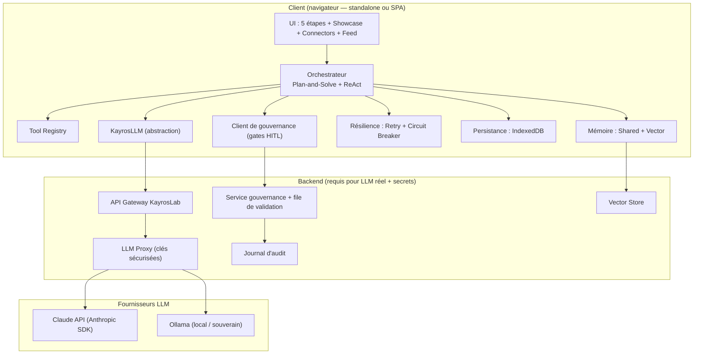
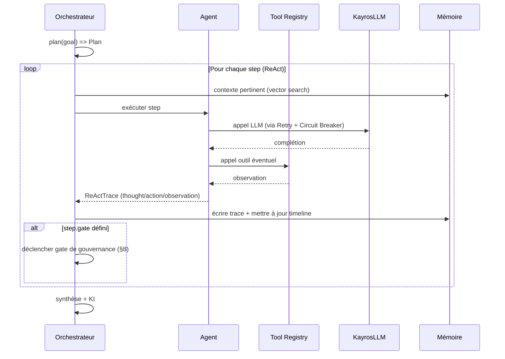
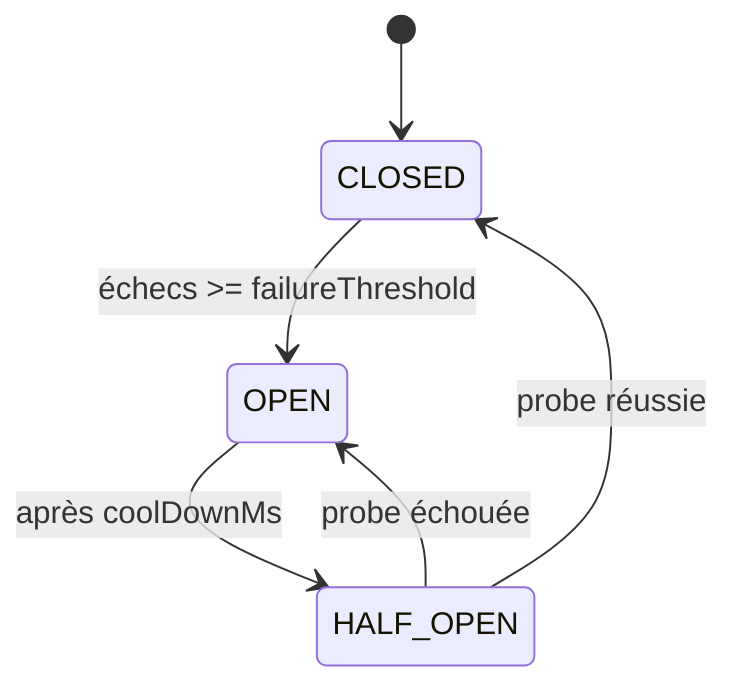
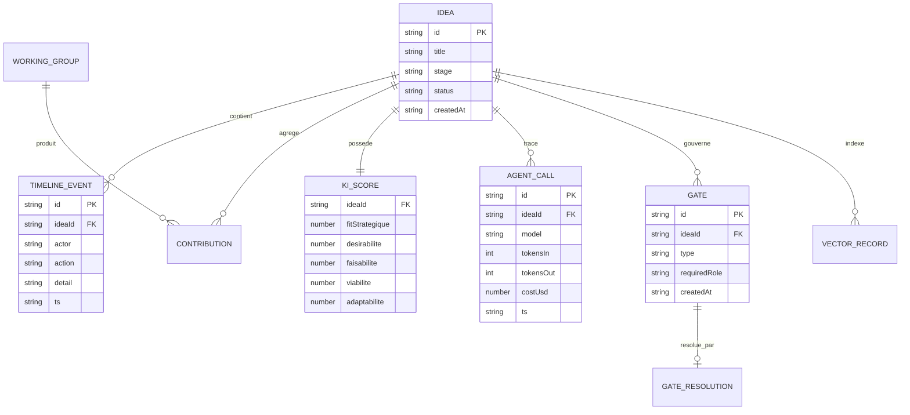

# KayrosLab — Spécifications Techniques

> Dérivé de `SPECIFICATIONS_FONCTIONNELLES.md` (v0.3 validée). Décrit **comment** construire le « LLM gouverné » : architecture, composants, contrats d'interface, données, résilience, sécurité, tests.

| | |
|---|---|
| **Document** | Spécifications techniques (STD) |
| **Version** | 0.3 — v0.3.0 features intégrées |
| **Date** | 23 juillet 2026 |
| **Statut** | 🟢 Validé |
| **Réf. fonctionnelle** | `SPECIFICATIONS_FONCTIONNELLES.md` v0.3 (EF-01 → EF-38, EF-88 → EF-111) |
| **Dépôt** | https://github.com/Geoking2104/KayrosLab |
| **Cible de version langage** | ES2023, Node 20 LTS, TypeScript 5.x (progressif) |

**Conventions.** `🟢 Existant` · `🟠 Partiel/simulé` · `🔵 Cible`. Les blocs de code sont des **contrats** (interfaces / pseudo-implémentations), pas du code de production figé. Les incertitudes sont marquées **« ⚠️ à trancher »**.

---

## 0. Principes directeurs

1. **Offline-first préservé.** L'app doit continuer à tourner en un seul fichier HTML sans backend pour la démo ; le backend n'est requis que pour les appels LLM réels et le secret des clés (§10).
2. **Abstraction avant intégration.** Tout appel LLM passe par `KayrosLLM` : le code métier ne connaît jamais le fournisseur.
3. **Tout est tracé.** Chaque action agent/humaine produit un événement horodaté rattaché à une idée (EF-31/32).
4. **La gouvernance est un composant, pas une option.** Les gates HITL et le veto sont des points d'extension de l'orchestrateur (EF-20, EF-34).
5. **Complexité proportionnée.** On n'introduit IndexedDB, Vector Memory ou backend que lorsque la fonction l'exige (roadmap §24).

---

## 1. Architecture cible (vue composants)



**Trois paliers de déploiement (voir §15) :**

| Palier | Description | LLM | Clés API | Statut |
|---|---|---|---|---|
| **P0 — Standalone** | SPA React/Vite + localStorage, LLM simulé ; export PDF, campaigns, history, settings, slack, multi-idea, onboarding tour | Mock | Aucune | 🟢 |
| **P1 — Local souverain** | SPA React/Vite + backend Fastify local + Ollama + Qdrant embarqué | Ollama | Aucune (local) | 🔵 |
| **P2 — Cloud gouverné** | App (SPA) + backend proxy + vector store + service gouvernance | Claude/Ollama | Backend uniquement | 🔵 |

---

## 2. Stack technique

| Couche | Existant (🟢) | Cible (🔵) |
|---|---|---|
| UI | **React 18 + Vite 5** ; Chart.js 4.x ; three.js r134 | 🟢 |
| État | **React Context** + stores localStorage (settings, history, campaigns, tour) | Store typé + IndexedDB (idb) |
| LLM | délégation **simulée** (`setTimeout`) | `KayrosLLM` → Anthropic SDK (`@anthropic-ai/sdk`) / Ollama REST |
| Backend | inexistant | **Node 20 + Fastify** (proxy, gouvernance, vector) — décision actée |
| Vector store | inexistant | **Qdrant** dès qu'un store persistant est requis (P1 embarqué / P2 service) — décision actée |
| Persistance | **localStorage** (campaigns, history, settings, tour) | IndexedDB → (v6) ElectricSQL pour sync |
| Export | **CSS @media print** (zéro dépendance) | Bibliothèque PDF dédiée (P1) |
| PWA | **manifest.json + sw.js** (cache-first, offline fallback) | 🟢 |
| Build/CI | Vite build | GitHub Actions (lint, test, build, déploiement Pages/preview) |

---

## 3. Orchestrateur (Plan-and-Solve + ReAct)

Réalise EF-15/16. Deux phases : **Plan** (décomposition explicite) puis boucle **Solve/ReAct** (raisonner → agir via outil/agent → observer).

```ts
// Contrat (TypeScript)
interface Plan {
  ideaId: string;
  goal: string;
  steps: PlanStep[];            // ordonnées, avec dépendances
}
interface PlanStep {
  id: string;
  description: string;
  agent: AgentType;             // Planner | Critic | DevilsAdvocate | RedTeam | Bisociateur | Synthesizer
  tool?: string;                // clé Tool Registry, optionnel
  dependsOn: string[];
  gate?: GateType;              // point de gouvernance éventuel
}
interface ReActTrace {
  stepId: string;
  thought: string;              // raisonnement
  action: { type: "tool" | "agent" | "llm"; name: string; input: unknown };
  observation: unknown;         // résultat
  tokens?: { in: number; out: number };
  ts: string;                   // ISO 8601
}

interface Orchestrator {
  plan(goal: string, ctx: IdeaContext): Promise<Plan>;
  run(plan: Plan, opts: RunOptions): AsyncGenerator<ReActTrace>;  // streaming d'événements
}
interface RunOptions {
  governance: "auto" | "supervise" | "strict";  // défaut: "supervise" (EF-38)
  sovereignty: "cloud" | "local";
  maxSteps: number;             // garde-fou anti-boucle
  budget?: { maxTokens?: number; maxCostUsd?: number };
}
```



- **EF-15** — `plan()` retourne une liste de steps **avant** exécution ; le plan est persisté et visible (timeline).
- **EF-16** — chaque `ReActTrace` est émis en streaming et journalisé.
- **Garde-fous :** `maxSteps` (anti-boucle ReAct), budget tokens/coût, timeout par step.

---

## 4. Tool Registry

Réalise EF (outils : `search_regulatory_risks`, `calculate_ki_impact`…). Outils déclaratifs, validés par schéma, exposables aux LLMs en *function calling*.

```ts
interface ToolDef<I = unknown, O = unknown> {
  name: string;                       // ex: "search_regulatory_risks"
  description: string;
  inputSchema: JSONSchema;            // validation d'entrée
  outputSchema: JSONSchema;
  handler: (input: I, ctx: ToolCtx) => Promise<O>;
  sideEffect: "none" | "read" | "write";  // gouvernance : write => gate possible
}
interface ToolRegistry {
  register(tool: ToolDef): void;
  get(name: string): ToolDef | undefined;
  toLLMSpec(): LLMToolSpec[];         // export au format function-calling du provider
}
```

**Outils initiaux (cible) :**

| Outil | Entrée | Sortie | Effet |
|---|---|---|---|
| `search_regulatory_risks` | `{ domaine, marché }` | `{ risques[] }` | read |
| `calculate_ki_impact` | `{ ideaId, changement }` | `{ delta_KI }` | read |
| `simulate_trajectory` | `{ scénarios[], variables[], iterations? }` | `{ scénariosPondérés[], valeurAttendue, p10, p50, p90 }` | read |
| `estimate_resources` | `{ jalons[], hypothèsesCoût }` | `{ etp, budget, tco, roiProjeté }` | read |
| `persist_idea` | `{ idea }` | `{ ok, version }` | write |
| `publish_to_feed` | `{ ideaId }` | `{ ok }` | write |

> **Sécurité.** Les outils `write` peuvent exiger une validation humaine avant exécution (config `gate`).
> **Déterminisme (EF-41).** `simulate_trajectory` et `estimate_resources` sont des **calculs déterministes** (Monte-Carlo/espérance, arithmétique de coûts) : le LLM ne fournit que les **hypothèses et distributions** en entrée ; l'outil calcule et renvoie les résultats tracés. Aucun chiffre n'est « inventé » par le LLM.

### 4.1 Étape Projeter — boucle cyclique (EF-39→45 🟢 implémentés)

- **Roadmap & ressources.** Générées par le Planner (`core/roadmap.mjs` → `buildRoadmap`, `core/projection.mjs` → `simulateTrajectory`/`estimateResources`) ; modèle `Roadmap = { jalons[], raci[], ressources, kpis[], risques[], gatesFuturs[] }` persisté par idée. API `POST /v1/ideas/:id/roadmap` (construction + sauvegarde) et `GET /v1/ideas/:id/roadmap` (lecture + rapport d'impact) ; événement `project.roadmap` tracé par le journal d'audit (EF-32).
- **Matrice de risques (EF-42).** `core/risques.mjs` — `niveauRisque` (score = probabilité × impact, niveaux faible/moyen/élevé/critique), `matriceRisques` (grille 5×5 + distribution), `detectDeclencheurs` (risques actifs ≥ seuil → gate `re_arbitrage`). API `POST/GET /v1/ideas/:id/risques` (add/update/remove, événements `risque.*`).
- **Capitalisation No-Go (EF-44).** `core/capitalisation.mjs` — `buildCapitalisation` (apprentissages + conditions de réactivation + signaux, rendu structuré), `addApprentissage`, `reactivationReady` (conditions satisfaites face aux signaux constatés), `resumeCapitalisation`. API `POST/GET /v1/ideas/:id/capitalisation` (réservée aux idées `non_poursuivi`, événement `capitalisation.build` ; l'idée reste reactivable via `model.reactivate`).
- **Jalons de gouvernance futurs (EF-45).** `core/gates-futurs.mjs` — `setGatesFuturs` (gates COMEX datés dans la roadmap), `gatesFutursStatus` (à venir / dus / matérialisés), `dueGates`, `materialiserGate`. API `POST/GET /v1/ideas/:id/gates-futurs` + `POST .../gates-futurs/materialise` (à échéance, ouvre de vrais gates via `GovernanceService.open`, événements `gatesfuturs.*`).
- **Boucle Projeter → Écouter (EF-43).** Moteur `core/loop.mjs` (`evaluateKpis`/`alertsToSignals`/`evaluateKpisWithDrift` + `MonitoringLoop`) + `core/kpi-drift.mjs` ; exposé par `POST /v1/ideas/:id/execution/monitor` : relève les KPIs constatés en Réaliser (`idea.impact.releves`), évalue seuils et dérive, persiste `idea.loop`, journalise `loop.monitor`/`loop.alert` et ouvre un gate `re_arbitrage` COMEX si un signal est produit. La lecture d'exécution passe par `GET /v1/ideas/:id/execution` (execution + progression + rapport d'impact). Rend le processus continu et apprenant.
- **Portée décisionnelle.** `Go` → roadmap + suivi ; `No-Go` → dossier de capitalisation (`Capitalisation = { apprentissages[], réactivation, signaux[] }`) ; `Révision` → note conditionnelle renvoyée à Éprouver.

### 4.2 Étape Arbitrer — synthèse & décision tracée (EF-13/14 🟢 implémentés)

- **Vote multi-critères (EF-13).** `core/working-group.mjs` — `createWorkingGroup` (membres + quorum), `wgAggregateVotes` (agrégation pondérée par rôle via `evaluation.aggregateVotes`, recommandation Go/No-Go/Révision), `wgDecision`. Le vote du Working Group est un **conseil instructif** ; la décision finale reste une résolution formelle via `GovernanceService` (RBAC, veto). API `POST /v1/ideas/:id/working-group` + `POST/GET /v1/gates/:gateId/votes`.
- **Synthèse d'arbitrage (F1).** `core/arbitrage.mjs` → `buildSyntheseArbitrage` compose un dossier pour l'arbitre COMEX à partir de **données réelles uniquement** : recommandation du groupe de travail (ou `null`), red flags dérivés de la matrice de risques (niveaux critique/élevé), projection Monte-Carlo existante, gates en attente et journal des décisions. API `GET /v1/ideas/:id/arbitrage`.
- **Décision tracée immuable (EF-14).** `core/arbitrage.mjs` → `recordDecision` ajoute une décision Go/No-Go/Révision horodatée, signée (auteur + rôle) et séquencée au journal append-only `idea.decisions` ; `decisionsTimeline`/`lastDecision` lisent le journal en copies immuables. La résolution d'un gate (`POST /v1/gates/:gateId/resolve`) alimente le journal à chaque décision. API `GET /v1/ideas/:id/decisions` (journal + dernière décision).
- **Traçabilité.** Les décisions sont simultanément journalisées dans le journal d'audit persistant (`gate.resolved`, EF-32) et portées par l'idée ; la justification (F7) est consignée dans chaque enregistrement (`reason`).

### 4.3 Étape Écouter — signaux faibles (EF-01/EF-02 🟢 implémentés)

- **Ingestion & normalisation (F2).** `core/ecouter.mjs` — `normalizeSignal` (id canonique stable `idSignal(source|contenu)` → déduplication naturelle, date validée, tags dédupliqués), persisté sur l'idée (`idea.signals`). API `POST /v1/ideas/:id/signals` (événement `ecouter.add`).
- **Scoring expliqué (EF-02/F4).** `scoreSignal` — note 0–100 = moyenne pondérée des dimensions renseignées (pertinence 50% · fraîcheur 25% · impact 25%) ; la fraîcheur est **calculée** par décroissance exponentielle déterministe (demi-vie 90 j), la pertinence/impact sont **importés** du LLM/humain. Aucune dimension absente n'est devinée : `dimensions[]` + `raison` rendent le score traçable.
- **Réduction de bruit (F5).** `reductionBruit` (signaux sous seuil masqués **mais conservés**, réversibles) + `renderNoiseReduction` (rendu lisible). API `POST /v1/ideas/:id/signals/noise` (seuil persisté sur `idea.ecouter.seuil`).
- **Promotion (EF-01/F6).** `promoteSignal` — signal qualifié horodaté + signé (auteur), porté par `idea.signals[]` et journalisé (`ecouter.promote`). API `POST /v1/ideas/:id/signals/promote`.
- **Clustering (F3/F7).** `clusterSignals` — regroupement par tag (ou source) préparant Cartographier ; `rapportEcoute` synthétise réduction + clusters + rendu (API `GET /v1/ideas/:id/signals`).

### 4.4 Étape Cartographier — réseau & ponts de bisociation (EF-03/EF-04 🟢 implémentés)

- **Réseau de tendances (F1/EF-03).** `core/cartographier.mjs` — `normalizeTendance`/`idTendance` (id stable par nom → déduplication), `buildReseau` (nœuds normalisés + arêtes typées `correlation|causalite|opposition` validées et dédupliquées par id canonique `de|type|vers`), `centralite` (degré + pivots), `zonesTension` (arêtes d'opposition), `horizonEffectif` (renseigné > dérivé d'une date > `null`). API `POST /v1/ideas/:id/tendances` (construit + persiste `idea.cartographie` + journalise `carto.build` ; sans liste, construit depuis les signaux qualifiés d'Écouter) et `GET /v1/ideas/:id/tendances` (rapport agrégé).
- **Ponts de bisociation (EF-04/F2).** `suggestPonts` — paires de clusters **distants** (`distanceClusters`, partage de tags réel, seuil `plancher`), jamais déjà reliées (`dejaLie`) ; `nouveaute` = distance déterministe, `justification` explicite, `plausibilite` importée du LLM/humain. `scorePont` calcule nouveauté × plausibilité / 100, **`null` si la plausibilité est absente** (jamais inventée). API `POST /v1/ideas/:id/tendances/ponts` (suggestions ; avec `plausibilite[]` → scoring + persistance + `carto.ponts`).
- **Sélection → Construire (F6).** `sendNetworkSelectionToScenario` — payload structuré `{ destination: 'construire', noeuds[], ponts[], ts }`. API `POST /v1/ideas/:id/tendances/selection` (persiste `idea.cartographie.selection` + `carto.selection`).
- **Plausibilité LLM.** L'agent Bisociateur existant (`core/agents/bisociator-agent.mjs`, collision mode, sortie `structured.collision`) est le fournisseur naturel de la plausibilité des ponts ; sans son apport, les ponts restent affichés non scorés.

---

## 5. Abstraction LLM (`KayrosLLM`)

Réalise EF-24/25/26. Interface unique, adaptateurs par fournisseur, bascule mock → réel sans changer l'appelant.

```ts
interface LLMMessage { role: "system" | "user" | "assistant" | "tool"; content: string; }
interface LLMRequest {
  messages: LLMMessage[];
  model: string;
  tools?: LLMToolSpec[];
  temperature?: number;
  stream?: boolean;
  signal?: AbortSignal;
}
interface LLMResponse {
  text: string;
  toolCalls?: { name: string; input: unknown }[];
  usage: { tokensIn: number; tokensOut: number; costUsd: number };
  provider: string;
  latencyMs: number;
}
interface LLMProvider {
  id: "mock" | "anthropic" | "ollama";
  complete(req: LLMRequest): Promise<LLMResponse>;
  stream?(req: LLMRequest): AsyncGenerator<string>;
}

// Façade
class KayrosLLM {
  constructor(private providers: Record<string, LLMProvider>, private policy: RoutingPolicy) {}
  async complete(req: LLMRequest): Promise<LLMResponse> {
    const provider = this.route(req);          // selon souveraineté/rôle/coût
    return withResilience(() => provider.complete(req), this.breakerFor(provider.id));
  }
  private route(req: LLMRequest): LLMProvider { /* local => ollama ; sinon anthropic ; fallback mock */ }
}
```

**Adaptateurs :**

| Provider | Détail | Statut |
|---|---|---|
| `mock` | réponses déterministes/simulées (existant `delegateToExternalAgent`) | 🟢 |
| `anthropic` | `@anthropic-ai/sdk`, Messages API, streaming, function calling | 🔵 |
| `ollama` | REST `POST /api/chat` (local), modèles ex. `llama3.1`, `qwen2.5` | 🔵 |

- **EF-26** — `RoutingPolicy` : si `sovereignty=local` → forcer `ollama` ; sinon rôle→modèle (ex. « Strategic Reasoning » → Claude) ; fallback `mock` si tout échoue.
- **⚠️ à trancher :** modèle d'embeddings (Anthropic n'en fournit pas nativement) → utiliser un modèle local (Ollama `nomic-embed-text`) ou un service dédié (§6.2).

---

## 6. Mémoire

### 6.1 Shared Memory (EF-17)
Contexte partagé entre agents pour une idée : faits, hypothèses, contributions, décisions. Clé = `ideaId`. Persisté (IndexedDB).

```ts
interface SharedMemory {
  ideaId: string;
  facts: MemoryEntry[];
  hypotheses: MemoryEntry[];
  contributions: Contribution[];
}
interface MemoryEntry { id: string; actor: string; content: string; ts: string; source?: string; }
```

### 6.2 Vector Memory (EF-18)
Recherche sémantique des idées/contributions passées par **similarité cosinus**.

```ts
interface VectorRecord { id: string; ideaId: string; text: string; embedding: number[]; }
interface VectorStore {
  upsert(rec: VectorRecord): Promise<void>;
  search(embedding: number[], k: number): Promise<{ id: string; score: number }[]>; // cosinus
}
function cosine(a: number[], b: number[]): number { /* dot(a,b) / (‖a‖·‖b‖) */ return 0; }
```

| Palier | Implémentation vector |
|---|---|
| P0 | index en mémoire JS + cosinus (fallback, ~10³ vecteurs) |
| P1/P2 | **Qdrant** (décision actée) — mode embarqué/local en P1 (souveraineté), service dédié en P2. Recherche cosinus/dot native, filtrage par `ideaId`. |

- **Embeddings :** générés via `KayrosLLM` (provider embeddings dédié), mis en cache par hash de texte.

---

## 7. Résilience (Retry + Circuit Breaker)

Réalise EF-27/28. Toute sortie LLM/outil externe passe par `withResilience`.

```ts
interface RetryPolicy { maxRetries: number; baseMs: number; factor: number; jitter: boolean; }
// délai = baseMs * factor^n (+ jitter aléatoire), plafonné
interface BreakerConfig { failureThreshold: number; coolDownMs: number; halfOpenProbes: number; }

async function withResilience<T>(fn: () => Promise<T>, breaker: CircuitBreaker, retry?: RetryPolicy): Promise<T> {
  if (breaker.state === "OPEN" && !breaker.canProbe()) return breaker.fallback();
  // retry exponentiel + gestion des transitions du breaker
}
```



| Paramètre | Valeur par défaut (proposée) | Rôle |
|---|---|---|
| `maxRetries` | 3 | tentatives avant échec |
| `baseMs` / `factor` | 400 ms / 2 | backoff exponentiel |
| `failureThreshold` | 5 | ouverture du circuit |
| `coolDownMs` | 30 000 | avant HALF_OPEN |
| `fallback` | provider alternatif → sinon réponse dégradée tracée | continuité |

- **EF-28** — l'ouverture du circuit et le basculement fallback sont **journalisés** (incident) et visibles dans la timeline.

---

## 8. Gouvernance & censeurs humains (technique)

Réalise EF-19/20/21, EF-34/36/37/38. Un **gate** interrompt l'orchestration et attend une décision humaine.

```ts
type GateType = "expert_review" | "red_team_veto" | "comex_arbitrage" | "output_censor";
type Decision = "approve" | "reject" | "revise";

interface GateRequest {
  id: string; ideaId: string; type: GateType;
  payload: unknown;                 // contenu à valider
  requiredRole: HumanRole;          // RBAC
  createdAt: string;
}
interface GateResolution {
  gateId: string; decision: Decision; by: string; role: HumanRole;
  reason: string;                   // obligatoire si reject/revise
  resolvedAt: string;
}
interface GovernanceService {
  open(req: GateRequest): Promise<string>;      // met en file d'attente
  await(gateId: string): Promise<GateResolution>;
  policyFor(ideaOutput: Output, level: RunOptions["governance"]): GateType | null;
}
```

**RBAC — rôles & droits de veto (dérivé de la matrice fonctionnelle §3.4) :**

| Rôle (`HumanRole`) | Gates autorisés | Veto |
|---|---|---|
| `expert_metier` | `expert_review` | conditionnel |
| `red_team` | `red_team_veto` | ✅ bloquant |
| `comex` | `comex_arbitrage`, `output_censor` | ✅ |
| `facilitateur` | animation, aucun veto | ❌ |

```mermaid
sequenceDiagram
    participant O as Orchestrateur
    participant G as GovernanceService
    participant H as Censeur humain
    O->>G: open(GateRequest, requiredRole)
    G-->>H: notification (file de validation)
    H->>G: resolve(decision, reason)
    G-->>O: GateResolution
    alt approve
        O->>O: poursuivre / restituer
    else reject (veto)
        O->>O: bloquer ; message motivé (EF-37)
    else revise
        O->>O: renvoyer à l'étape amont (ex: E4 -> E3)
    end
```

- **EF-38** — mode par défaut `supervise` : `policyFor()` ne crée un gate `output_censor` **que** si l'output est classé « sensible » (règles : sujets réglementaires, décision Go/No-Go, diffusion externe). `strict` force le gate ; `auto` ne crée aucun gate.
- **Classement « sensible » (décision actée) :** **classifieur LLM**. Un appel `KayrosLLM` dédié (prompt de classification + rôles/labels : `reglementaire`, `decision_go_nogo`, `diffusion_externe`, `neutre`) évalue chaque output candidat et renvoie un label + score de confiance ; au-dessus d'un seuil, un gate `output_censor` est ouvert. Le classifieur tourne de préférence en **local (Ollama)** pour la souveraineté et le coût. Repli : liste de règles statiques si le classifieur est indisponible (circuit breaker).

---

## 9. Modèle de données



> **Existant (à faire évoluer).** Clés `localStorage` actuelles : `kayros_connectors`, `kayros_agent_history`. Modèles observés : `connector { id, name, role, provider, apiKey }`, `agentCall { timestamp, model, role, tokensIn, tokensOut, estimatedCost }`. Cible : migration vers les entités ci-dessus en IndexedDB, `apiKey` **retirée du client** (§10).

**Multi-idées (EF-30) :** chaque idée est un agrégat isolé (store IndexedDB `ideas/{id}`), pas d'état global partagé entre idées.

---

## 10. API « LLM gouverné » & sécurité

### 10.1 Endpoint principal (EF-33/35)

```
POST /v1/govern/query
```
```json
// Requête
{
  "query": "Évalue le risque réglementaire du scénario X",
  "governance": "supervise",         // auto | supervise | strict (défaut supervise)
  "sovereignty": "cloud",            // cloud | local
  "ideaId": "idea_123"               // optionnel
}
```
```json
// Réponse (200) — ou 202 si en attente de validation humaine
{
  "status": "auto|validated_human|blocked_veto|pending_review",
  "answer": "…",
  "trace": {
    "agents": ["Planner","Critic","RedTeam"],
    "llmCalls": [{"provider":"anthropic","tokensIn":1200,"tokensOut":640,"costUsd":0.021}],
    "kiStrategique": {"fitStrategique":7.8,"desirabilite":7.1,"faisabilite":6.9,"viabilite":7.4,"adaptabilite":7.0}
  },
  "ideaRef": "idea_123",
  "gateId": "gate_456"               // présent si pending_review
}
```
- **EF-36/37** — en `strict`, réponse `202 pending_review` + `gateId` ; après veto → `blocked_veto` avec message motivé, **jamais le contenu sensible**.
- Streaming : `GET /v1/govern/stream/{runId}` (SSE) diffuse les `ReActTrace`.

### 10.2 Sécurité (EF non-fonctionnelles §8 des SF)

| Sujet | Règle | Palier |
|---|---|---|
| **Clés LLM** | Jamais côté client en prod. Le client appelle le **backend proxy** ; les clés vivent côté serveur (variable d'env / coffre). | P2 |
| **Auth** | Jeton de session (OAuth/OIDC) + RBAC pour les gates | P2 |
| **CORS / CSRF** | Origines allow-list ; jetons anti-CSRF sur mutations | P2 |
| **Rate limiting** | Par utilisateur/idée ; plafond tokens/coût (EF budget) | P2 |
| **Souveraineté** | Mode `local` = Ollama, aucune donnée ne sort | P1 |
| **Journal d'audit** | Décisions humaines immuables, exportables | P2 |
| **PII** | Pas de données personnelles dans les prompts par défaut ; masquage | P2 |

> ⚠️ **Rappel de sécurité (existant).** Le prototype stocke des `apiKey` en `localStorage` — acceptable en démo (`demo-key`), **interdit en production**. Le proxy backend est un prérequis P2.

---

## 11. Kayroslab Index (KI) — algorithme

Réalise EF-22/23. **5 dimensions stratégiques d'abord**, dérivées/alimentées par la couche technique (décision actée §6.4 SF).

```ts
interface KIStrategic { fitStrategique:number; desirabilite:number; faisabilite:number; viabilite:number; adaptabilite:number; }
interface KITechnical { global:number; velocite:number; divergence:number; fiabilite:number; impact:number; originalite:number; }

// Existant (with-ai-agents.html) : KITechnical calculé depuis l'activité
// Cible : mapping technique -> stratégique + apports agents (Red Team => faisabilite/viabilite, Bisociateur => adaptabilite...)
function toStrategic(t: KITechnical, signals: KISignals): KIStrategic { /* pondérations paramétrables */ }
```

- **EF-23** — Radar Chart (Chart.js `type:"radar"`) sur les 5 axes stratégiques à l'étape Arbitrer ; historique des scores par version d'idée.
- **Ordre de calcul (décision actée) : le KI est d'abord stratégique, puis technique.** Les 5 dimensions stratégiques sont la **couche de référence** (affichage, votes, décision) ; les 6 dimensions techniques sont **calculées ensuite** et servent d'**instrumentation/alimentation** des scores stratégiques via `toStrategic()`.
- Pondérations **paramétrables** (config) ; les valeurs par défaut de la matrice technique→stratégique restent à **calibrer empiriquement** (non bloquant : matrice identité pondérée en v1).

---

## 12. Consolidation des artefacts (lot d'ingénierie)

Objectif : **1 fichier de référence unique** (`kayroslab-complete-with-ai-agents.html`) intégrant le workflow 5 étapes du prototype 163 Ko.

**Fichiers legacy retirés** (nettoyage v0.3.0) : `kayroslab-enhanced-future-proofing.html`, `kayroslab-portfolio.html`, `kayroslab-reference.html`, `CONSOLIDATION.md`.

| Étape | Action | Risque |
|---|---|---|
| 1 | Extraire les modules JS du 163 Ko (workflow, Working Groups, PDF, ROI) | Couplage au DOM |
| 2 | Namespacing (éviter collisions de fonctions globales `switchTab`, etc.) | Conflits de noms |
| 3 | Fusionner les fonctionnalités manquantes dans le fichier de référence | Régressions |
| 4 | Tests de non-régression manuels + captures | Couverture |

> Recommandation : préparer la fusion dans une **branche** dédiée + PR, plutôt que des commits directs sur `main`.

---

## 13. Observabilité

- **Logs structurés** (JSON) côté backend : `runId`, `ideaId`, `provider`, `latencyMs`, `tokens`, `costUsd`, `breakerState`.
- **Métriques** : coût cumulé par idée, taux de retry, taux d'ouverture du circuit, temps moyen de gate humain.
- **Traçabilité** : la timeline UI = projection lisible du journal d'audit (EF-31/32).

---

## 14. Stratégie de tests

Format Given/When/Then aligné sur les critères d'acceptation fonctionnels.

| Niveau | Cible | Exemples |
|---|---|---|
| **Unitaire** | Retry/Breaker, cosinus, KI, RoutingPolicy | *Given* 5 échecs *When* appel *Then* état OPEN + fallback |
| **Contrat** | Adaptateurs `KayrosLLM` (mock/anthropic/ollama) | schéma requête/réponse respecté |
| **Intégration** | Orchestrateur + Tool Registry + Mémoire | plan → trace → timeline persistée |
| **Gouvernance** | Gates + veto | *Given* attaque critique *When* E4 *Then* transition E5 bloquée |
| **E2E** | Parcours 5 étapes + API gouvernée | mode `strict` => `202 pending_review` |
| **Non-régression** | Consolidation artefacts (§12) | captures avant/après |

Outils cibles : Vitest (unit/contrat), Playwright (E2E). ⚠️ à trancher.

---

## 15. Déploiement & CI/CD

| Palier | Hébergement | LLM | CI |
|---|---|---|---|
| P0 | GitHub Pages / githack (standalone) | mock | lint + build |
| P1 | Poste local + Ollama | ollama | tests unit |
| P2 | Front (Pages/Vercel) + backend (conteneur) | claude/ollama | build + tests + déploiement |

- **GitHub Actions** : `lint → test → build → preview` sur PR ; déploiement Pages sur `main`.
- **Secrets** : clés LLM en secrets GitHub/serveur, jamais dans le repo.

---

## 16. Export PDF — Print-based (EF-88/89)

Aucune dépendance. L'export repose sur CSS `@media print` et l'API native `window.print()`.

### 16.1 Composant `PdfExport.jsx`

```tsx
// Rendu conditionnel d'un div.print-report masqué à l'écran, visible à l'impression
// Inclut : KI score, tableau concurrents, tableau gaps, grille ontologie
// Déclenché par bouton "Exporter PDF" → window.print()
function PdfExport({ baseline, competitors, gaps, ki, ontology }) {
  return (
    <div className="print-report">
      <header><h1>KayrosLab — Rapport d'analyse</h1></header>
      <section className="ki-score">…</section>
      <section className="competitors">…</section>
      <section className="gaps">…</section>
      <section className="ontology-grid">…</section>
    </div>
  );
}
```

### 16.2 CSS `@media print`

```css
@media print {
  .header, .tabs, .export-bar, .sidebar, .actions, .back-button { display: none !important; }
  .print-report { display: block; position: absolute; top: 0; left: 0; width: 100%; }
  body { font-size: 12pt; color: #000; background: #fff; }
  @page { margin: 2cm; }
}
```

---

## 17. Campaigns / Hackathons (EF-90/91)

Stockage localStorage via `campaignStore.js`. CRUD complet, soumissions liées à une campagne, classement par KI.

### 17.1 Store

```ts
interface Campaign {
  id: string;
  title: string;
  description: string;
  deadline: string;           // ISO 8601
  status: "open" | "closed";
  submissions: Submission[];  // idées soumises
  createdAt: string;
}
interface Submission {
  idea: string;
  ki: number;
  scores: Record<string, number>;
  author: string;
  submittedAt: string;
}

// campaignStore.js — CRUD localStorage
const STORAGE_KEY = "kayros_campaigns";
function loadCampaigns(): Campaign[] { return JSON.parse(localStorage.getItem(STORAGE_KEY) ?? "[]"); }
function saveCampaigns(c: Campaign[]): void { localStorage.setItem(STORAGE_KEY, JSON.stringify(c)); }
```

### 17.2 Composants

- **CampaignList** — liste des campagnes avec filtre open/closed, bouton créer.
- **CampaignForm** — formulaire titre, description, deadline (date picker).
- **CampaignDetail** — détail + soumissions + countdown (`setInterval`, calcul `new Date(campaign.deadline) - Date.now()`). Boutons Close/Reopen togglent `status`.

### 17.3 Analyse et classement

Les soumissions sont analysées via `runAnalysis()` (store partagé). Le leaderboard trie par KI descendant.

---

## 18. History (EF-92/93)

Stockage localStorage via `historyStore.js`. Sauvegarde automatique après chaque analyse, consultation, comparaison, restauration.

### 18.1 Store

```ts
interface HistoryEntry {
  id: string;
  idea: string;
  baseline: string;
  competitors: Competitor[];
  gaps: Gap[];
  ki: KIStrategic;
  scores: Record<string, number>;
  timestamp: string;
}

// historyStore.js — CRUD localStorage
const STORAGE_KEY = "kayros_history";
function loadHistory(): HistoryEntry[] { /* JSON.parse */ }
function saveHistory(entries: HistoryEntry[]): void { /* JSON.stringify */ }
function addEntry(entry: HistoryEntry): void { /* load + push + save */ }
function deleteEntries(ids: string[]): void { /* filter + save */ }
```

### 18.2 Sauvegarde automatique

Dans `handleAnalyze()`, après le calcul des résultats, un appel à `addEntry` persisté l'analyse complète (baseline, concurrents, gaps, KI, idée reformulée).

### 18.3 Composants

- **HistoryList** — recherche textuelle (`input` → `filter`), sélection par checkbox (`ids: Set<string>`).
- **HistoryCompare** — deux entrées côte à côte ; tableau des 14 scores `ENTITY_TYPES` avec colonne Δ (différence).
- **Restauration** — clic « Restore » charge l'état complet de l'analyse dans le formulaire (baseline, competitors, gaps, ki, idea).

---

## 19. Settings (EF-94/95)

Stockage localStorage via `settingsStore.js`. Thème clair/sombre, seuil de gap, clé API backend, locale.

### 19.1 Store

```ts
interface Settings {
  theme: "light" | "dark";
  gapThreshold: number;       // défaut 0.15
  apiKey: string;             // X-API-Key header
  locale: "fr" | "en";
  slackWebhookUrl: string;
  slackAutoSend: boolean;
}

// settingsStore.js
const STORAGE_KEY = "kayros_settings";
function loadSettings(): Settings { /* defaults + merge localStorage */ }
function saveSettings(s: Partial<Settings>): void { /* merge + save */ }
```

### 19.2 Thème

`applyTheme(theme)` écrit `data-theme` sur `document.documentElement`. CSS :

```css
[data-theme="dark"] { --bg: #1a1a2e; --text: #e0e0e0; --card-bg: #16213e; --accent: #e94560; }
```

~250 lignes de surcharges dark pour tous les composants (header, tabs, cards, tableaux, formulaires, badges).

### 19.3 Intégrations

- **Seuil de gap** — passé à `computeGaps()` pour filtrer les écarts significatifs.
- **Clé API** — envoyée comme header `X-API-Key` sur les requêtes backend.
- **Locale** — synchronisée bidirectionnellement avec le contexte i18n (`I18nContext`).

---

## 20. PWA (Progressive Web App) (EF-101/102/103/104)

Permet l'installation sur mobile/desktop, offline fallback, cache des assets statiques.

### 20.1 `manifest.json`

```json
{
  "name": "KayrosLab",
  "short_name": "KayrosLab",
  "description": "LLM gouverné — analyse stratégique",
  "start_url": "./",
  "display": "standalone",
  "background_color": "#ffffff",
  "theme_color": "#D83B01",
  "icons": [
    { "src": "./icon-192.svg", "sizes": "192x192", "type": "image/svg+xml" },
    { "src": "./icon-512.svg", "sizes": "512x512", "type": "image/svg+xml" }
  ]
}
```

### 20.2 `sw.js` — Service Worker

```js
const CACHE = "kayroslab-v1";
const ASSETS = ["./", "./index.html", "./assets/index.css", "./assets/index.js"];

self.addEventListener("install", (e) => {
  e.waitUntil(caches.open(CACHE).then((c) => c.addAll(ASSETS)));
});

self.addEventListener("fetch", (e) => {
  const url = new URL(e.request.url);
  // Cache-first pour les assets statiques
  if (url.origin === location.origin && (url.pathname.match(/\.(css|js|svg|woff2?)$/) || url.pathname === "/")) {
    e.respondWith(caches.match(e.request).then((r) => r || fetch(e.request)));
  } else {
    // Network-first pour le reste
    e.respondWith(
      fetch(e.request).then((r) => { const resp = r.clone(); caches.open(CACHE).then((c) => c.put(e.request, resp)); return r; })
        .catch(() => caches.match("./") || caches.match(e.request))
    );
  }
});
```

### 20.3 Icônes SVG

Inline SVG : lettre « K » blanche sur fond rectangulaire orange `#D83B01`. Deux tailles : 192×192 et 512×512.

### 20.4 Métas iOS

```html
<meta name="apple-mobile-web-app-capable" content="yes" />
<meta name="apple-mobile-web-app-status-bar-style" content="black-translucent" />
<meta name="apple-mobile-web-app-title" content="KayrosLab" />
<link rel="apple-touch-icon" href="./icon-192.svg" />
```

### 20.5 Enregistrement SW

Dans `index.html`, script inline :

```js
if ("serviceWorker" in navigator) {
  navigator.serviceWorker.register("./sw.js").catch(console.warn);
}
```

---

## 21. Slack Webhooks (EF-96)

Zéro dépendance. Envoi POST JSON vers une URL Slack Incoming Webhook au format Block Kit.

### 21.1 Envoi

```ts
async function sendSlackNotification(webhookUrl: string, payload: SlackPayload): Promise<boolean> {
  try {
    const res = await fetch(webhookUrl, {
      method: "POST",
      headers: { "Content-Type": "application/json" },
      body: JSON.stringify(payload),
    });
    return res.ok;
  } catch { return false; }
}
```

### 21.2 Format Block Kit

```json
{
  "blocks": [
    { "type": "header", "text": { "type": "plain_text", "text": "Nouvelle analyse KayrosLab" } },
    { "type": "section", "fields": [{ "type": "mrkdwn", "text": "*Idée:* ..." }] },
    { "type": "section", "fields": [{ "type": "mrkdwn", "text": "*Concurrents:* ..." }] },
    { "type": "section", "fields": [{ "type": "mrkdwn", "text": "*Gaps:* ..." }] },
    { "type": "context", "elements": [{ "type": "mrkdwn", "text": "KayrosLab — analyse stratégique" }] }
  ]
}
```

### 21.3 Auto-send

Après chaque analyse, la fonction vérifie `settings.slackWebhookUrl && settings.slackAutoSend` ; si vrai, déclenche `sendSlackNotification`.

### 21.4 Test

Bouton « Test Slack » dans la page Settings envoie un échantillon avec le texte « Test de connexion KayrosLab ✅ ».

---

## 22. Multi-idea Analysis (EF-97/98)

Analyse groupée de plusieurs idées avec limite de concurrence, barre de progression, classement par KI.

### 22.1 Composant `MultiIdeaAnalysis.jsx`

```tsx
function MultiIdeaAnalysis() {
  const [ideas, setIdeas] = useState<string[]>([]);
  const [results, setResults] = useState<AnalysisResult[]>([]);
  const [progress, setProgress] = useState({ current: 0, total: 0 });
  const [running, setRunning] = useState(false);

  const extractIdeas = (raw: string): string[] =>
    raw.split("\n").map(l => l.trim()).filter(l => l.length >= 10).slice(0, 10);

  const runAll = async (ideas: string[]) => {
    const CONCURRENCY = 3;
    const results: AnalysisResult[] = [];
    const iterator = ideas.entries();
    const workers = Array(CONCURRENCY).fill(null).map(async () => {
      for (const [i, idea] of iterator) {
        const r = await runAnalysis(idea);
        results.push({ idea, ...r });
        setProgress({ current: results.length, total: ideas.length });
      }
    });
    await Promise.all(workers);
    return results.sort((a, b) => b.ki.global - a.ki.global);
  };
}
```

### 22.2 Affichage

Chaque carte de résultat affiche l'idée et les 14 scores `ENTITY_TYPES` sous forme de badges colorés (vert ≥ 7, orange 4-6, rouge < 4). Barre de progression `(current / total)`.

---

## 23. Onboarding Tour (EF-99/100)

Guide interactif en 7 étapes avec surlignage, positionnement dynamique, sauvegarde localStorage.

### 23.1 Store

```ts
// tourStore.js
const STORAGE_KEY = "kayros_tour_completed";
function isTourCompleted(): boolean { return localStorage.getItem(STORAGE_KEY) === "true"; }
function completeTour(): void { localStorage.setItem(STORAGE_KEY, "true"); }
function resetTour(): void { localStorage.removeItem(STORAGE_KEY); }
```

### 23.2 Définitions

7 étapes :
1. « Bienvenue dans KayrosLab » → cible `body`
2. « Saisissez votre idée » → cible `#idea-input` (skip if data exists)
3. « Analysez » → cible `.analyze-btn`
4. « Découvrez le KI » → cible `.ki-score-card`
5. « Comparez » → cible `.competitors-section`
6. « Exportez » → cible `.export-bar`
7. « Terminé » → cible `body`

### 23.3 Composant `OnboardingTour.jsx`

```tsx
function OnboardingTour() {
  const [step, setStep] = useState(0);
  const steps = useMemo(() => defineSteps().filter(s => s.requiresData ? hasData() : true), []);
  // Position via getBoundingClientRect() + fixed
  // Overlay semi-transparent avec backdrop click → skip
  // Highlight pulse CSS animation sur la cible
}
```

- Filtrage adaptatif : `requiresData` masque une étape si l'utilisateur n'a pas encore de données ; `skipIfData` saute si déjà renseigné.
- Positionnement : `getBoundingClientRect()` + `position: fixed` pour placer le tooltip.
- Animation : `@keyframes pulse { 0% { box-shadow: 0 0 0 0 rgba(216, 59, 1, 0.4); } 70% { box-shadow: 0 0 0 12px rgba(216, 59, 1, 0); } }`.

---

## 24. Feuille de route technique (dérivée du backlog fonctionnel)

| Lot technique | Réf. EF | Palier | Priorité | Statut |
|---|---|---|---|---|
| Modules `KayrosLLM` + adaptateur mock (extraction) | EF-24/25 | P0 | Must | 🟢 |
| Orchestrateur Plan-and-Solve + ReAct | EF-15/16 | P0/P1 | Must | 🟢 |
| Résilience Retry + Circuit Breaker | EF-27/28 | P0 | Must | 🟢 |
| Adaptateur Ollama (souverain) | EF-26 | P1 | Must | 🔵 |
| Gouvernance : gates + RBAC + veto | EF-20/34/36/38 | P1/P2 | Must | 🔵 |
| Migration IndexedDB + multi-idées | EF-29/30 | P1 | Should | 🔵 |
| Vector Memory | EF-18 | P1/P2 | Should | 🔵 |
| Backend proxy + API gouvernée + sécurité clés | EF-33/35 §10 | P2 | Must | 🔵 |
| KI stratégique + Radar | EF-23 | P1 | Could | 🔵 |
| Consolidation artefacts (1 fichier) | §12 | P0/P1 | Must | 🟢 |
| **Export PDF** | EF-88/89 | P0 | Must | 🟢 |
| **Campaigns / Hackathons** | EF-90/91 | P0 | Must | 🟢 |
| **History** | EF-92/93 | P0 | Must | 🟢 |
| **Settings (theme, seuil, locale, clé)** | EF-94/95 | P0 | Must | 🟢 |
| **Slack Webhooks** | EF-96 | P0 | Must | 🟢 |
| **Multi-idea Analysis** | EF-97/98 | P0 | Must | 🟢 |
| **Onboarding Tour** | EF-99/100 | P0 | Must | 🟢 |
| **PWA (manifest, SW, icons)** | EF-101/102/103/104 | P0 | Must | 🟢 |
| Sync cloud (ElectricSQL) | — | v6 | Won't-now | 🔵 |
| Décentralisation (Holochain) | — | v7 | Won't-now | 🔵 |

---

## 25. Décisions d'architecture (ADR — synthèse)

| ADR | Décision | Raison | Statut |
|---|---|---|---|
| ADR-01 | Abstraction `KayrosLLM` obligatoire | découpler métier/fournisseur | ✅ |
| ADR-02 | Backend proxy pour les clés en P2 | sécurité (pas de clé client) | ✅ |
| ADR-03 | Défaut gouvernance = `supervise` | décision produit (SF §7) | ✅ |
| ADR-04 | IndexedDB pour la persistance | volumes + multi-idées | ✅ |
| ADR-05 | Ollama pour la souveraineté | offline/local | ✅ |
| ADR-06 | **Vector store = Qdrant** | recherche vectorielle native, filtrage, mode local souverain | ✅ |
| ADR-07 | **React 18 + Vite 5 dès P1** | maintenabilité anticipée | ✅ |
| ADR-08 | Embeddings via Ollama local | Anthropic sans embeddings natifs | ✅ |
| ADR-09 | **Backend = Node 20 + Fastify** | perf, plugins, schémas JSON natifs | ✅ |
| ADR-10 | **Output sensible = classifieur LLM** (Ollama, repli règles) | précision > liste statique | ✅ |

---

## 26. Risques techniques & questions ouvertes

| Risque | Impact | Mitigation |
|---|---|---|
| Boucles ReAct non bornées | coût/latence | `maxSteps` + budget tokens |
| Coût LLM non maîtrisé | budget | plafonds + journalisation coût |
| Clés API exposées (existant) | sécurité | proxy backend P2 (bloquant prod) |
| Fusion artefacts régressive | qualité démo | branche + PR + non-régression |
| Latence gates humains | UX | modes async + notifications |
| Embeddings/souveraineté | dépendance | Ollama local par défaut |
| localStorage size limit (5-10 Mo) | saturation | compression + nettoyage ; migration IndexedDB P1 |

**Décisions actées (16/07/2026) :**
1. ✅ Backend = **Fastify** (Node 20).
2. ✅ Vector store = **Qdrant** (embarqué/local en P1, service en P2).
3. ✅ **React 18 + Vite 5 dès P1** (SPA).
4. ✅ Classification « output sensible » = **classifieur LLM** (Ollama, repli règles statiques).
5. ✅ KI **d'abord stratégique puis technique** (les 6 dims techniques alimentent les 5 stratégiques).

**Reste à calibrer (non bloquant) :** valeurs par défaut de la matrice de pondération technique → stratégique (matrice identité pondérée en v1).

---

## 27. Traçabilité EF → composants techniques

| EF (fonctionnel) | Composant technique (ce doc) |
|---|---|
| EF-15/16 | §3 Orchestrateur |
| EF-17/18 | §6 Mémoire |
| EF-19/20/21 | §8 Gouvernance |
| EF-22/23 | §11 KI |
| EF-24/25/26 | §5 KayrosLLM |
| EF-27/28 | §7 Résilience |
| EF-29/30 | §9 Données |
| EF-31/32 | §13 Observabilité |
| EF-33/34/35/36/37/38 | §10 API gouvernée |
| EF-39/40/41/42/43/44/45 | §4.1 Étape Projeter (outils `simulate_trajectory`, `estimate_resources`, boucle planifiée) |
| EF-46/47/48/49/50 | `core/auth.mjs` (scrypt, jetons HMAC, `SessionStore`, `LoginThrottle`, `FileUserStore`), `core/repository.mjs` |
| EF-51/52/53/54/55 | `core/repository.mjs` (`portfolio`, `counts`, `list`) |
| EF-56/57/58 | `core/model.mjs` (`setStage`/`setStatus`, `DORMANT_STATUSES`, `reactivate`, `applyDecision`) |
| EF-59/60/61/62 | `core/intake.mjs` (`validateIntake`, `intakeToHypotheses`, `intakeToAttackTargets`) |
| EF-63/64/65/66/67 | `core/evaluation.mjs` (`aggregateVotes`, `ROLE_WEIGHTS`), `POST /v1/ideas/:id/votes` |
| EF-68/69/70/71 | `core/scorecard.mjs` (`Scorecard`, `ScorecardRegistry`), `POST /v1/ideas/:id/score` |
| EF-72/73/74/75 | `core/notify.mjs` (`WebhookNotifier`, `EmailNotifier`, `CompositeNotifier`, `gateNotifier`), hook `GovernanceService` |
| EF-76/77/78/79 | `core/impact.mjs` (`recordInvestment`, `recordBenefit`, `computeVariance`, `impactReport`) |
| EF-80/81/82/83 | *Non implémenté — suppose une extension du modèle de processus (à arbitrer).* |
| EF-84/85/86/87 | *Non implémenté — reporting portefeuille.* |
| **EF-88/89** | **§16 Export PDF — print-based, CSS @media print** |
| **EF-90/91** | **§17 Campaigns / Hackathons — localStorage, countdown, leaderboard** |
| **EF-92/93** | **§18 History — localStorage, auto-save, compare, restore** |
| **EF-94/95** | **§19 Settings — theme, gap threshold, API key, locale** |
| **EF-96** | **§21 Slack Webhooks — fetch POST, Block Kit, auto-send** |
| **EF-97/98** | **§22 Multi-idea Analysis — concurrency 3, progress bar, sorted results** |
| **EF-99/100** | **§23 Onboarding Tour — 7 steps, getBoundingClientRect, localStorage flag** |
| **EF-101/102/103/104** | **§20 PWA — manifest.json, sw.js, icons SVG, meta iOS, SW registration** |

### 27.1 Persistance des données (EF-46, EF-49)

Trois dépôts fichiers à écriture **atomique** (temporaire + `rename`), configurés par variables d'environnement :

| Donnée | Variable | Module | Remarque |
|---|---|---|---|
| Comptes | `KAYROS_USERS_FILE` | `FileUserStore` | permissions `0600` (contient des empreintes) |
| Idées | `KAYROS_IDEAS_FILE` | `FileIdeaRepository` | |
| Gates + audit | `KAYROS_GATES_FILE` | `FileGateStore` | file restaurée via `governance.restore()` |

**Limite connue.** Les promesses de gate ne sont pas persistables : après redémarrage, un gate restauré n'a plus de résolveur en mémoire. Il reste résolvable et la décision est tracée, mais l'appelant qui attendait a disparu avec le process. La **denylist de jetons révoqués** reste en mémoire (dernière donnée volatile).

---

*Fin des spécifications techniques v0.3 — Validé le 23 juillet 2026.*
