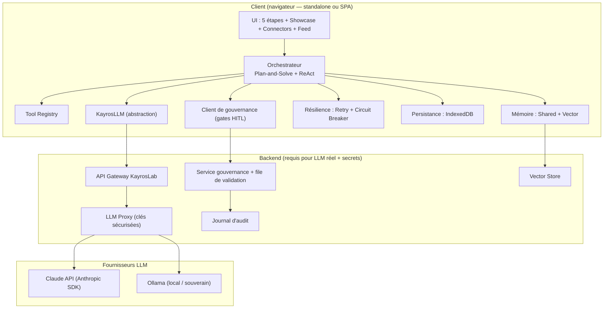
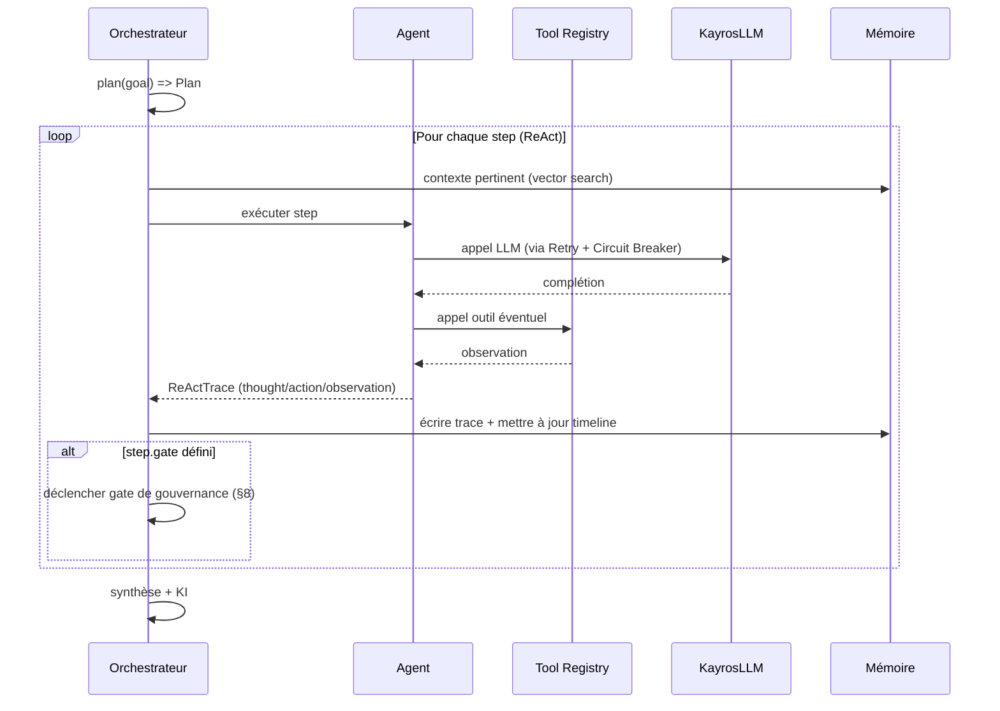
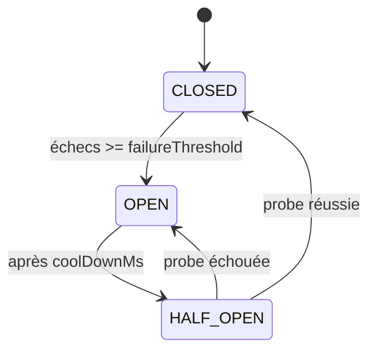
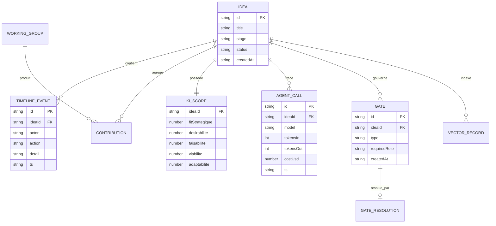

# KayrosLab — Spécifications Techniques

> Dérivé de `SPECIFICATIONS_FONCTIONNELLES.md` (v0.2 validée). Décrit **comment** construire le « LLM gouverné » : architecture, composants, contrats d'interface, données, résilience, sécurité, tests.

| | |
|---|---|
| **Document** | Spécifications techniques (STD) |
| **Version** | 0.2 — décisions d'architecture intégrées |
| **Date** | 15 juillet 2026 |
| **Statut** | 🟢 Prêt à committer (5 arbitrages techniques tranchés) |
| **Réf. fonctionnelle** | `SPECIFICATIONS_FONCTIONNELLES.md` v0.2 (EF-01 → EF-38) |
| **Dépôt** | https://github.com/Geoking2104/KayrosLab |
| **Cible de version langage** | ES2023, Node 20 LTS, TypeScript 5.x (progressif) |

**Conventions.** `🟢 Existant` · `🟠 Partiel/simulé` · `🔵 Cible`. Les blocs de code sont des **contrats** (interfaces / pseudo-implémentations), pas du code de production figé. Les incertitudes sont marquées **« ⚠️ à trancher »**.

---

## 0. Principes directeurs

1. **Offline-first préservé.** L'app doit continuer à tourner en un seul fichier HTML sans backend pour la démo ; le backend n'est requis que pour les appels LLM réels et le secret des clés (§10).
2. **Abstraction avant intégration.** Tout appel LLM passe par `KayrosLLM` : le code métier ne connaît jamais le fournisseur.
3. **Tout est tracé.** Chaque action agent/humaine produit un événement horodaté rattaché à une idée (EF-31/32).
4. **La gouvernance est un composant, pas une option.** Les gates HITL et le veto sont des points d'extension de l'orchestrateur (EF-20, EF-34).
5. **Complexité proportionnée.** On n'introduit IndexedDB, Vector Memory ou backend que lorsque la fonction l'exige (roadmap §16).

---

## 1. Architecture cible (vue composants)



**Trois paliers de déploiement (voir §15) :**

| Palier | Description | LLM | Clés API | Statut |
|---|---|---|---|---|
| **P0 — Standalone** | 1 fichier HTML, tout en mémoire/localStorage, LLM simulé | Mock | Aucune | 🟢 |
| **P1 — Local souverain** | SPA React/Vite + backend Fastify local + Ollama + Qdrant embarqué | Ollama | Aucune (local) | 🔵 |
| **P2 — Cloud gouverné** | App (SPA) + backend proxy + vector store + service gouvernance | Claude/Ollama | Backend uniquement | 🔵 |

---

## 2. Stack technique

| Couche | Existant (🟢/🟠) | Cible (🔵) |
|---|---|---|
| UI | HTML + CSS inline + JS vanilla ; Chart.js 4.x ; three.js r134 | Conserver P0 ; **migrer vers React 18 + Vite 5 dès P1** (décision actée) |
| État | variables globales + `localStorage` | Store typé + IndexedDB (idb) |
| LLM | délégation **simulée** (`setTimeout`) | `KayrosLLM` → Anthropic SDK (`@anthropic-ai/sdk`) / Ollama REST |
| Backend | inexistant | **Node 20 + Fastify** (proxy, gouvernance, vector) — décision actée |
| Vector store | inexistant | **Qdrant** dès qu'un store persistant est requis (P1 embarqué / P2 service) — décision actée |
| Persistance | `localStorage` | IndexedDB → (v6) ElectricSQL pour sync |
| Build/CI | aucun | GitHub Actions (lint, test, build, déploiement Pages/preview) |

> **Note migration.** Le passage vanilla → React n'est pas un prérequis du « LLM gouverné » : l'orchestrateur, `KayrosLLM` et la résilience peuvent être livrés en modules JS/TS importés dans le fichier standalone. La SPA React est un confort de maintenance (palier P2).

---

## 3. Orchestrateur (Plan-and-Solve + ReAct)

Réalise EF-15/16. Deux phases : **Plan** (décomposition explicite) puis boucle **Solve/ReAct** (raisonner → agir via outil/agent → observer).

```ts
// Contrat (TypeScript)
interface Plan {
  ideaId: string;
  goal: string;
  steps: PlanStep[];            // ordonnées, avec dépendances
}
interface PlanStep {
  id: string;
  description: string;
  agent: AgentType;             // Planner | Critic | DevilsAdvocate | RedTeam | Bisociateur | Synthesizer
  tool?: string;                // clé Tool Registry, optionnel
  dependsOn: string[];
  gate?: GateType;              // point de gouvernance éventuel
}
interface ReActTrace {
  stepId: string;
  thought: string;              // raisonnement
  action: { type: "tool" | "agent" | "llm"; name: string; input: unknown };
  observation: unknown;         // résultat
  tokens?: { in: number; out: number };
  ts: string;                   // ISO 8601
}

interface Orchestrator {
  plan(goal: string, ctx: IdeaContext): Promise<Plan>;
  run(plan: Plan, opts: RunOptions): AsyncGenerator<ReActTrace>;  // streaming d'événements
}
interface RunOptions {
  governance: "auto" | "supervise" | "strict";  // défaut: "supervise" (EF-38)
  sovereignty: "cloud" | "local";
  maxSteps: number;             // garde-fou anti-boucle
  budget?: { maxTokens?: number; maxCostUsd?: number };
}
```



- **EF-15** — `plan()` retourne une liste de steps **avant** exécution ; le plan est persisté et visible (timeline).
- **EF-16** — chaque `ReActTrace` est émis en streaming et journalisé.
- **Garde-fous :** `maxSteps` (anti-boucle ReAct), budget tokens/coût, timeout par step.

---

## 4. Tool Registry

Réalise EF (outils : `search_regulatory_risks`, `calculate_ki_impact`…). Outils déclaratifs, validés par schéma, exposables aux LLMs en *function calling*.

```ts
interface ToolDef<I = unknown, O = unknown> {
  name: string;                       // ex: "search_regulatory_risks"
  description: string;
  inputSchema: JSONSchema;            // validation d'entrée
  outputSchema: JSONSchema;
  handler: (input: I, ctx: ToolCtx) => Promise<O>;
  sideEffect: "none" | "read" | "write";  // gouvernance : write => gate possible
}
interface ToolRegistry {
  register(tool: ToolDef): void;
  get(name: string): ToolDef | undefined;
  toLLMSpec(): LLMToolSpec[];         // export au format function-calling du provider
}
```

**Outils initiaux (cible) :**

| Outil | Entrée | Sortie | Effet |
|---|---|---|---|
| `search_regulatory_risks` | `{ domaine, marché }` | `{ risques[] }` | read |
| `calculate_ki_impact` | `{ ideaId, changement }` | `{ delta_KI }` | read |
| `persist_idea` | `{ idea }` | `{ ok, version }` | write |
| `publish_to_feed` | `{ ideaId }` | `{ ok }` | write |

> **Sécurité.** Les outils `write` peuvent exiger une validation humaine avant exécution (config `gate`).

---

## 5. Abstraction LLM (`KayrosLLM`)

Réalise EF-24/25/26. Interface unique, adaptateurs par fournisseur, bascule mock → réel sans changer l'appelant.

```ts
interface LLMMessage { role: "system" | "user" | "assistant" | "tool"; content: string; }
interface LLMRequest {
  messages: LLMMessage[];
  model: string;
  tools?: LLMToolSpec[];
  temperature?: number;
  stream?: boolean;
  signal?: AbortSignal;
}
interface LLMResponse {
  text: string;
  toolCalls?: { name: string; input: unknown }[];
  usage: { tokensIn: number; tokensOut: number; costUsd: number };
  provider: string;
  latencyMs: number;
}
interface LLMProvider {
  id: "mock" | "anthropic" | "ollama";
  complete(req: LLMRequest): Promise<LLMResponse>;
  stream?(req: LLMRequest): AsyncGenerator<string>;
}

// Façade
class KayrosLLM {
  constructor(private providers: Record<string, LLMProvider>, private policy: RoutingPolicy) {}
  async complete(req: LLMRequest): Promise<LLMResponse> {
    const provider = this.route(req);          // selon souveraineté/rôle/coût
    return withResilience(() => provider.complete(req), this.breakerFor(provider.id));
  }
  private route(req: LLMRequest): LLMProvider { /* local => ollama ; sinon anthropic ; fallback mock */ }
}
```

**Adaptateurs :**

| Provider | Détail | Statut |
|---|---|---|
| `mock` | réponses déterministes/simulées (existant `delegateToExternalAgent`) | 🟢 |
| `anthropic` | `@anthropic-ai/sdk`, Messages API, streaming, function calling | 🔵 |
| `ollama` | REST `POST /api/chat` (local), modèles ex. `llama3.1`, `qwen2.5` | 🔵 |

- **EF-26** — `RoutingPolicy` : si `sovereignty=local` → forcer `ollama` ; sinon rôle→modèle (ex. « Strategic Reasoning » → Claude) ; fallback `mock` si tout échoue.
- **⚠️ à trancher :** modèle d'embeddings (Anthropic n'en fournit pas nativement) → utiliser un modèle local (Ollama `nomic-embed-text`) ou un service dédié (§6.2).

---

## 6. Mémoire

### 6.1 Shared Memory (EF-17)
Contexte partagé entre agents pour une idée : faits, hypothèses, contributions, décisions. Clé = `ideaId`. Persisté (IndexedDB).

```ts
interface SharedMemory {
  ideaId: string;
  facts: MemoryEntry[];
  hypotheses: MemoryEntry[];
  contributions: Contribution[];
}
interface MemoryEntry { id: string; actor: string; content: string; ts: string; source?: string; }
```

### 6.2 Vector Memory (EF-18)
Recherche sémantique des idées/contributions passées par **similarité cosinus**.

```ts
interface VectorRecord { id: string; ideaId: string; text: string; embedding: number[]; }
interface VectorStore {
  upsert(rec: VectorRecord): Promise<void>;
  search(embedding: number[], k: number): Promise<{ id: string; score: number }[]>; // cosinus
}
function cosine(a: number[], b: number[]): number { /* dot(a,b) / (‖a‖·‖b‖) */ return 0; }
```

| Palier | Implémentation vector |
|---|---|
| P0 | index en mémoire JS + cosinus (fallback, ~10³ vecteurs) |
| P1/P2 | **Qdrant** (décision actée) — mode embarqué/local en P1 (souveraineté), service dédié en P2. Recherche cosinus/dot native, filtrage par `ideaId`. |

- **Embeddings :** générés via `KayrosLLM` (provider embeddings dédié), mis en cache par hash de texte.

---

## 7. Résilience (Retry + Circuit Breaker)

Réalise EF-27/28. Toute sortie LLM/outil externe passe par `withResilience`.

```ts
interface RetryPolicy { maxRetries: number; baseMs: number; factor: number; jitter: boolean; }
// délai = baseMs * factor^n (+ jitter aléatoire), plafonné
interface BreakerConfig { failureThreshold: number; coolDownMs: number; halfOpenProbes: number; }

async function withResilience<T>(fn: () => Promise<T>, breaker: CircuitBreaker, retry?: RetryPolicy): Promise<T> {
  if (breaker.state === "OPEN" && !breaker.canProbe()) return breaker.fallback();
  // retry exponentiel + gestion des transitions du breaker
}
```



| Paramètre | Valeur par défaut (proposée) | Rôle |
|---|---|---|
| `maxRetries` | 3 | tentatives avant échec |
| `baseMs` / `factor` | 400 ms / 2 | backoff exponentiel |
| `failureThreshold` | 5 | ouverture du circuit |
| `coolDownMs` | 30 000 | avant HALF_OPEN |
| `fallback` | provider alternatif → sinon réponse dégradée tracée | continuité |

- **EF-28** — l'ouverture du circuit et le basculement fallback sont **journalisés** (incident) et visibles dans la timeline.

---

## 8. Gouvernance & censeurs humains (technique)

Réalise EF-19/20/21, EF-34/36/37/38. Un **gate** interrompt l'orchestration et attend une décision humaine.

```ts
type GateType = "expert_review" | "red_team_veto" | "comex_arbitrage" | "output_censor";
type Decision = "approve" | "reject" | "revise";

interface GateRequest {
  id: string; ideaId: string; type: GateType;
  payload: unknown;                 // contenu à valider
  requiredRole: HumanRole;          // RBAC
  createdAt: string;
}
interface GateResolution {
  gateId: string; decision: Decision; by: string; role: HumanRole;
  reason: string;                   // obligatoire si reject/revise
  resolvedAt: string;
}
interface GovernanceService {
  open(req: GateRequest): Promise<string>;      // met en file d'attente
  await(gateId: string): Promise<GateResolution>;
  policyFor(ideaOutput: Output, level: RunOptions["governance"]): GateType | null;
}
```

**RBAC — rôles & droits de veto (dérivé de la matrice fonctionnelle §3.4) :**

| Rôle (`HumanRole`) | Gates autorisés | Veto |
|---|---|---|
| `expert_metier` | `expert_review` | conditionnel |
| `red_team` | `red_team_veto` | ✅ bloquant |
| `comex` | `comex_arbitrage`, `output_censor` | ✅ |
| `facilitateur` | animation, aucun veto | ❌ |

```mermaid
sequenceDiagram
    participant O as Orchestrateur
    participant G as GovernanceService
    participant H as Censeur humain
    O->>G: open(GateRequest, requiredRole)
    G-->>H: notification (file de validation)
    H->>G: resolve(decision, reason)
    G-->>O: GateResolution
    alt approve
        O->>O: poursuivre / restituer
    else reject (veto)
        O->>O: bloquer ; message motivé (EF-37)
    else revise
        O->>O: renvoyer à l'étape amont (ex: E4 -> E3)
    end
```

- **EF-38** — mode par défaut `supervise` : `policyFor()` ne crée un gate `output_censor` **que** si l'output est classé « sensible » (règles : sujets réglementaires, décision Go/No-Go, diffusion externe). `strict` force le gate ; `auto` ne crée aucun gate.
- **Classement « sensible » (décision actée) :** **classifieur LLM**. Un appel `KayrosLLM` dédié (prompt de classification + rôles/labels : `reglementaire`, `decision_go_nogo`, `diffusion_externe`, `neutre`) évalue chaque output candidat et renvoie un label + score de confiance ; au-dessus d'un seuil, un gate `output_censor` est ouvert. Le classifieur tourne de préférence en **local (Ollama)** pour la souveraineté et le coût. Repli : liste de règles statiques si le classifieur est indisponible (circuit breaker).

---

## 9. Modèle de données



> **Existant (à faire évoluer).** Clés `localStorage` actuelles : `kayros_connectors`, `kayros_agent_history`. Modèles observés : `connector { id, name, role, provider, apiKey }`, `agentCall { timestamp, model, role, tokensIn, tokensOut, estimatedCost }`. Cible : migration vers les entités ci-dessus en IndexedDB, `apiKey` **retirée du client** (§10).

**Multi-idées (EF-30) :** chaque idée est un agrégat isolé (store IndexedDB `ideas/{id}`), pas d'état global partagé entre idées.

---

## 10. API « LLM gouverné » & sécurité

### 10.1 Endpoint principal (EF-33/35)

```
POST /v1/govern/query
```
```json
// Requête
{
  "query": "Évalue le risque réglementaire du scénario X",
  "governance": "supervise",         // auto | supervise | strict (défaut supervise)
  "sovereignty": "cloud",            // cloud | local
  "ideaId": "idea_123"               // optionnel
}
```
```json
// Réponse (200) — ou 202 si en attente de validation humaine
{
  "status": "auto|validated_human|blocked_veto|pending_review",
  "answer": "…",
  "trace": {
    "agents": ["Planner","Critic","RedTeam"],
    "llmCalls": [{"provider":"anthropic","tokensIn":1200,"tokensOut":640,"costUsd":0.021}],
    "kiStrategique": {"fitStrategique":7.8,"desirabilite":7.1,"faisabilite":6.9,"viabilite":7.4,"adaptabilite":7.0}
  },
  "ideaRef": "idea_123",
  "gateId": "gate_456"               // présent si pending_review
}
```
- **EF-36/37** — en `strict`, réponse `202 pending_review` + `gateId` ; après veto → `blocked_veto` avec message motivé, **jamais le contenu sensible**.
- Streaming : `GET /v1/govern/stream/{runId}` (SSE) diffuse les `ReActTrace`.

### 10.2 Sécurité (EF non-fonctionnelles §8 des SF)

| Sujet | Règle | Palier |
|---|---|---|
| **Clés LLM** | Jamais côté client en prod. Le client appelle le **backend proxy** ; les clés vivent côté serveur (variable d'env / coffre). | P2 |
| **Auth** | Jeton de session (OAuth/OIDC) + RBAC pour les gates | P2 |
| **CORS / CSRF** | Origines allow-list ; jetons anti-CSRF sur mutations | P2 |
| **Rate limiting** | Par utilisateur/idée ; plafond tokens/coût (EF budget) | P2 |
| **Souveraineté** | Mode `local` = Ollama, aucune donnée ne sort | P1 |
| **Journal d'audit** | Décisions humaines immuables, exportables | P2 |
| **PII** | Pas de données personnelles dans les prompts par défaut ; masquage | P2 |

> ⚠️ **Rappel de sécurité (existant).** Le prototype stocke des `apiKey` en `localStorage` — acceptable en démo (`demo-key`), **interdit en production**. Le proxy backend est un prérequis P2.

---

## 11. Kayroslab Index (KI) — algorithme

Réalise EF-22/23. **5 dimensions stratégiques d'abord**, dérivées/alimentées par la couche technique (décision actée §6.4 SF).

```ts
interface KIStrategic { fitStrategique:number; desirabilite:number; faisabilite:number; viabilite:number; adaptabilite:number; }
interface KITechnical { global:number; velocite:number; divergence:number; fiabilite:number; impact:number; originalite:number; }

// Existant (with-ai-agents.html) : KITechnical calculé depuis l'activité
// Cible : mapping technique -> stratégique + apports agents (Red Team => faisabilite/viabilite, Bisociateur => adaptabilite...)
function toStrategic(t: KITechnical, signals: KISignals): KIStrategic { /* pondérations paramétrables */ }
```

- **EF-23** — Radar Chart (Chart.js `type:"radar"`) sur les 5 axes stratégiques à l'étape Arbitrer ; historique des scores par version d'idée.
- **Ordre de calcul (décision actée) : le KI est d'abord stratégique, puis technique.** Les 5 dimensions stratégiques sont la **couche de référence** (affichage, votes, décision) ; les 6 dimensions techniques sont **calculées ensuite** et servent d'**instrumentation/alimentation** des scores stratégiques via `toStrategic()`.
- Pondérations **paramétrables** (config) ; les valeurs par défaut de la matrice technique→stratégique restent à **calibrer empiriquement** (non bloquant : matrice identité pondérée en v1).

---

## 12. Consolidation des artefacts (lot d'ingénierie)

Objectif : **1 fichier de référence unique** (`kayroslab-complete-with-ai-agents.html`) intégrant le workflow 5 étapes du prototype 163 Ko et le Collision Mode de `enhanced-future-proofing`.

| Étape | Action | Risque |
|---|---|---|
| 1 | Extraire les modules JS du 163 Ko (workflow, Working Groups, PDF, ROI) | Couplage au DOM |
| 2 | Namespacing (éviter collisions de fonctions globales `switchTab`, etc.) | Conflits de noms |
| 3 | Fusionner Collision Mode + délégation externe dans le showcase | Régressions |
| 4 | Tests de non-régression manuels + captures | Couverture |
| 5 | Retirer `enhanced-future-proofing.html` une fois fusionné | Perte si non testé |

> Recommandation : préparer la fusion dans une **branche** dédiée + PR, plutôt que des commits directs sur `main`.

---

## 13. Observabilité

- **Logs structurés** (JSON) côté backend : `runId`, `ideaId`, `provider`, `latencyMs`, `tokens`, `costUsd`, `breakerState`.
- **Métriques** : coût cumulé par idée, taux de retry, taux d'ouverture du circuit, temps moyen de gate humain.
- **Traçabilité** : la timeline UI = projection lisible du journal d'audit (EF-31/32).

---

## 14. Stratégie de tests

Format Given/When/Then aligné sur les critères d'acceptation fonctionnels.

| Niveau | Cible | Exemples |
|---|---|---|
| **Unitaire** | Retry/Breaker, cosinus, KI, RoutingPolicy | *Given* 5 échecs *When* appel *Then* état OPEN + fallback |
| **Contrat** | Adaptateurs `KayrosLLM` (mock/anthropic/ollama) | schéma requête/réponse respecté |
| **Intégration** | Orchestrateur + Tool Registry + Mémoire | plan → trace → timeline persistée |
| **Gouvernance** | Gates + veto | *Given* attaque critique *When* E4 *Then* transition E5 bloquée |
| **E2E** | Parcours 5 étapes + API gouvernée | mode `strict` => `202 pending_review` |
| **Non-régression** | Consolidation artefacts (§12) | captures avant/après |

Outils cibles : Vitest (unit/contrat), Playwright (E2E). ⚠️ à trancher.

---

## 15. Déploiement & CI/CD

| Palier | Hébergement | LLM | CI |
|---|---|---|---|
| P0 | GitHub Pages / githack (standalone) | mock | lint + build |
| P1 | Poste local + Ollama | ollama | tests unit |
| P2 | Front (Pages/Vercel) + backend (conteneur) | claude/ollama | build + tests + déploiement |

- **GitHub Actions** : `lint → test → build → preview` sur PR ; déploiement Pages sur `main`.
- **Secrets** : clés LLM en secrets GitHub/serveur, jamais dans le repo.

---

## 16. Feuille de route technique (dérivée du backlog fonctionnel)

| Lot technique | Réf. EF | Palier | Priorité |
|---|---|---|---|
| Modules `KayrosLLM` + adaptateur mock (extraction) | EF-24/25 | P0 | Must |
| Orchestrateur Plan-and-Solve + ReAct | EF-15/16 | P0/P1 | Must |
| Résilience Retry + Circuit Breaker | EF-27/28 | P0 | Must |
| Adaptateur Ollama (souverain) | EF-26 | P1 | Must |
| Gouvernance : gates + RBAC + veto | EF-20/34/36/38 | P1/P2 | Must |
| Migration IndexedDB + multi-idées | EF-29/30 | P1 | Should |
| Vector Memory | EF-18 | P1/P2 | Should |
| Backend proxy + API gouvernée + sécurité clés | EF-33/35 §10 | P2 | Must |
| KI stratégique + Radar | EF-23 | P1 | Could |
| Consolidation artefacts (1 fichier) | §12 | P0/P1 | Must |
| Sync cloud (ElectricSQL) | — | v6 | Won't-now |
| Décentralisation (Holochain) | — | v7 | Won't-now |

---

## 17. Décisions d'architecture (ADR — synthèse)

| ADR | Décision | Raison | Statut |
|---|---|---|---|
| ADR-01 | Abstraction `KayrosLLM` obligatoire | découpler métier/fournisseur | ✅ |
| ADR-02 | Backend proxy pour les clés en P2 | sécurité (pas de clé client) | ✅ |
| ADR-03 | Défaut gouvernance = `supervise` | décision produit (SF §7) | ✅ |
| ADR-04 | IndexedDB pour la persistance | volumes + multi-idées | ✅ |
| ADR-05 | Ollama pour la souveraineté | offline/local | ✅ |
| ADR-06 | **Vector store = Qdrant** | recherche vectorielle native, filtrage, mode local souverain | ✅ |
| ADR-07 | **React 18 + Vite 5 dès P1** | maintenabilité anticipée | ✅ |
| ADR-08 | Embeddings via Ollama local | Anthropic sans embeddings natifs | ✅ |
| ADR-09 | **Backend = Node 20 + Fastify** | perf, plugins, schémas JSON natifs | ✅ |
| ADR-10 | **Output sensible = classifieur LLM** (Ollama, repli règles) | précision > liste statique | ✅ |

---

## 18. Risques techniques & questions ouvertes

| Risque | Impact | Mitigation |
|---|---|---|
| Boucles ReAct non bornées | coût/latence | `maxSteps` + budget tokens |
| Coût LLM non maîtrisé | budget | plafonds + journalisation coût |
| Clés API exposées (existant) | sécurité | proxy backend P2 (bloquant prod) |
| Fusion artefacts régressive | qualité démo | branche + PR + non-régression |
| Latence gates humains | UX | modes async + notifications |
| Embeddings/souveraineté | dépendance | Ollama local par défaut |

**Décisions actées (16/07/2026) :**
1. ✅ Backend = **Fastify** (Node 20).
2. ✅ Vector store = **Qdrant** (embarqué/local en P1, service en P2).
3. ✅ **React 18 + Vite 5 dès P1** (SPA).
4. ✅ Classification « output sensible » = **classifieur LLM** (Ollama, repli règles statiques).
5. ✅ KI **d'abord stratégique puis technique** (les 6 dims techniques alimentent les 5 stratégiques).

**Reste à calibrer (non bloquant) :** valeurs par défaut de la matrice de pondération technique → stratégique (matrice identité pondérée en v1).

---

## 19. Traçabilité EF → composants techniques

| EF (fonctionnel) | Composant technique (ce doc) |
|---|---|
| EF-15/16 | §3 Orchestrateur |
| EF-17/18 | §6 Mémoire |
| EF-19/20/21 | §8 Gouvernance |
| EF-22/23 | §11 KI |
| EF-24/25/26 | §5 KayrosLLM |
| EF-27/28 | §7 Résilience |
| EF-29/30 | §9 Données |
| EF-31/32 | §13 Observabilité |
| EF-33/34/35/36/37/38 | §10 API gouvernée |

---

*Fin des spécifications techniques v0.1 — soumises à validation. À committer sur le dépôt après revue, comme les specs fonctionnelles.*
