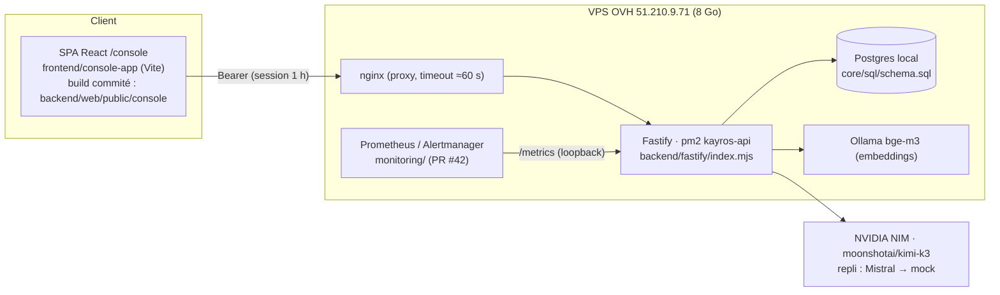
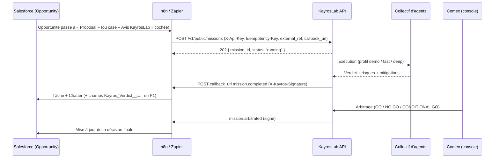

# Console KayrosLab : revue d'architecture et intégration Salesforce (Zapier / n8n)

| Champ | Valeur |
|---|---|
| Date | 9 octobre 2026 |
| Périmètre | Console (`/console`, API `api.kayroslab.com`). **Salon est hors périmètre** (application externe). |
| Base | `main` @ `85816b3` (après PR #39 à #44) |
| Statut | Proposition (phase 1). Rien n'est implémenté ici : le code d'intégration est la phase 2, après validation. |
| Documents liés | `docs/CAHIER-DES-CHARGES-CONSOLE.md`, `docs/PRODUCTION-CONSOLE-V2.md`, `docs/CONSOLE-HYBRID-AGENTS.md`, `docs/developer-portal-mcp.md`, `monitoring/README.md` |

## 0. En une minute

- **Le cœur est déjà réutilisable** : missions asynchrones (`202` + polling), verdicts structurés (`GO` / `CONDITIONAL_GO` / `NO_GO`, justification, risques, mitigations), arbitrage humain, agents personnifiés, jetons machine hachés par tenant (MCP), notifier webhook. Il n'y a pas à réécrire de moteur.
- **Ce qui manque pour Salesforce via Zapier/n8n** : une authentification machine pour la console (les jetons de session expirent au bout d'une heure), un **callback signé** à la fin d'une mission (12 min sous Kimi K3, incompatible avec un polling Zapier), une **petite API publique stable** documentée en **OpenAPI**, et des **gabarits prêts à importer**.
- **Pour une preuve de concept évidente** : un profil d'exécution `demo` (verdict en quelques secondes, sans LLM payant) et un profil `fast`, sinon chaque démo dure 12 minutes.
- **Effort P0** : environ 11 à 13 jours-homme pour un PoC « Opportunité Salesforce → avis du comité IA → réponse écrite sur l'Opportunité », importable en 15 minutes.

## 1. Architecture actuelle de la console



| Brique | Où | Rôle |
|---|---|---|
| SPA console | `frontend/console-app/src/App.jsx` (769 lignes), `src/api.js` | Un seul composant : agents, sessions, missions, arbitrage. Jeton en `sessionStorage`. Polling toutes les 3 s. |
| Routes console | `backend/fastify/routes/console.mjs` | `/v1/console/*` : overview, agents (CrystalKnows, personnalité, profil humain), sessions, `POST /sessions/:id/run` (202), threads, arbitrage. |
| Gateway hybride | `core/hybrid-agent-gateway.mjs` | Salles, fils, exécution asynchrone (`startMessage`, statut `running`, puis `awaiting_arbitration`, `needs_clarification`, `resolved` ou `failed`). Marque `failed` les fils `running` au démarrage. |
| Moteur de collectif | `core/swarm.mjs` | Registre d'agents, exécution, consensus (`SWARM_VERDICTS`), veto C-suite, `human_decision`. |
| Personnification | `core/impersonator.mjs`, `core/personality.mjs` | Packs de rôles (CFO, CTO, DRH…) et import de profils réels CrystalKnows (avec consentement). |
| Auth | `core/auth.mjs`, `backend/fastify/plugins/auth.mjs`, `routes/auth-routes.mjs` | scrypt et jetons HMAC, **TTL 3600 s**. Rôles `contributeur` / `comex` / `admin`. SSO OIDC (Authelia, `docs/SSO.md`). |
| Isolation | `routes/console.mjs` (`accessibleRoom`, `tenantWide`) | Le contributeur voit ses sessions (`owner_id`), comex et admin voient le tenant (PR #39). |
| LLM | `backend/fastify/lib/llm-config.mjs`, `core/kayros-llm.mjs` | `LLM_PROVIDER`, sinon NVIDIA, Mistral, Anthropic, mock. Retry 429, `LLM_MAX_CONCURRENCY=2`. Les replis sont exposés dans `llm_degraded`. |
| Machine-to-machine | `backend/fastify/lib/mcp-auth.mjs`, `routes/mcp.mjs`, `lib/developer-portal-mcp.mjs`, `scripts/generate-mcp-token.mjs` | Jetons **hachés SHA-256, par tenant, avec scopes** (`portal:read`, `swarm:read|write|run`) pour `/mcp`. Configurés via `KAYROS_MCP_CLIENTS_JSON`. |
| Notifications | `core/notify.mjs` (`WebhookNotifier`, `EmailNotifier`), `lib/context.mjs:323` | Webhook global `KAYROS_NOTIFY_WEBHOOK` sur les gates. Commentaire « Slack, Teams, n8n, Zapier ». **Non signé, ni par tenant, ni par événement mission.** |
| Connecteurs chat | `routes/connectors.mjs`, `core/connector-config.mjs`, `core/connector-oauth.mjs` | Slack, Teams, Discord avec vérification de signature entrante (HMAC Slack) : un modèle à réutiliser. |
| Observabilité | `backend/fastify/lib/metrics.mjs`, `monitoring/` | `kayros_console_runs_total`, `_run_duration_seconds`, `_runs_interrupted_total`, `kayros_llm_fallbacks_total`… 19 alertes routées vers Slack. |
| Déploiement | `.github/workflows/deploy-vps-backend.yml`, `deploy/ovh-vps/*.sh` | Une fusion sur `main` réécrit `.env` depuis les secrets GitHub et lance `pm2 reload`. |

### Contrat de mission actuel

```
POST /v1/console/sessions/:sessionId/run   { question, context? }
→ 202 { session_id, thread_id, run_id, status:"running", progress, poll:"/v1/console/threads/<id>" }
GET  /v1/console/threads/:threadId
→ { thread: { status, messages:[{kind:"run", run:{consensus:{verdict, rationale, …}}}], … } }
POST /v1/console/threads/:threadId/arbitrate   (comex/admin)
```

**Existe déjà** : asynchrone, 409 si une mission tourne déjà, statuts lisibles.
**Manque** : identifiant externe (`external_ref`), idempotence, callback, et une forme de réponse « plate » simple à mapper dans Zapier (le verdict est enfoui dans `messages[].run.consensus`).

## 2. Faiblesses et problèmes connus

| # | Sujet | Constat | Impact intégration | Gravité |
|---|---|---|---|---|
| F1 | **Missions lentes** | Kimi K3 prend environ 12 min par mission (3 agents). Mistral reste en 429 (quota). | Démo impossible en direct. Zapier ne peut pas attendre (les pas sont limités en durée). | 🔴 |
| F2 | **Missions tuées par un déploiement ou un redémarrage** | L'exécution tourne dans le processus. Au boot, les fils `running` passent en `failed` (`INTERRUPTED_RUN_ERROR`, `core/hybrid-agent-gateway.mjs`). | Chaque fusion sur `main` peut perdre les missions Salesforce en cours, sans rappel. | 🔴 |
| F3 | **Pas d'authentification machine pour la console** | Jetons de session à TTL 1 h. Les jetons MCP ne couvrent que `/mcp` et `/v1/swarm/*` (exécution synchrone). | Zapier/n8n devraient stocker un mot de passe utilisateur. | 🔴 |
| F4 | **`/v1/swarm/*` sans contrôle de propriétaire** | `routes/swarm.mjs` exige une session et le bon tenant, mais un contributeur peut lire ou lancer les configurations et runs d'un autre membre du tenant. | Une clé d'intégration exposée via ces routes aurait une portée trop large. | 🟠 |
| F5 | **Registre d'agents à l'échelle du tenant** | `core/swarm.mjs` `list({tenantId})` : tous les agents (y compris les profils CrystalKnows réels) sont visibles du tenant. | Données personnelles : un profil réel importé devrait être limité à son propriétaire ou à un groupe. | 🟠 |
| F6 | **Webhook sortant naïf** | `WebhookNotifier` : URL globale, pas de signature, pas de retry durable, payload texte (`core/notify.mjs:57`). | Inutilisable comme contrat d'intégration. | 🟠 |
| F7 | **SMTP non configuré en prod** | `KAYROS_SMTP_URL` vide : pas de mot de passe oublié, pas d'e-mail de fin de mission. | Onboarding self-service impossible. | 🟡 |
| F8 | **Pas d'OpenAPI** | Aucune spec ni `@fastify/swagger`. Les schémas Zod sont dans les routes. | Zapier et n8n (nœud HTTP) se configurent à la main. Pas de « Import from OpenAPI ». | 🟡 |
| F9 | **SPA monolithique** | `App.jsx` concentre toutes les vues. | Ajouter un onglet « Intégrations » est faisable, mais la dette augmente. | 🟡 |
| F10 | **Quotas « version en ligne »** | 3 sessions par utilisateur, 3 agents construits par session (`routes/console.mjs:94`). | Un compte de service partagé atteint vite la limite : il faut des quotas par clé ou par tenant. | 🟡 |
| F11 | **Hygiène** | `backend/fastify/.env.sample` contient une adresse Gmail personnelle dans l'exemple SMTP (pas de secret). | À neutraliser (`user@example.com`). | 🟢 |

## 3. Cible : intégration Salesforce via Zapier / n8n

### 3.1 Principes

1. **Async d'abord, callback ensuite** : on crée une mission, on reçoit `202`, puis KayrosLab **rappelle** l'outil no-code (webhook signé). Le polling reste possible mais n'est pas le chemin nominal.
2. **Une petite surface publique `/v1/public/*` stable et versionnée**, distincte de `/v1/console/*` (interne, libre d'évoluer).
3. **Clés d'API par tenant, liées à un compte de service**, réutilisant le modèle `lib/mcp-auth.mjs` (hash SHA-256, scopes, expiration) mais **stockées en Postgres** et gérables depuis la console. Plus de JSON en variable d'environnement.
4. **L'humain garde la main** : le verdict du collectif est un avis. L'arbitrage comex peut se faire dans la console, et un second événement `mission.arbitrated` le renvoie vers Salesforce.
5. **Zéro installation côté Salesforce pour le PoC** : la réponse est écrite comme **Tâche** et **post Chatter** sur l'Opportunité. Les champs personnalisés sont optionnels (P1).

### 3.2 Flux cible



### 3.3 API publique minimale (v1)

Auth : `Authorization: Bearer kl_live_<prefix>_<secret>` (ou `X-Api-Key`). Scopes : `missions:write`, `missions:read`, `collectives:read`, `webhooks:manage`.

| Méthode | Chemin | Usage | Notes |
|---|---|---|---|
| `GET` | `/v1/public/me` | Test de connexion (Zapier « auth test », n8n credential test) | `{ tenant_id, key_name, scopes }` |
| `GET` | `/v1/public/collectives` | Liste des collectifs (sessions) utilisables, pour un menu déroulant | `{ id, name, agents:[{name, role, persona}] }` |
| `POST` | `/v1/public/missions` | Crée et lance une mission | Corps ci-dessous. `202`. **`Idempotency-Key` obligatoire** (ex. `sf-<OpportunityId>-<StageName>`). |
| `GET` | `/v1/public/missions/:id` | Statut et verdict (repli si pas de callback) | Forme plate (ci-dessous). |
| `GET` | `/v1/public/missions?external_ref=salesforce:Opportunity:006…` | Retrouver une mission depuis l'objet CRM | |
| `POST` / `DELETE` | `/v1/public/webhooks` | Abonnement REST Hooks (app Zapier privée, P1) | `{ url, events[] }` → `{ id, secret }` |

```jsonc
// POST /v1/public/missions
{
  "collective_id": "sess_…",              // ou "template": "comite-deal-review"
  "question": "Faut-il engager la remise de 18 % demandée par ACME pour signer avant le 31/10 ?",
  "context": "Montant 240 k€, stage Proposal, concurrent X, marge cible 32 %…",
  "profile": "fast",                      // demo | fast | deep  (défaut : fast)
  "external_ref": { "system": "salesforce", "object": "Opportunity", "id": "006XXXXXXXXXXXX", "url": "https://acme.my.salesforce.com/006…" },
  "callback_url": "https://n8n.example.com/webhook-waiting/123",   // optionnel
  "metadata": { "owner_email": "ae@acme.com" }
}
// 202
{ "mission_id": "msn_…", "status": "running", "poll_url": "/v1/public/missions/msn_…", "eta_seconds": 90 }
```

```jsonc
// GET /v1/public/missions/:id  et payload webhook « mission.completed »
{
  "event": "mission.completed",            // mission.completed | mission.failed | mission.arbitrated
  "event_id": "evt_…", "occurred_at": "2026-10-09T14:00:00Z",
  "mission_id": "msn_…", "status": "awaiting_arbitration",
  "external_ref": { "system": "salesforce", "object": "Opportunity", "id": "006…" },
  "verdict": "CONDITIONAL_GO",             // GO | CONDITIONAL_GO | NO_GO
  "summary": "Signer sous conditions : remise plafonnée à 12 %…",
  "risks": ["…"], "conditions": ["…"],
  "agents": [{ "name": "CFO (pack)", "verdict": "CONDITIONAL_GO" }, { "name": "M. Dupont (CrystalKnows)", "verdict": "NO_GO" }],
  "human_decision": null,                  // rempli sur mission.arbitrated
  "llm": { "provider": "nvidia", "degraded": false },
  "dossier_url": "https://www.kayroslab.com/console/#/threads/thr_…"
}
```

Mapping vers l'existant : `POST /v1/public/missions` appelle `hybridGateway.startMessage` sur la salle `collective_id`, avec un compte de service comme `user_id`. Le statut se lit via `executionView` et `summarizeSwarmRun` (`core/hybrid-agent-gateway.mjs:91`). **Aucune duplication du moteur.**

### 3.4 Clés d'API et comptes de service

- Table `api_keys` (`id`, `tenant_id`, `name`, `prefix`, `sha256`, `scopes[]`, `service_user_id`, `created_by`, `created_at`, `last_used_at`, `expires_at`, `revoked_at`). Le hash suit `hashMcpToken` et la comparaison `timingSafeEqual` (`lib/mcp-auth.mjs`).
- Chaque clé est rattachée à un **utilisateur de service** (`role: 'service'`, nouveau rôle dans `core/auth.mjs`). L'isolation `owner_id` de la PR #39 s'applique donc telle quelle : la clé ne voit que ses propres missions et les collectifs qui lui sont partagés.
- Console, onglet **Intégrations** (admin) : « Créer une clé » (affichée une seule fois), révoquer, dernière utilisation, et bouton **« Envoyer un webhook de test »**.
- Rate-limit par clé (le plugin `@fastify/rate-limit` est déjà utilisé par `/mcp`) et quota de missions par jour et par tenant (remplace F10 pour les intégrations).

### 3.5 Webhooks sortants signés

- Signature à la Stripe : `X-Kayros-Signature: t=<unix>,v1=<hex HMAC-SHA256(secret, t + "." + body)>`, tolérance de 5 min. Le secret est propre à l'abonnement (ou à la clé). On réutilise `createHmac` de `core/auth.mjs`.
- **Outbox Postgres** (`webhook_deliveries`) : 6 tentatives (1 min → 6 h), `event_id` unique pour l'idempotence côté récepteur, journal visible dans la console. Les livraisons survivent ainsi aux redéploiements (corrige F6 et une partie de F2).
- Vérification en n8n : nœud Code, 6 lignes de `crypto`. En Zapier : étape « Code by Zapier » (exemple fourni dans le guide).
- Le `WebhookNotifier` existant reste pour les gates ; le nouveau module `core/integrations/webhooks.mjs` le remplace pour les événements mission.

### 3.6 OpenAPI

- `docs/openapi/kayroslab-public-v1.yaml` (OpenAPI 3.1), générée depuis les schémas Zod (`zod-to-json-schema`) et servie par `GET /v1/public/openapi.json`, avec une page `/docs` (Scalar ou Redoc, statique).
- Bénéfices : n8n (nœud HTTP avec import cURL et OpenAPI), Zapier (Platform CLI ou UI), Postman, Salesforce **External Services** (import OpenAPI natif, ce qui permet un Flow Salesforce sans Apex en P2).

### 3.7 Profils d'exécution (rendre le PoC évident)

| Profil | Moteur | Durée cible | Usage |
|---|---|---|---|
| `demo` | Provider mock déterministe (existant), contenu réaliste par pack de rôles | < 5 s | Tester le câblage Salesforce ↔ n8n sans coût ni attente. Toujours étiqueté `llm.provider = "mock"`. |
| `fast` | Modèle rapide (ex. `deepseek-v4.1-flash` via NVIDIA, déjà validé en PR #40), 3 agents, `max_tokens` réduit | 1–2 min | Démo client en direct. |
| `deep` | Kimi K3 (actuel) | ~12 min | Décisions réelles, résultat asynchrone par callback. |

Implémentation : `NVIDIA_MODEL_FAST` / `NVIDIA_MODEL_DEEP` dans `lib/llm-config.mjs`, choix par mission.

### 3.8 Gabarits no-code

**n8n (recommandé pour le PoC : un seul workflow, l'attente se fait côté n8n)**

1. **Salesforce Trigger** (Opportunity updated) → **IF** `StageName == "Proposal/Price Quote"`.
2. **HTTP Request** `POST /v1/public/missions` avec `callback_url = {{$execution.resumeUrl}}`, header `Idempotency-Key = sf-{{$json.Id}}-{{$json.StageName}}`.
3. **Wait** « On Webhook Call » (reprise quand KayrosLab rappelle, timeout 30 min).
4. **Code** : vérifie `X-Kayros-Signature`.
5. **Salesforce** : *Create Task* (« Avis KayrosLab : CONDITIONAL GO », description = summary + risques + lien dossier), plus un post Chatter optionnel (*Salesforce → Custom API call* `chatter/feed-elements`).
6. Branche `mission.failed` → Task « Avis indisponible, relancer ».

Squelette livré en phase 2 dans `integrations/n8n/salesforce-opportunity-review.json` :

```json
{
  "name": "KayrosLab · Avis comité IA sur Opportunité Salesforce",
  "nodes": [
    { "name": "Opportunity mise à jour", "type": "n8n-nodes-base.salesforceTrigger", "parameters": { "triggerOn": "opportunityUpdated" } },
    { "name": "Stage = Proposal ?", "type": "n8n-nodes-base.if" },
    { "name": "Créer mission KayrosLab", "type": "n8n-nodes-base.httpRequest",
      "parameters": { "method": "POST", "url": "https://api.kayroslab.com/v1/public/missions",
        "authentication": "genericCredentialType", "genericAuthType": "httpHeaderAuth",
        "jsonBody": "={ \"collective_id\": \"{{$vars.KAYROS_COLLECTIVE}}\", \"profile\": \"fast\", \"question\": \"Faut-il engager {{$json.Name}} ({{$json.Amount}} €) ?\", \"external_ref\": {\"system\":\"salesforce\",\"object\":\"Opportunity\",\"id\":\"{{$json.Id}}\"}, \"callback_url\": \"{{$execution.resumeUrl}}\" }" } },
    { "name": "Attendre le verdict", "type": "n8n-nodes-base.wait", "parameters": { "resume": "webhook", "httpMethod": "POST", "limitWaitTime": true, "resumeAmount": 30, "resumeUnit": "minutes" } },
    { "name": "Vérifier signature", "type": "n8n-nodes-base.code" },
    { "name": "Tâche Salesforce", "type": "n8n-nodes-base.salesforce", "parameters": { "resource": "task", "operation": "create" } }
  ]
}
```

**Zapier (deux Zaps, Zapier n'attend pas 12 min)**

- *Zap A* : **Salesforce → Updated Field on Record** (Opportunity.StageName) → **Filter** → **Webhooks by Zapier → POST** `/v1/public/missions` avec `callback_url` = l'URL du Catch Hook du Zap B.
- *Zap B* : **Webhooks by Zapier → Catch Raw Hook** → **Code by Zapier** (vérification HMAC) → **Salesforce → Create Record (Task)** et/ou **Update Record** (champs `Kayros_*__c`).
- P1 : **app Zapier privée « KayrosLab »** (auth par clé d'API, trigger « Mission terminée » en REST Hook via `/v1/public/webhooks`, action « Lancer une mission », champ dynamique « Collectif » via `/v1/public/collectives`). On passe alors à un seul Zap sans URL à copier.

**Objets Salesforce**
- PoC : **aucune personnalisation**. On utilise `Task` (Subject, Description, WhatId = OpportunityId) et Chatter.
- P1 (package de métadonnées fourni) : sur Opportunity, `Kayros_Verdict__c` (picklist GO/CONDITIONAL_GO/NO_GO), `Kayros_Summary__c` (texte long), `Kayros_Status__c`, `Kayros_Mission_Id__c`, `Kayros_Dossier_URL__c`, `Kayros_Human_Decision__c`, et une case `Kayros_Request_Review__c` comme déclencheur explicite.
- P2 : appel direct sans middleware, via Flow Salesforce, **HTTP Callout** et **Named Credential** (import de la spec OpenAPI en External Service), avec un composant LWC « Avis du comité IA » sur la fiche Opportunité.

## 4. PoC en 15 minutes (une fois les P0 livrés)

| Min | Étape | Qui | Détail |
|---|---|---|---|
| 0–2 | Clé d'API | Admin KayrosLab | Console → **Intégrations** → « Créer une clé » (scopes `missions:*`, `collectives:read`). Copier la clé (affichée une seule fois). |
| 2–4 | Collectif | Admin KayrosLab | Console → créer une session « Comité deal review » avec les packs CFO, Directeur commercial et Juriste (ou un profil CrystalKnows réel). Copier l'`id`. |
| 4–7 | n8n | Ops / RevOps | Importer `integrations/n8n/salesforce-opportunity-review.json`. Créer le credential *Header Auth* (`Authorization: Bearer kl_live_…`) et le credential *Salesforce OAuth2*. Renseigner `KAYROS_COLLECTIVE`. |
| 7–8 | Test de câblage | Ops | Bouton « Envoyer un webhook de test » dans la console, ou une mission `profile: "demo"`. Le résultat est visible dans n8n en < 5 s. |
| 8–12 | Démo réelle | Commercial | Dans Salesforce (Developer Edition gratuite suffit), passer une Opportunité en *Proposal/Price Quote*. Avec le profil `fast`, une Tâche « Avis KayrosLab : CONDITIONAL GO » apparaît en 1–2 min avec les risques et le lien vers le dossier. |
| 12–15 | Gouvernance | Comex | Ouvrir le lien du dossier, arbitrer. `mission.arbitrated` met la Tâche à jour avec la décision humaine. |

**PoC J0, sans attendre la phase 2** (faisable aujourd'hui, à réserver à une démo interne) : n8n appelle `POST /v1/auth/login` (compte dédié) → `POST /v1/console/sessions/:id/run` → boucle *Wait 60 s* + `GET /v1/console/threads/:id` jusqu'à un statut ≠ `running` → extraction de `messages[-1].run.consensus.verdict` → Tâche Salesforce. Limites : mot de passe stocké dans n8n, jeton d'une heure, environ 12 min sous K3, mission perdue si un déploiement survient pendant l'exécution.

## 5. Backlog priorisé

Estimations en jours-homme (j), tests inclus.

### P0 : PoC Salesforce évident (≈ 11–13 j)

| ID | Item | Fichiers touchés | Effort |
|---|---|---|---|
| P0-1 | **Clés d'API par tenant et comptes de service** (table `api_keys`, rôle `service`, hachage façon `mcp-auth`, scopes, rate-limit par clé) | `core/sql/migrations/`, `core/auth.mjs`, `backend/fastify/plugins/auth.mjs`, nouveau `lib/api-keys.mjs` | 2 |
| P0-2 | **API publique `/v1/public/*`** (`me`, `collectives`, `missions` POST/GET, recherche par `external_ref`), avec **`Idempotency-Key`** et forme de réponse plate | nouveau `routes/public-api.mjs`, `core/hybrid-agent-gateway.mjs` (stockage de `external_ref`) | 2 |
| P0-3 | **Webhooks signés HMAC et outbox Postgres** (`mission.completed`, `.failed`, `.arbitrated`), retries, `callback_url` par mission | nouveau `core/integrations/webhooks.mjs`, hook en fin de `startMessage` et de `arbitrateThread` | 2 |
| P0-4 | **Missions durables** : file en Postgres (`FOR UPDATE SKIP LOCKED`) au lieu de l'exécution dans le processus, reprise après redémarrage et `pm2 reload` sans perte. Pas de Redis sur un VPS de 8 Go. | `core/hybrid-agent-gateway.mjs`, `core/pg-store.mjs`, `index.mjs` | 2–3 |
| P0-5 | **Profils `demo` / `fast` / `deep`** (choix du modèle par mission, `llm.provider` toujours exposé) | `lib/llm-config.mjs`, `core/kayros-llm.mjs` | 1 |
| P0-6 | **OpenAPI 3.1 et page `/docs`** pour la surface publique | `docs/openapi/`, `routes/public-api.mjs` | 1 |
| P0-7 | **Gabarit n8n et guide Zapier en 2 Zaps** (FR/EN), snippets de vérification HMAC, Developer Edition Salesforce pas à pas | `integrations/n8n/`, `integrations/zapier/README.md`, `docs/INTEGRATION-SALESFORCE.md` | 1 |
| P0-8 | **Sécurité** : contrôle de propriétaire sur `/v1/swarm/*` (F4), neutralisation de l'e-mail dans `.env.sample` (F11) | `routes/swarm.mjs`, `.env.sample` | 0,5 |

### P1 : industrialiser (≈ 10–12 j)

| ID | Item | Effort |
|---|---|---|
| P1-1 | Onglet **Intégrations** dans la console (clés, abonnements, journal des livraisons, bouton de test), découpage de `App.jsx` en vues | 2 |
| P1-2 | **App Zapier privée** (auth par clé, trigger REST Hook « Mission terminée », action « Lancer une mission », listes dynamiques) | 3 |
| P1-3 | **Package Salesforce** (champs `Kayros_*__c`, case déclencheur, layout) en métadonnées SFDX | 1,5 |
| P1-4 | Registre d'agents **par propriétaire ou groupe** pour les profils CrystalKnows réels (F5, RGPD) | 2 |
| P1-5 | **SMTP** configuré (secret GitHub) : mot de passe oublié et e-mail de fin de mission (F7) | 0,5 |
| P1-6 | Quotas par tenant et par clé, métriques `kayros_public_api_*` et `kayros_webhook_deliveries_*`, alertes sur les échecs de livraison | 1 |
| P1-7 | « Gabarits de comité » prêts à l'emploi (`deal-review`, `remise-exceptionnelle`, `go-no-go-rfp`) sélectionnables par `template` | 1 |

### P2 : natif et diffusion (≈ 15 j et plus)

| ID | Item | Effort |
|---|---|---|
| P2-1 | Salesforce natif : **External Service** (OpenAPI) + Flow + Named Credential, composant **LWC** « Avis du comité IA » | 5 |
| P2-2 | Nœud communautaire **n8n** `n8n-nodes-kayroslab` et app Zapier publique | 4 |
| P2-3 | OAuth2 *client credentials* (en plus des clés), rotation automatique | 2 |
| P2-4 | Make.com, HubSpot, Microsoft Dynamics (réutilisent la même API publique) | 3 |
| P2-5 | Haute disponibilité (2 nœuds, Postgres managé) quand la charge le justifie | — |

## 6. Décisions à valider avant la phase 2

1. **n8n d'abord** (un seul workflow, auto-hébergeable sur le VPS ou en n8n Cloud) et Zapier en guide 2-Zaps, puis app privée en P1 ? *(recommandé)*
2. Profil par défaut des intégrations : **`fast`** (DeepSeek Flash) plutôt que K3, K3 restant disponible en `deep` ?
3. Écriture Salesforce du PoC : **Tâche + Chatter sans personnalisation**, champs `Kayros_*__c` en P1 ?
4. File de missions **en Postgres** (pas de Redis) ?
5. Hébergement de n8n pour la démo : n8n Cloud (essai) ou conteneur sur le VPS (≈ 300 Mo de RAM) ?
